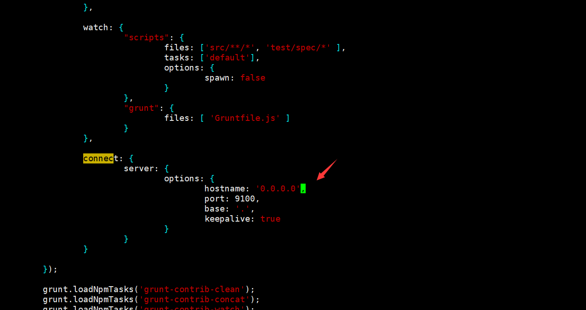
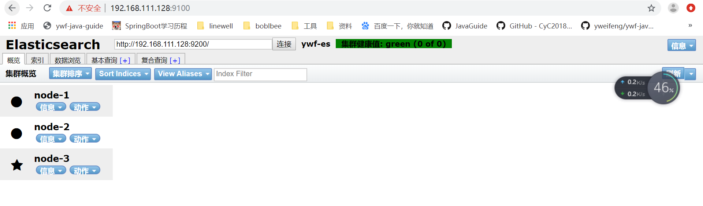

# ES集群搭建

虚拟机环境 **centos7**、**Elasticsearch6.8.5**  

**cluster.name: ywf-es**

| 服务器          | node.name | node.master | node.data |
| --------------- | --------- | ----------- | --------- |
| 192.168.111.128 | node-1    | true        | true      |
| 192.168.111.129 | node-2    | true        | true      |
| 192.168.111.130 | node-3    | true        | true      |

## ES安装

```shell
# 下载地址 https://www.elastic.co/cn/downloads/past-releases#elasticsearch
# 创建目录
mkdir /opt/elk
# 解压到/opt/elk
tar -zxvf elasticsearch-6.8.5.tar.gz
# 重命名
mv elasticsearch-6.8.5 es
```

## 创建目录

```shell
cd /opt/elk/es
# 创建data目录 存放数据
mkdir data
# 创建logs目录 存放日志
mkdir logs
```

## 修改elasticsearch配置文件 

- **vim/opt/elk/es/config/elasticsearch.yml**

```properties
#集群的名称
cluster.name: ywf-es
#节点名称,其余两个节点分别为node-2 和node-3
node.name: node-1
#指定该节点是否有资格被选举成为master节点，默认是true，es是默认集群中的第一台机器为master，如果这台机挂了就会重新选举master
node.master: true
#允许该节点存储数据(默认开启)
node.data: true
#索引数据的存储路径
path.data: /opt/elk/es/data
#日志文件的存储路径
path.logs: /opt/elk/es/logs
#设置为true来锁住内存。因为内存交换到磁盘对服务器性能来说是致命的，当jvm开始swapping时es的效率会降低，所以要保证它不swap
bootstrap.memory_lock: false
#绑定的ip地址
network.host: 192.168.111.128
#设置对外服务的http端口，默认为9200
http.port: 9200
# 设置节点间交互的tcp端口,默认是9300 
transport.tcp.port: 9300
#Elasticsearch将绑定到可用的环回地址，并将扫描端口9300到9305以尝试连接到运行在同一台服务器上的其他节点。
#这提供了自动集群体验，而无需进行任何配置。数组设置或逗号分隔的设置。每个值的形式应该是host:port或host
#（如果没有设置，port默认设置会transport.profiles.default.port 回落到transport.tcp.port）。
#请注意，IPv6主机必须放在括号内。默认为127.0.0.1, [::1]
discovery.zen.ping.unicast.hosts: ["192.168.111.128:9300", "192.168.111.129:9300", "192.168.111.130:9300"]
#如果没有这种设置,遭受网络故障的集群就有可能将集群分成两个独立的集群 - 分裂的大脑 - 这将导致数据丢失
discovery.zen.minimum_master_nodes: 3
```

## 调整jvm内存 

```shell
vim /opt/elk/es/config/jvm.options 
#默认是1g官方建议对jvm进行一些修改，不然很容易出现OOM,参考官网改参数配置最好不要超过内存的50% 
-Xms512m
-Xmx512m
```

## 修改limits.conf

```shell
vim /etc/security/limits.conf
# 添加如下内容，保存退出

es soft nofile 65536
es hard nofile 65536

* soft nofile 65535
* hard nofile 65535
* soft nproc 4096
* hard nproc 4096
```

## 修改sysctl.conf

```shell
vim /etc/sysctl.conf

vm.max_map_count=655360
```

## 执行sysctl -p

```shell
sysctl -p
```

## 拷贝到其他服务器

```shell
scp -r /opt/elk/es root@192.168.111.129:/opt/elk
scp -r /opt/elk/es root@192.168.111.130:/opt/elk
```

vim/opt/elk/es/config/elasticsearch.yml

修改elasticsearch配置文件 **node.name**分别为**node-2**、**node-3**

##  建立用户并授权

```shell
#(es不能用root运行) 
#添加用户
useradd es
#赋予文件夹权限
chown -R es:es /opt/elk/es
```

## 启动应用

```shell
# 切换用户为es
su es
bin/elasticsearch -d
```

# Elasticsearch-head插件安装

## 安装Git

```shell
yum install git
git  --version
```

## 安装node

```
1、安装node
2、执行 npm install
```

## 安装grunt

```shell
npm install -g grunt-cli  #安装grunt命令行工具grunt-cli
npm install grunt --save-dev  #安装grunt及其插件
grunt -version   #查看安装版本情况
```

## 下载并安装elasticsearch-head

```shell
cd /opt/elk 

git clone git://github.com/mobz/elasticsearch-head.git   #git下载

cd elasticsearch-head  #进入目录

cnpm install  # 如果npm使用很多错误，尝试使用cnpm

cnpm install grunt --save  #安装grunt到模块中并保存
```

## 修改两处的配置

```shell
# 修改elasticsearch.yml
vim /opt/elk/es/config/elasticsearch.yml
# 增加如下字段
http.cors.enabled: true
http.cors.allow-origin: "*"

# 修改elasticsearch-head下的Gruntfile.js
vim /opt/elk/elasticsearch-head/Gruntfile.js
# 其中增加一个
hostname: '0.0.0.0'  或者是 hostname: '*'
```



## 关闭防火墙

```shell
systemctl stop firewalld.service  #停止firewall
systemctl disable firewalld.service  #禁止firewall开机启动
firewall-cmd --state #查看默认防火墙状态（关闭后显示notrunning，开启后显示running）
```

## 用户授权

```shell
chown -R es:es /opt/elk/elasticsearch-head
```

## 启动ES

```shell
# 切换用户为es
su es
cd /opt/elk/es
bin/elasticsearch -d
```

##  启动head插件 

```shell
# 很多时候重启会遇上9200，或者9100端口占用
netstat -tunlp |grep 9100  #查看某个端口情况
kill -9 pid

cd /opt/elk/elasticsearch-head/
nohup grunt  server &
```

## 浏览器访问

[192.168.111.128:9100](192.168.111.128:9100)

