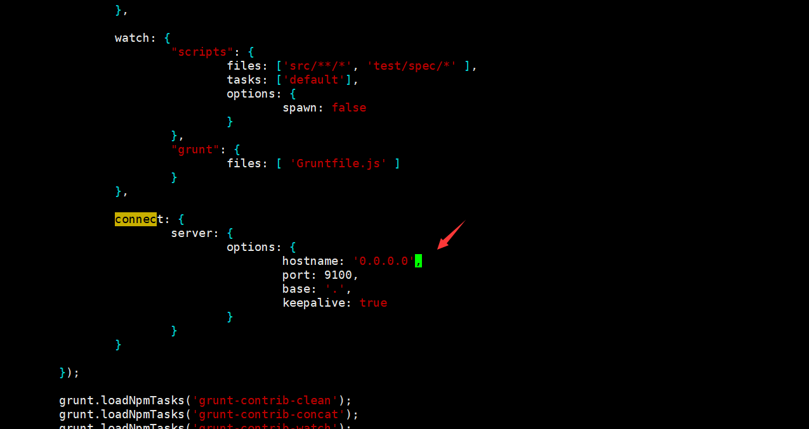

## 安装Git

```shell
yum install git
git  --version
```

## 安装node

```
1、安装node
2、执行 npm install
```

## 安装grunt

```shell
npm install -g grunt-cli  #安装grunt命令行工具grunt-cli
npm install grunt --save-dev  #安装grunt及其插件
grunt -version   #查看安装版本情况
```

## 下载并安装elasticsearch-head

```shell
cd /opt/elk 

git clone git://github.com/mobz/elasticsearch-head.git   #git下载

cd elasticsearch-head  #进入目录

cnpm install  # 如果npm使用很多错误，尝试使用cnpm

cnpm install grunt --save  #安装grunt到模块中并保存
```

## 修改两处的配置

```shell
# 修改elasticsearch.yml
vim /opt/elk/es/config/elasticsearch.yml
# 增加如下字段
http.cors.enabled: true
http.cors.allow-origin: "*"

# 修改elasticsearch-head下的Gruntfile.js
vim /opt/elk/elasticsearch-head/Gruntfile.js
# 其中增加一个
hostname: '0.0.0.0'  或者是 hostname: '*'
```



## 关闭防火墙

```shell
systemctl stop firewalld.service  #停止firewall
systemctl disable firewalld.service  #禁止firewall开机启动
firewall-cmd --state #查看默认防火墙状态（关闭后显示notrunning，开启后显示running）
```

## 用户授权

```shell
chown -R es:es /opt/elk/elasticsearch-head
```

## 启动ES

```shell
# 切换用户为es
su es
cd /opt/elk/es
bin/elasticsearch -d
```

##  启动head插件 

```shell
# 很多时候重启会遇上9200，或者9100端口占用
netstat -tunlp |grep 9100  #查看某个端口情况
kill -9 pid

cd /opt/elk/elasticsearch-head/
nohup grunt  server &
```

## 浏览器访问

[192.168.111.128:9100](192.168.111.128:9100)

