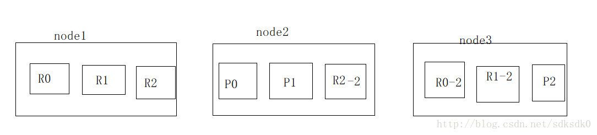
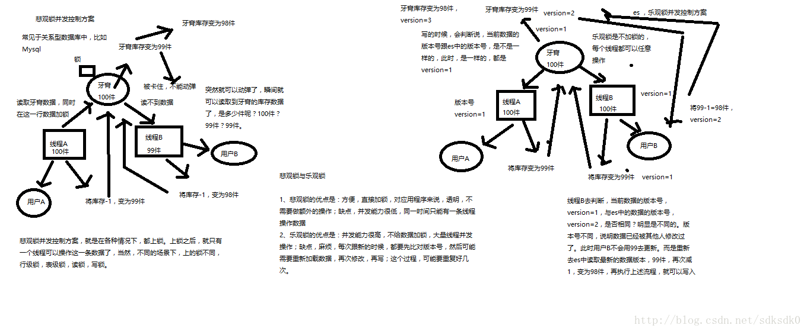

<!-- TOC -->

- [ES基础篇](#es基础篇)
    - [ES的功能](#es的功能)
        - [分布式的搜索引擎和数据分析引擎](#分布式的搜索引擎和数据分析引擎)
        - [全文检索，结构化检索，数据分析](#全文检索结构化检索数据分析)
        - [对海量数据进行近实时的处理](#对海量数据进行近实时的处理)
    - [ES的核心概念](#es的核心概念)
        - [集群(cluster)](#集群cluster)
        - [节点(node)](#节点node)
        - [索引(index)](#索引index)
        - [类型(type)](#类型type)
        - [映射(mapping)](#映射mapping)
        - [文档(document)](#文档document)
        - [字段(field)](#字段field)
        - [分片(shard)和副本(replica)](#分片shard和副本replica)
        - [分段(segment)](#分段segment)
        - [segment查询](#segment查询)
        - [segment生成](#segment生成)
    - [ES的核心机制](#es的核心机制)
        - [主备机制](#主备机制)
        - [容错机制](#容错机制)
        - [刪除或者更新原理](#刪除或者更新原理)
    - [ES的并发控制](#es的并发控制)
        - [并发解决方案](#并发解决方案)

<!-- /TOC -->

# ES基础篇

## ES的功能

### 分布式的搜索引擎和数据分析引擎

**搜索**：百度，网站的站内搜索，IT系统的检索
**数据分析**：电商网站，最近7天牙膏这种商品销量排名前10的商家有哪些；新闻网站，最近1个月访问量排名前3的新闻版块是哪些
**分布式，搜索，数据分析**

### 全文检索，结构化检索，数据分析

**全文检索**：我想搜索商品名称包含牙膏的商品，select * from products where product_name like "%牙膏%"
**结构化检索**：我想搜索商品分类为日化用品的商品都有哪些，select * from products where category_id='日化用品'
**部分匹配、自动完成、搜索纠错、搜索推荐**
数据分析：我们分析每一个商品分类下有多少个商品，select category_id,count(*) from products group by category_id

### 对海量数据进行近实时的处理

**分布式**：ES自动可以将海量数据分散到多台服务器上去存储和检索
海联数据的处理：分布式以后，就可以采用大量的服务器去存储和检索数据，自然而然就可以实现海量数据的处理了
**近实时**：检索个数据要花费1小时（这就不要近实时，离线批处理，batch-processing）；在秒级别对数据进行搜索和分析

跟分布式/海量数据相反的：lucene，单机应用，只能在单台服务器上使用，最多只能处理单台服务器可以处理的数据量


## ES的核心概念

### 集群(cluster)

```
集群由一个或多个节点组成。一个集群有一个默认名称"Elasticsearch"。

注意：不同集群，集群名称应唯一。
```

### 节点(node)

```
节点是集群的一部分。ES 6.x中，有多种类型的节点：

- Master节点：存元数据。

- Data节点：存数据。

- Ingest节点：可在数据真正进入index前,通过配置pipline拦截器对数据ETL。

- Coordinate节点：协调节点。如接收搜索请求，并将请求转发到数据节点，每个数据节点在本地执行请求并将结果返回给协调节点。

协调节点将每个数据节点的结果汇总并返回给客户端。每个节点默认都是一个协调节点。当将node.master，node.data和node.ingest设置为false时，该节点仅用作协调节点。

  注意：Coordinate Tribe 是一种特殊类型的协调节点，可连接到多个集群并在所有连接的集群中执行搜索和其他操作。
```

### 索引(index)

```
一个index可以理解成一个关系型数据库。
```

### 类型(type)

```
一种type就像一类表。如用户表、充值表等。

注意：

    - ES 5.x中一个index可以有多种type。

    - ES 6.x中一个index只能有一种type。

    - ES 7.x以后，将移除type这个概念。
```

### 映射(mapping)

```
mapping定义了每个字段的类型、字段所使用的分词器等。相当于关系型数据库中的表结构。
```

### 文档(document)

```
一个document相当于关系型数据库中的一行row。
```

### 字段(field)

```
文档中的一个字段field就相当于关系型数据库中的一列column。
```

### 分片(shard)和副本(replica)

```
副本是分片的副本。分片有主分片(primary Shard)和副本分片(replica Shard)之分。

一个Index数据在物理上被分布在多个主分片中，每个主分片只存放部分数据。

每个主分片可以有多个副本，叫副本分片，是主分片的复制。

注意：

    1. 一个document只存在于某个primary shard以及其对应的replica shard上，不会在多个primary shard上。

    2. 默认情况下，一个index有5个主分片,每个主分片都有一个副本。这样，整个index就有10个分片，要保证整个集群健康，就需要至少两个节点。因为主分片和副本分片不能在同一台机器上。

    3. 主分片的数量在创建索引后不能再被修改，副本分片的数量可以改变。

    4. 每个分片shard都是一个完整的lucene实例，有完整创建索引和处理请求的能力。

    5. 分片有助于es水平扩展。副本一般用来容错，相当于主分片的HA。除此之外，分片和副本还有助于提高并行搜索的性能，因为可以在所有副本上并行执行搜索。
```

### 分段(segment)

```
一个shard包含多个segment，每个segment都是倒排索引。
```

### segment查询

```
查询时，每个shard会把所有segment结果汇总作为shard的结果返回。
```

### segment生成

```
1.写入ES时，一方面会把数据写入到内存Buffer缓冲，为防止Buffer中数据丢失，另一方面会同时把数据写入到translog日志文件。

2.每隔1秒钟，数据从Buffer被写入到segment file，直接写入os cache。

3.os cache segment file被打开供search使用，然后内存Buffer被清空。

4.随着时间推移，os cache中segment file越来越多，translog日志文件也越来越大，当translog日志文件大到一定程度的时候就会触发flush操作。

5.flush操作将os cache中segment file持久化到磁盘并删除translog日志文件。

6.当segment增多到一定程度，会触发ES合并segment,将许多小的segment合并成大segment并删除小segment，提高查询性能。
```


## ES的核心机制

### 主备机制

```
（1）index包含多个shard
（2）每个shard都是一个最小工作单元，承载部分数据，lucene实例，完整的建立索引和处理请求的能力
（3）增减节点时，shard会自动在nodes中负载均衡
（4）primary shard和replica shard，每个document肯定只存在于某一个primary shard以及其对应的replica shard中，不可能存在于多个primary shard
（5）replica shard是primary shard的副本，负责容错，以及承担读请求负载
（6）primary shard的数量在创建索引的时候就固定了，replica shard的数量可以随时修改
（7）primary shard的默认数量是5，replica默认是1，默认有10个shard，5个primary shard，5个replica shard
（8）primary shard不能和自己的replica shard放在同一个节点上（否则节点宕机，primary shard和副本都丢失，起不到容错的作用），但是可以和其他primary shard的replica shard放在同一个节点上
```

### 容错机制

```
（1）9 shard，3 node
（2）master node宕机，自动master选举，red
（3）replica容错：新master将replica提升为primary shard，yellow
（4）重启宕机node，master copy replica到该node，使用原有的shard并同步宕机后的修改，green
```



 **容错步骤:** 

```
a、原来node1是一个master，假如因为某种原因node1宕机了，node中是R0，R1和R2全部丢失。
b、进行master选举，自动选举另外一个node成为新的master，承担起master的责任来，例如现在全部选举了node2为master。
c、新的master，将丢失的primary shard的某个replica shard提升为primary  shard。此时集群的状态就会变为yellow，原因是虽然目前所有的primary  shard全部变成active，但是replice shard少了，也就并不是所有的replica  shard都是active。
d、重启故障的node1，新的master(node2)会将缺失的副本都copy一份到这个node1上面去，而且这个node1会使用之前已经有的shard数据，只是同步一下宕机之后发生的修改，此时，集群是status再次变回green。
```


### 刪除或者更新原理

```
如果是删除操作，commit的时候会生成一个 .del文件，里面将某个doc标识为 deleted状态，那么搜索的时候根据 .del文件就知道这个doc是否被删除了。

如果是更新操作，就是将原来的doc标识为deleted状态，然后重新写入一条数据。

buffer 每refresh一次，就会产生一个segment file，所以默认情况下是1秒钟一个segment file，这样下来segment file会越来越多，此时会定期执行merge。

每次merge的时候，会将多个segment file合并成一个，同时这里会将标识为 deleted的doc给物理删除掉，然后将新的segment file写入磁盘，这里会写一个

commit point，标识所有新的 segment file，然后打开segment file供搜索使用，同时删除旧的segment file。
```


## ES的并发控制

**背景：** 
在电商平台中，用户抢购鞋子，原库存为100，线程A和线程B同时进来了，总有一个线程是先到的，假设现在线程A先到，这个时候线程A把100改为99，线程B也改为99，然而实际上两个用户抢购之后，库存应该是98，会导致数据不准确，所以这样就出现并发控制的问题。 

### 并发解决方案

 **悲观锁**： 



**悲观锁方案**

常见于关系型数据库中。在各种情况下都上锁，就只有一个线程可以操作这条数据，不同的场景下，有行级锁、表级锁、读锁和写锁。

工作流程： 
读取鞋子数据的时候，就在这行加锁，线程A先不改数据， 
线程b去读的时候会发现都不到数据，被卡住不能动。 
线程A把库存改为99。 
线程b可以读取库存数据了，是99件。 
然后线程B再把库存改为98。

**乐观锁方案**

乐观锁是不加锁的，每个线程都可以操作，通过一个version号来识别，看是不是一样的，例如线程A操作后是version=1，库存改为99，同一时间有一个用户B也读到了这数据，下单也把库存变为99件，version=2，线程B去判断，version=1与es中的版本version=2，说明数据已经被其他人修改过了，然后就重新去es中读取最新版本数据，也就是99，然后再减一，就变为98件了。 
总之：99—version1 98–version2.

**悲观锁的优点**：方便，对应用程序来说透明，缺点：并发能力低。 
**乐观锁的优点**：并发能力高，都需要重新比对版本号，然后可能需要重新加载数据，再写，这个过程，可能需要重复好几次

每次执行修改和删除，这个version的版本号会自动加1 
在删除一个document之后，并没有物理删除掉的，因为它的版本号信息还是保留着的，先删除一条document，再重新创建这条document，其实会在delete version基础之上，再把version号加1.

es的后台都是多线程异步的，多个修改请求，是没有顺序的，例如后修改的先到。 
es内部的多线程异步并发是基于自己的verison版本号进行乐观锁控制的，在后修改的先到时，filed=test3，version =2,修改后到时，先修改filed=test2,veriosn=1,此时会比较veriosn，是否相等，如果不相等的话，就直接丢弃这条数据了。


## ES 数据读写流程


### es 读数据过程

  可以通过 `doc id` 来查询，会根据 `doc id` 进行 hash，判断出来当时把 `doc id` 分配到了哪个 shard 上面去，从那个 shard 去查询。

- 客户端发送请求到任意一个 node，成为 `coordinate node`。
- `coordinate node` 对 `doc id` 进行哈希路由，将请求转发到对应的 node，此时会使用 `round-robin`随机轮询算法，在 `primary shard` 以及其所有 replica 中随机选择一个，让读请求负载均衡。
- 接收请求的 node 返回 document 给 `coordinate node`。
- `coordinate node` 返回 document 给客户端。


### es 搜索流程

- 客户端发送请求到一个 `coordinate node`。
- 协调节点将搜索请求转发到所有的 shard 对应的 `primary shard` 或 `replica shard`，都可以。
- query phase：每个 shard 将自己的搜索结果（其实就是一些 `doc id`）返回给协调节点，由协调节点进行数据的合并、排序、分页等操作，产出最终结果。
- fetch phase：接着由协调节点根据 `doc id` 去各个节点上拉取实际的 `document` 数据，最终返回给客户端。


### es写入过程

1. 客户端随机选择一个node发送数据, 此时该node为协调节点(coordinating node)
   1.1. coordinating node 通过 _id计算出该document在哪个shard上, 假设为shard0, 计算方式如下:

   > hash(_id) % number_of_primary_shards

   1.2. node 根据 cluster state 获取到 shard0 在 node1 上

   

2. 将消息发送到 node1 的 P0 上

3. P0 收到数据后, 将数据同步到 自己的 replica shard R0上

4. P0 和 R0 都处理完毕, 才会返回客户端成功

> Px 为 primary shard
> Rx 为 replica shard
> 当客户端请求为查询时, 路由到任意 shard(primary shard 或者 replica shard) 查询到数据即可返回.

详细流程


1. P0收到document, 同时将数据写入到 内存buffer和translog中

2. 每隔1s或buffer满时, buffer中的数据会 refresh 到segment中, 而后进入os cache, 一旦segment进入到 cache中,其中的数据, 则可以被搜索到

   > refresh 时间可以手动设置, 也可以手动触发 refresh

3. 清空buffer, translog不处理

4. 重复1-3操作, translog不断增大, translog每隔30分钟,或大到一定量时, 会触发commit操作

5. 将buffer中内容刷新到segment中, 并清空buffer

6. 将一个commit point 写入到磁盘文件中, 标识此次commit 对应的 segment

7. 执行 fsync 将 os cache 中的数据强制刷新到磁盘文件中

8. 删除 translog 文件


**删除和更新操作**

> 在commit时, 如果操作为删除, 生成一个 .del文件, 其中将该document标记位deleted, 并不是真正的物理删除, 此时如果有查询请求, 会先查询 .del文件中是否有该记录, 如果有, 则回复不存在.
> 在commit时, 如果为更新操作, 则是将原document标记位deleted, 同时写入一条新数据

**服务宕机重启, translog 日志作用**

> translog是先写入到 os cache中, 然后每隔5s写入到磁盘文件中, 假如服务宕掉, 可能会失去5s数据, 也可以修改写入磁盘的时机, 但是可能会影响性能
> translog中记录的是数据操作信息, 在服务宕机重启时, 会读取translog磁盘文件, 然后将translog中的数据重新恢复到 segment中, 然后进行后续操作

**segment merge 过程**

> segment 持续生成, 会导致 segment不断变多, 占用[文件句柄](https://baike.baidu.com/item/文件句柄), cpu资源等等
> es后台有一个专门的程序负责合并segment, 将小的 segment 合成大的segment, 同时写一个commit point, 标识 新的segment file.
> 打开新的segment供查询使用, 删除旧的 segment
> segment 合并过程中, 被标记位 deleted 的document 不会被合并. 即: 在合并 segment时, 才将 document 真正物理删除
> 合并的segment 可以使磁盘上已经commit的索引 也可以是内存中还未commit的索引


## ES正/倒排索引

### 正排索引和倒排索引简介

   对于搜索引擎来讲。

   正排索引是文档 Id 到文档内容、单词的关联关系，也就是说可以通过 Id获取到文档的内容。

   倒排索引是单词到文档 Id 的关联关系，也就是说了一通过单词搜索到文档 Id。

   倒排索引的查询流程是：首先根据关键字搜索到对应的文档 Id，然后根据正排索引查询文档 Id 的完整内容，最后返回给用户想要的结果。

 

### 倒排索引

   倒排索引是搜索引擎的核心，主要包含两个部分：

   • 单词词典（Trem Dictionary）：记录的是所有的文档分词后的结果

   • 倒排列表（Posting List）：记录了单词对应文档的集合，由倒排索引项（Posting）组成。

   单词字典的实现一般采用B+Tree的方式，来保证高效


 倒排索引项（Posting）主要包含如下的信息：

   • 文档ID，用于获取原始文档的信息

   • 单词频率（TF，Term Frequency），记录该单词在该文档中出现的次数，用于后续相关性算分。

   • 位置（Position），记录单词在文档中的分词位置（多个），用于做词语搜索。

   • 偏移（Offset），记录单词在文档的开始和结束位置，用于高亮显示。

   es存储的是一个json的内容，其中包含很多字段，每个字段都会有自己的倒排索引。

 

3.正排索引

   搜索的时候，要依靠倒排索引：排序的时候，需要依靠正排索引，看到每个document的每个field，然后进行排序，所谓的正排索引，其实就是doc values。

   在建立索引的时候，一方面会建立倒排索引，以供搜索用；一方面建立正排索引，也就是doc values，以供排序，聚合，过滤等操作使用。

   doc values是被保存在硬盘上的，此时如果内存足够，os会自动将其缓存在内存中，性能还是会很高的，如果内存不足够，os会将其写入磁盘上。

   • 例子：

```
doc1：hello world you and me
doc2：hi，world，how are you

建立倒排索引
word     doc1         doc2
hello      *            
world      *            *
you        *            *
and        *            
me         *
hi                      *
how                     *
are                     *

hello you --> hello, you
hello doc1
you   doc1,doc2

排序：sort by age
因为不可能将所有的document的分词都重新取出来进行排序，所以需要正排索引，用于排序

doc1:{"name":"jack","age":27}
doc2:{"name":"tom","age":30}

建立正排索引，每一行是一个doc
document   name     age
doc1       jack     27
doc2       tom      30

建立索引的时候会执行上面两个操作：一个做倒排索引，一个做正排排序
```

 