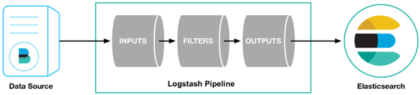

# logstash部署

## logstash介绍

Logstash使用管道方式进行日志的搜集处理和输出。Logstash管道有两个必需的元素，输入和输出，以及一个可选元素过滤器。输入插件从数据源那里消费数据，过滤器插件根据你的期望修改数据，输出插件将数据写入目的地。在logstash中，包括了三个阶段:输入input --> 处理filter（不是必须的） --> 输出output




### 输入

logstash主要支持的数据输入方式为：标准输入、文件输入、TCP输入、syslog输入、http_poller抓取、kafka消息队列输入等。

### 过滤器

数据从源传输到存储库的过程中，Logstash 过滤器能够解析各个事件，识别已命名的字段以构建结构，并将它们转换成通用格式，以便更轻松、更快速地分析和实现商业价值。Logstash 能够动态地转换和解析数据，不受格式或复杂度的影响。

目前，logstash过滤器支持的功能有：date时间处理、GROK正则捕获、dissect解析、GeoIP地址查询、Json编解码、metrics数据修改、splite拆分事件、交叉日志合并等。

### 输出

目前，logstash主要支持的输出方式：输出到Elasticsearch、发送email、调用系统命令执行、保存成文件、报警发送到Nagios、标准输出stdout、TCP发送数据、输出到HDFS。


## 下载安装

下载地址：[https://www.elastic.co/cn/downloads/past-releases](https://www.elastic.co/cn/downloads/past-releases/)

```shell
# 解压
tar -zxvf 
# 重命名
mv
```


## 测试

### 简单测试

新建logstatsh_test.conf

```bash
vim conf/logstash_test.conf
input {
    stdin {
    }
}
output {
    stdout {
    	codec => rubydebug {}
    }
}
```

执行测试

```shell
bin/logstash -f conf/logstash_test.conf
```


### 测试发送到ES

新建logstatsh_es_test.conf

```bash
vim conf/logstatsh_es_testinput{
    stdin{
    }
}
output{
    elasticsearch {
        hosts => ["192.168.111.128:9200","192.168.111.129:9200","192.168.111.130:9200"] 
        index => "logstash_test"
    }
    stdout{
        codec=>rubydebug
    }
}
```

执行测试

```shell
bin/logstash -f conf/logstatsh_es_testinput.conf
```

