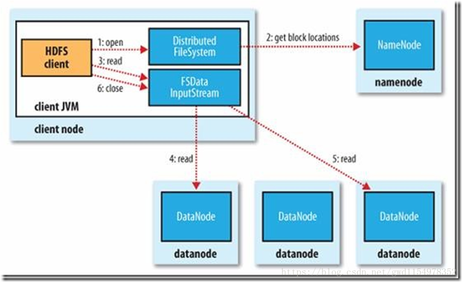
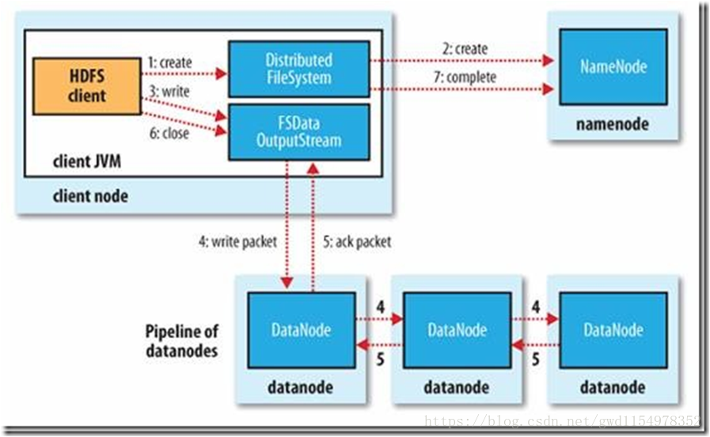

<!-- TOC -->

- [hadoop介绍](#hadoop介绍)
    - [一.hadoop是什么](#一hadoop是什么)
    - [二 .hadoop能干什么](#二-hadoop能干什么)
    - [三.hadoop的核心](#三hadoop的核心)
    - [四.HDFS的架构](#四hdfs的架构)
    - [五.Hadoop的特点](#五hadoop的特点)
    - [六.NameNode](#六namenode)
        - [1.简介](#1简介)
        - [2.NameNode的工作特点](#2namenode的工作特点)
        - [3.什么时候checkpoint](#3什么时候checkpoint)
    - [七.SecondaryNameNode](#七secondarynamenode)
        - [1.简介](#1简介-1)
        - [2.工作流程](#2工作流程)
    - [八.DataNode](#八datanode)
    - [九.HDFS](#九hdfs)
        - [（1）读过程](#1读过程)
        - [（2）写过程](#2写过程)

<!-- /TOC -->
# hadoop介绍

## 一.hadoop是什么

Hadoop被公认是一套行业大数据标准开源软件，在分布式环境下提供了海量数据的处理能力。几乎所有主流厂商都围绕Hadoop开发工具、开源软件、商业化工具和技术服务。今年大型IT公司，如EMC、Microsoft、Intel、Teradata、Cisco都明显增加了Hadoop方面的投入。

 

## 二 .hadoop能干什么

hadoop擅长日志分析，facebook就用Hive来进行日志分析，2009年时facebook就有非编程人员的30%的人使用HiveQL进行数据分析；淘宝搜索中的自定义筛选也使用的Hive；利用Pig还可以做高级的数据处理，包括Twitter、LinkedIn 上用于发现您可能认识的人，可以实现类似Amazon.com的协同过滤的推荐效果。淘宝的商品推荐也是！在Yahoo！的40%的Hadoop作业是用pig运行的，包括垃圾邮件的识别和过滤，还有用户特征建模。（2012年8月25新更新，天猫的推荐系统是hive，少量尝试mahout！）

 

## 三.hadoop的核心

- **HDFS**: Hadoop Distributed File System  分布式文件系统
- **YARN**: Yet Another Resource Negotiator   资源管理调度系统

- **Mapreduce**：分布式运算框架

 

## 四.HDFS的架构

主从结构

    •主节点， namenode
    
    •从节点，有很多个: datanode

namenode负责：

    •接收用户操作请求
    
    •维护文件系统的目录结构
    
    •管理文件与block之间关系，block与datanode之间关系

datanode负责：

    •存储文件
    
    •文件被分成block存储在磁盘上
    
    •为保证数据安全，文件会有多个副本

 

Secondary NameNode负责：

    合并fsimage和edits文件来更新NameNode的metedata

 

## 五.Hadoop的特点

**扩容能力（Scalable）**：能可靠地（reliably）存储和处理千兆字节（PB）数据。

**成本低（Economical）**：可以通过普通机器组成的服务器群来分发以及处理数据。这些服务器群总计可达数千个节点。

**高效率（Efficient）**：通过分发数据，hadoop可以在数据所在的节点上并行地（parallel）处理它们，这使得处理非常的快速。

**可靠性（Reliable）**：hadoop能自动地维护数据的多份副本，并且在任务失败后能自动地重新部署（redeploy）计算任务。

 

## 六.NameNode

### 1.简介

namenode是整个文件系统的管理节点。他维护着整个文件系统的文件目录树，文件/目录的元信息和每个文件对应的数据块列表。接收用户的操作请求。

文件包括：

**fsimage** : 元数据镜像文件。存储某一时段NameNode内存元数据信息。

**edits **: 操作日志文件。

**fstime** : 保存最近一次checkpoint的时间。

 

### 2.NameNode的工作特点

NameNode始终在内存中保存metedata，用于处理“读请求”，到有“写请求”到来时，NameNode首先会写editlog到磁盘，即向edits文件中写日志，成功返回后，才会修改内存，并且向客户端返回。

Hadoop会维护一个人fsimage文件，也就是NameNode中metedata的镜像，但是fsimage不会随时与NameNode内存中的metedata保持一致，而是每隔一段时间通过合并edits文件来更新内容。Secondary NameNode就是用来合并fsimage和edits文件来更新NameNode的metedata的。

 

### 3.什么时候checkpoint

fs.checkpoint.period 指定两次checkpoint的最大时间间隔，默认3600秒。 
fs.checkpoint.size    规定edits文件的最大值，一旦超过这个值则强制checkpoint，不管是否到达最大时间间隔。默认大小是64M。

 

 

## 七.SecondaryNameNode

### 1.简介

HA的一个解决方案。但不支持热备。配置即可。
执行过程：从NameNode上下载元数据信息（fsimage,edits），然后把二者合并，生成新的fsimage，在本地保存，并将其推送到NameNode，替换旧的fsimage.
默认在安装在NameNode节点上，但这样...不安全！

### 2.工作流程

（1）secondary通知namenode切换edits文件；
（2）secondary从namenode获得fsimage和edits(通过http)；
（3）secondary将fsimage载入内存，然后开始合并edits；
（4）secondary将新的fsimage发回给namenode；
（5）namenode用新的fsimage替换旧的fsimage；

 

## 八.DataNode

提供真实文件数据的存储服务。
**文件块（block）**：最基本的存储单位。对于文件内容而言，一个文件的长度大小是size，那么从文件的０偏移开始，按照固定的大小，顺序对文件进行划分并编号，划分好的每一个块称一个Block。HDFS默认Block大小是128MB，以一个256MB文件，共有256/128=2个Block.
dfs.block.size
不同于普通文件系统的是，HDFS中，如果一个文件小于一个数据块的大小，并不占用整个数据块存储空间;
Replication:多复本。默认是三个。

 

## 九.HDFS

### （1）读过程

1.初始化FileSystem，然后客户端(client)用FileSystem的open()函数打开文件

2.FileSystem用RPC调用元数据节点，得到文件的数据块信息，对于每一个数据块，元数据节点返回保存数据块的数据节点的地址。

3.FileSystem返回FSDataInputStream给客户端，用来读取数据，客户端调用stream的read()函数开始读取数据。

4.DFSInputStream连接保存此文件第一个数据块的最近的数据节点，data从数据节点读到客户端(client)

5.当此数据块读取完毕时，DFSInputStream关闭和此数据节点的连接，然后连接此文件下一个数据块的最近的数据节点。

6.当客户端读取完毕数据的时候，调用FSDataInputStream的close函数。

7.在读取数据的过程中，如果客户端在与数据节点通信出现错误，则尝试连接包含此数据块的下一个数据节点。

8.失败的数据节点将被记录，以后不再连接。

 

### （2）写过程

1.初始化FileSystem，客户端调用create()来创建文件

2.FileSystem用RPC调用元数据节点，在文件系统的命名空间中创建一个新的文件，元数据节点首先确定文件原来不存在，并且客户端有创建文件的权限，然后创建新文件。

3.FileSystem返回DFSOutputStream，客户端用于写数据，客户端开始写入数据。

4.DFSOutputStream将数据分成块，写入data queue。data queue由Data Streamer读取，并通知元数据节点分配数据节点，用来存储数据块(每块默认复制3块)。分配的数据节点放在一个pipeline里。Data Streamer将数据块写入pipeline中的第一个数据节点。第一个数据节点将数据块发送给第二个数据节点。第二个数据节点将数据发送给第三个数据节点。

5.DFSOutputStream为发出去的数据块保存了ack queue，等待pipeline中的数据节点告知数据已经写入成功。

6.当客户端结束写入数据，则调用stream的close函数。此操作将所有的数据块写入pipeline中的数据节点，并等待ack queue返回成功。最后通知元数据节点写入完毕。

7.如果数据节点在写入的过程中失败，关闭pipeline，将ack queue中的数据块放入data queue的开始，当前的数据块在已经写入的数据节点中被元数据节点赋予新的标示，则错误节点重启后能够察觉其数据块是过时的，会被删除。失败的数据节点从pipeline中移除，另外的数据块则写入pipeline中的另外两个数据节点。元数据节点则被通知此数据块是复制块数不足，将来会再创建第三份备份。
