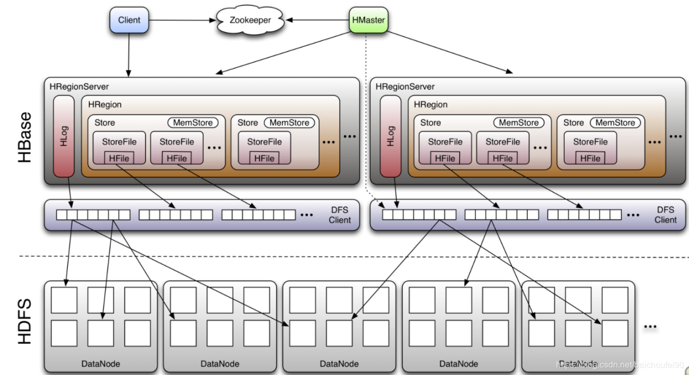
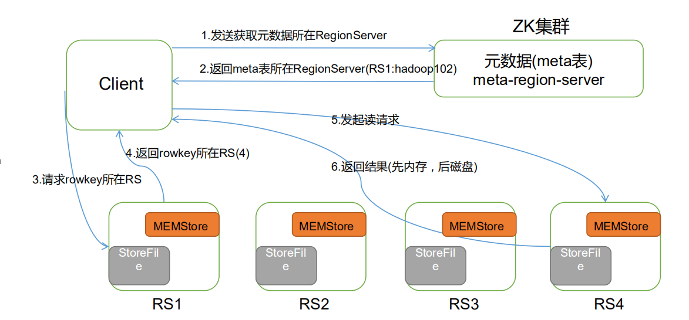
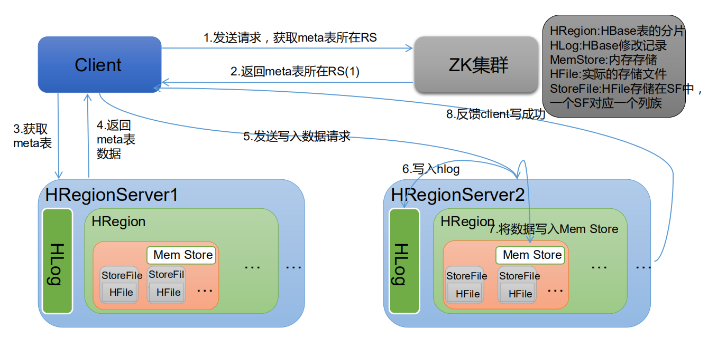

# HBase简介

## 什么是HBase

HBase的原型是Google的BigTable论文，受到了该论文思想的启发，目前作为Hadoop的子项目来开发维护，用于支持结构化的数据存储。

官方网站：http://hbase.apache.org


HBase是一个**高可靠性、高性能、面向列、可伸缩的分布式存储系统**，利用HBASE技术可在廉价PC Server上搭建起大规模结构化存储集群。

HBase的**目标是存储并处理大型的数据**，更具体来说是仅需使用普通的硬件配置，就能够处理由成千上万的行和列所组成的大型数据。


## HBase的特点

**1）海量存储**

Hbase适合存储PB级别的海量数据，在PB级别的数据以及采用廉价PC存储的情况下，能在几十到百毫秒内返回数据。这与Hbase的极易扩展性息息相关。正式因为Hbase良好的扩展性，才为海量数据的存储提供了便利。

**2）列式存储**

这里的列式存储其实说的是列族存储，Hbase是根据列族来存储数据的。列族下面可以有非常多的列，列族在创建表的时候就必须指定。

**3）极易扩展**

Hbase的扩展性主要体现在两个方面，一个是基于上层处理能力（RegionServer）的扩展，一个是基于存储的扩展（HDFS）。
通过横向添加RegionSever的机器，进行水平扩展，提升Hbase上层的处理能力，提升Hbsae服务更多Region的能力。

**4）高并发**

由于目前大部分使用Hbase的架构，都是采用的廉价PC，因此单个IO的延迟其实并不小，一般在几十到上百ms之间。这里说的高并发，主要是在并发的情况下，Hbase的单个IO延迟下降并不多。能获得高并发、低延迟的服务。

**5）稀疏**

稀疏主要是针对Hbase列的灵活性，在列族中，你可以指定任意多的列，在列数据为空的情况下，是不会占用存储空间的。


## HBase架构





从图中可以看出Hbase是由Client、Zookeeper、Master、HRegionServer、HDFS等几个组件组成，下面来介绍一下几个组件的相关功能：

**1) Client**

Client包含了访问Hbase的接口，另外Client还维护了对应的cache来加速Hbase的访问，比如cache .META.元数据的信息, 并连接对应RegionServer进行数据读写。当master rebalance region时，Client会重新进行查找。


**2) Zookeeper**

HBase通过Zookeeper来做master的高可用、RegionServer的监控、元数据的入口以及集群配置的维护等工作。具体工作如下：

通过Zoopkeeper来保证集群中只有1个master在运行，如果master异常，会通过竞争机制产生新的master提供服务

通过Zoopkeeper来监控RegionServer的状态，当RegionSevrer有异常的时候，通过回调的形式通知Master RegionServer上下线的信息

通过Zoopkeeper存储元数据的统一入口地址


**3) HMaster**

master节点的主要职责如下：
为RegionServer分配Region
维护整个集群的负载均衡
维护集群的元数据信息
发现失效的Region，并将失效的Region分配到正常的RegionServer上
当RegionSever失效的时候，协调对应Hlog的拆分


**4) HregionServer**

HregionServer直接对接用户的读写请求，是真正的“干活”的节点。它的功能概括如下：
管理master为其分配的Region
处理来自客户端的读写请求
负责和底层HDFS的交互，存储数据到HDFS
负责Region变大以后的拆分
负责Storefile的合并工作


**5) HDFS**

HDFS为Hbase提供最终的底层数据存储服务，同时为HBase提供高可用（Hlog存储在HDFS）的支持，具体功能概括如下：
提供元数据和表数据的底层分布式存储服务
数据多副本，保证的高可靠和高可用性

- HBase表的HDFS目录结构如下

  ```
  /hbase
      /data
          /<Namespace>                    (集群里的Namespaces)
              /<Table>                    (该集群的Tables)
                  /<Region>               (该table的Regions)
                      /<ColumnFamily>     (该Region的列族)
                          /<StoreFile>    (该列族的StoreFiles)
  ```

- HLog的HDFS目录结构如下

  ```
  /hbase
      /WALs
          /<RegionServer>    (RegionServers)
              /<WAL>         (WAL files for the RegionServer)
  ```


## HBase中的角色

### HMaster

**功能**

1．监控RegionServer

2．处理RegionServer故障转移

3．处理元数据的变更

4．处理region的分配或转移

5．在空闲时间进行数据的负载均衡

6．通过Zookeeper发布自己的位置给客户端

### RegionServer

**功能**

1．负责存储HBase的实际数据

2．处理分配给它的Region

3．刷新缓存到HDFS

4．维护Hlog

5．执行压缩

6．负责处理Region分片


### 其他组件

**1．Write-Ahead logs**

HBase的修改记录，当对HBase读写数据的时候，数据不是直接写进磁盘，它会在内存中保留一段时间（时间以及数据量阈值可以设定）。但把数据保存在内存中可能有更高的概率引起数据丢失，为了解决这个问题，数据会先写在一个叫做Write-Ahead logfile的文件中，然后再写入内存中。所以在系统出现故障的时候，数据可以通过这个日志文件重建。

**2．Region**

Hbase表的分片，HBase表会根据RowKey值被切分成不同的region存储在RegionServer中，在一个RegionServer中可以有多个不同的region。

**3．Store**

HFile存储在Store中，一个Store对应HBase表中的一个列族。

**4．MemStore**

顾名思义，就是内存存储，位于内存中，用来保存当前的数据操作，所以当数据保存在WAL中之后，RegsionServer会在内存中存储键值对。

**5．HFile**

这是在磁盘上保存原始数据的实际的物理文件，是实际的存储文件。StoreFile是以Hfile的形式存储在HDFS的。


## HBase原理

### 读流程



1）Client 先访问 zookeeper，从 meta 表读取 region 的位置，然后读取 meta 表中的数据。meta

中又存储了用户表的 region 信息；

2）根据 namespace、表名和 rowkey 在 meta 表中找到对应的 region 信息；

3）找到这个 region 对应的 regionserver； 

4）查找对应的 region； 

5）先从 MemStore 找数据，如果没有，再到 BlockCache 里面读；

6）BlockCache 还没有，再到 StoreFile 上读(为了读取的效率)； 

7）如果是从 StoreFile 里面读取的数据，不是直接返回给客户端，而是先写入 BlockCache，

再返回给客户端。


### 写流程



1）Client 向 HregionServer 发送写请求；

2）HregionServer 将数据写到 HLog（write ahead log）。为了数据的持久化和恢复；

3）HregionServer 将数据写到内存（MemStore）；

4）反馈 Client 写成功。


### 数据Flush过程

1）当 MemStore 数据达到阈值（默认是 128M，老版本是 64M），将数据刷到硬盘，将内存

中的数据删除，同时删除 HLog 中的历史数据；

2）并将数据存储到 HDFS 中；

3）在 HLog 中做标记点。


### 数据合并过程

1）当数据块达到 4 块，Hmaster 触发合并操作，Region 将数据块加载到本地，进行合并；

2）当合并的数据超过 256M，进行拆分，将拆分后的 Region 分配给不同的 HregionServer

管理；

3）当HregionServer宕机后，将HregionServer上的hlog拆分，然后分配给不同的HregionServer

加载，修改.META.； 

4）注意：HLog 会同步到 HDFS。