# 内存模型

## 1、运行时数据区

Java虚拟机在执行Java程序的过程中会把它管理的内存分为若干个不同的数据区域。这些区域有着各自的用途，一级创建和销毁的时间，有的区域随着虚拟机进程的启动而存在，有些区域则依赖用户线程的启动和结束而建立和销毁。根据《Java虚拟机规范》中规定，jvm所管理的内存大致包括以下几个运行时数据区域，如图所示：

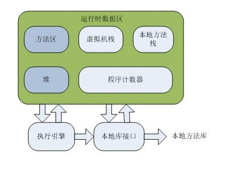

 

图解：

其中置灰部分是跟随虚拟机启动而存在的，线程共享

白色区域则是跟随线程启动而存在，线程私有


### 1.1 程序计数器

占据一块较小的内存空间，可以看做当前线程所执行的字节码的行号指示器。在虚拟机概念模型里，字节码解释器工作时就是通过改变这个计数器的值来选取下一条需要执行的字节码指令，分支，循环，跳转，异常处理，线程恢复等基础功能都需要依赖这个计数器来完成。

　　由于jvm的多线程是通过线程轮流切换并分配处理器执行时间的方式来实现的，在任何一个确定的时刻，一个处理器都只会执行一条线程中的指令。因此未来线程切换后能恢复到正确的执行位置，每条线程都需要有一个独立的程序计数器，各条线程之间计数器互不影响，独立存储，我们成这类内存区域为“线程私有”的内存。

　　如果线程正在执行的是一个Java方法，这个计数器记录的则是正在执行的虚拟机字节码指令的地址；

　　如果正在执行的是Native方法，这个计数器则为空（undefined）。

**此内存区域是唯一一个在Java虚拟机规范中没有规定任何OutOfMemoryError情况的区域**


### 1.2 Java虚拟机栈

线程私有，生命周期和线程相同，虚拟机栈描述的是Java方法执行的内存模型，每个方法在执行的同时都会创建一个栈帧 用于存储局部变量表，操作数栈，动态链接，方法出口等信息。每一个方法从调用直至完成的过程，就对应着一个栈帧在虚拟机栈中入栈到出栈的过程。

局部变量表存放了编译期可知的各种基本类型数据（boolean、byte、char、short、int、float、long、double）、对象引用、returnAddress类型（指向了一条字节码指令的地址）。

其中64位长度的long和double类型的数据会占用2个局部变量表空间（slot），其余的数据类型只占用1个。局部变量表所需的内存空间在编译期完成分配，当进入一个方法时，这个方法所需要在栈帧中分配多大的局部变量空间是完全确定的，在方法运行期间不会改变局部变量表的大小。

在Java虚拟机规范中，对此区域规定了两种异常状况：如果线程请求的栈深度大于虚拟机所允许的深度，将会抛出Stack OverflowError异常；如果虚拟机栈可以动态扩展时无法申请到足够的内存，就会抛出OutOfMemoryError异常。


### 1.3 本地方法栈

本地方法栈与虚拟机栈所发挥的作用非常相似，他们之间的区别不过是虚拟机栈为虚拟机执行Java方法（字节码）服务，而本地方法栈则为虚拟机中使用到的native方法服务。在虚拟机规范中对本地方法栈中方法使用的语言、使用方式与数据结构并没有强制规定，因此具体的虚拟机可以自由实现它。甚至有的虚拟机直接把本地方法栈和虚拟机栈合二为一，与虚拟机栈一样也会抛出Stack OverflowError异常和OutOfMemoryError异常。 


### 1.4 Java堆

对于大多数应用来说，堆空间是jvm内存中最大的一块。Java堆是被所有线程共享，虚拟机启动时创建，此内存区域唯一的目的就是存放对象实例，几乎所有的对象实例都在这里分配内存。这一点在Java虚拟机规范中的描述是：所有的对象实例以及数组都要在堆上分配，但是随着JIT编译器的发展和逃逸分析技术逐渐成熟，栈上分配，标量替换优化技术将会导致一些微妙的变化发生，所有的对象都分配在堆上也就变得不那么绝对了。

Java堆是垃圾收集器管理的主要区域，因此很多时候也被称为“GC堆”。从内存回收角度看，由于现在收集器基本都采用分代收集算法，所以Java堆还可以细分为：新生代和老年代；再细致一点的有Eden空间，From Survivor空间，To Survivor空间等。从内存分配的角度来看，线程共享的Java堆中可能划分出多个线程私有的分配缓冲区。不过无论如何划分，都与存放内容无关，无论哪个区域，存储的都仍然是对象实例，进一步划分的目的是为了更好的回收内存，或者更快的分配内存。（如果在堆中没有内存完成实例分配，并且堆也无法再扩展时，将会抛出OutOfMemoryError异常。）


### 1.5 方法区（也有人叫永久代）

和堆一样所有线程共享，主要用于存储已被jvm加载的类信息、常量、静态变量、即时编译器编译后的代码等数据。

（在JDK1.7发布的HotSpot中，已经把字符串常量池移除方法区了。）


### 1.6 常量池

运行时常量池是方法区的一部分。Class文件中除了有类的版本、字段、方法、接口等描述信息外，还有一项信息是常量池，用于存放编译期生成的各种字面量和符号引用，这部分内容将在类加载后进入方法区的运行时常量池中存放。

Java虚拟机对class文件每一部分的格式都有严格规定，每一个字节用于存储哪种数据都必须符合规范才会被jvm认可。但对于运行时常量池，Java虚拟机规范没做任何细节要求。

运行时常量池有个重要特性是动态性，Java语言不要求常量一定只在编译期才能产生，也就是并非预置入class文件中常量池的内容才能进入方法区的运行时常量池，运行期间也有可能将新的常量放入池中，这种特性使用最多的是String类的intern()方法。

既然运行时常量池是方法区的一部分，自然受到方法区内存的限制。当常量池无法再申请到内存时会抛出outOfMemeryError异常。


## 2、对象的创建

### 2.1 当虚拟机遇到一条New指令时：会进行如下步骤

1、检查指令的参数（即工作中我们New的对象），能否在常量池中找到它的符号引用。

2、如果存在，检查符号引用代表的类是否被加载、解析、初始化过。（如果没有则执行类的加载-----相关加载过程参考《[Jvm类的加载机制](https://www.cnblogs.com/chenpt/p/9777367.html)》）。

3、加载通过后，虚拟机将为新生对象分配内存。（所需内存大小在类加载完成后便可确定）


### 2.2 两种内存分配的方式

　　**指针碰撞**：假设Java堆中的内存是绝对规整的，所有用过的内存都放在一边，空闲的内存放在另一边。中间放着一个指针作为分界点的指示器，分配内存就仅仅是把指针往空闲空间那边挪动一段与对象大小相等的距离。这种方式则属于指针碰撞。

　　**空闲列表**：如果堆中的内存并不是规整的，已使用的内存和空闲内存相互交错，显然无法使用指针碰撞。虚拟机就必须维护一个列表，记录哪些内存是可用的，在分配的时候从列表中找到一块足够大的空间划分给对象实例，并更新记录表上的数据。这种方式属于空闲列表。

具体选择哪种分配方式由Java堆决定，而Java堆是否规整，则有GC收集器决定。因此使用Serial、ParNew等带Compact过程的收集器时，系统采用的分配算法是指针碰撞。而使用CMS这种基于Mark-Sweep算法的收集器时，通常采用的空闲列表。


### 2.3 如何保证分配内存时线程的安全性？

1. 对分配内存的动作进行同步处理（实际上虚拟机采用CAS配上失败重试的机制保证了更新操作的原子性）
2. 把分配内存的动作按照线程划分在不同的空间之中进行（即每个线程在Java堆中预先分配一小块内存（称为本地线程分配缓冲））。


## 3、 对象的内存布局 

在HotSpot虚拟机中对象的内存布局可以分为3块区域：对象头（Header）、实例数据（Instance Data）、对齐填充（Padding）

### 3.1 **对象头包括两部分信息**

1. 存储对象自身的运行时数据（如：哈希码、GC分代年龄、锁 等）
2. 类型指针（即对象指向他的类元数据的指针，虚拟机根据此指针来确认对象属于哪个类的实例）

### 3.2 **实例数据**

　　实例数据才是对象真正存贮的有效信息（即程序中所定义的各种类型的字段内容）。

### 3.3 **对齐填充**

　　不是必然存在的，仅仅起到占位符的作用。


## 4、 对象的访问定位

创建对象就是为了在程序中使用，我们的Java程序需要通过栈上的reference数据来操作堆上的具体对象。

### 4.1 对象的访问方式

#### 4.1.1 **句柄访问**

Java堆中划分出一块内存来作为句柄池，reference中存储的就是对象的句柄地址，句柄中包含了对象实例数据与类型数据各自的具体地址信息。

**优点**：reference中存储句柄地址是稳定的。在对象被移动时只会改变句柄中的实例数据指针，而reference本身不需要修改。

句柄访问图示：

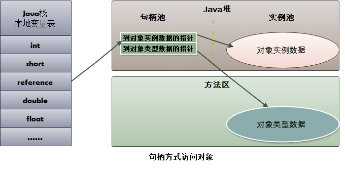

#### 4.1.2 **指针访问**

​	reference中存储的直接就是对象地址。

**优点**：速度快，节省了指针定位的时间成本。

指针访问图示：

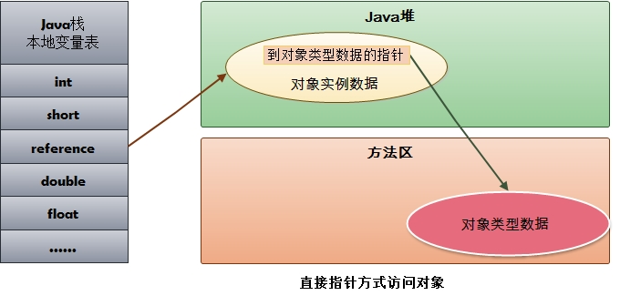


# 基础篇

程序计数器、虚拟机栈、本地方法栈，3个区域随着线程的生存而生存的。内存分配和回收都是确定的。随着线程的结束内存自然就被回收了，因此不需要考虑垃圾回收的问题。而Java堆和方法区则不一样，各线程共享，内存的分配和回收都是动态的。因此垃圾收集器所关注的都是这部分内存。 

接下来我们就讨论Jvm是怎么回收这部分内存的。在进行回收前垃圾收集器第一件事情就是确定哪些对象还存活，哪些已经死去。下面介绍两种基础的回收算法。 

## 1、回收算法

### 1.1 引用计数算法

给对象添加一个引用计数器，每当有一个地方引用它时计数器就+1，当引用失效时计数器就-1,。只要计数器等于0的对象就是不可能再被使用的。

　　此算法在大部分情况下都是一个不错的选择，也有一些著名的应用案例。但是Java虚拟机中是没有使用的。

　　**优点**：实现简单、判断效率高。

　　**缺点**：很难解决对象之间循环引用的问题。例如下面这个例子

```java
Object a = new Object();
Object b = new Object();
a=b;
b=a;
a=b=null;
//这样就导致gc无法回收他们。　`
```

### 1.2 可达性分析算法

　　通过一系列的称为“GC Roots”的对象作为起始点，从这些节点开始向下搜索，搜索所走过的路径称为引用链，当一个对象到GC Roots没有使用任何引用链时，则说明该对象是不可用的。

　　主流的商用程序语言（Java、C#等）在主流的实现中，都是通过可达性分析来判定对象是否存活的。

　　通过下图来清晰的感受gc root与对象展示的联系。所示灰色区域对象是存活的，Object5/6/7均是可回收的对象

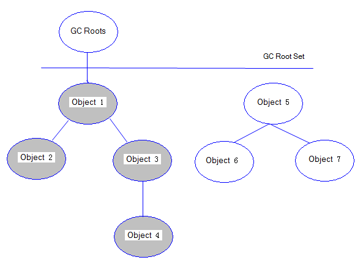 

　**在Java语言中，可作为GC Roots 的对象包括下面几种**

- 虚拟机栈（栈帧中的本地变量表）中引用的对象
- 方法区中静态变量引用的对象
- 方法区中常量引用的对象
- 本地方法栈（即一般说的 Native 方法）中JNI引用的对象

　**优点**：更加精确和严谨，可以分析出循环数据结构相互引用的情况；

　**缺点**：实现比较复杂、需要分析大量数据，消耗大量时间、分析过程需要GC停顿（引用关系不能发生变化），即停顿所有Java执行线程（称为"Stop The World"，是垃圾回收重点关注的问题）。


## 2、引用

　在jdk1.2之后，Java对引用的概念进行了扩充，总体分为4类：强引用、软引用、弱引用、虚引用，这4中引用强度依次逐渐减弱。

- **强引用**：指在代码中普遍存在的，类似 Object obj = new Object(); 这类的引用，只有强引用还存在，GC就永远不会收集被引用的对象。
- **软引用**：指一些还有用但并非必须的对象。直到内存空间不够时（抛出OutOfMemoryError之前），才会被垃圾回收。采用SoftReference类来实现软引用
- **弱引用**：用来描述非必须对象。当垃圾收集器工作时就会回收掉此类对象。采用WeakReference类来实现弱引用。
- **虚引用**：一个对象是否有虚引用的存在，完全不会对其生存时间构成影响， 唯一目的就是能在这个对象被回收时收到一个系统通知， 采用PhantomRenference类实现


## 3、判断一个对象生存还是死亡

宣告一个对象死亡，至少要经历两次标记。

### **3.1 第一次标记**

　　如果对象进行可达性分析算法之后没发现与GC Roots相连的引用链，那它将会第一次标记并且进行一次筛选。

　　**筛选条件**：判断此对象是否有必要执行finalize()方法。

　　**筛选结果**：当对象没有覆盖finalize()方法、或者finalize()方法已经被JVM执行过，则判定为可回收对象。如果对象有必要执行finalize()方法，则被放入F-Queue队列中。稍后在JVM自动建立、低优先级的Finalizer线程（可能多个线程）中触发这个方法；　　

### 3.2 第二次标记

　　GC对F-Queue队列中的对象进行二次标记。

　　如果对象在finalize()方法中重新与引用链上的任何一个对象建立了关联，那么二次标记时则会将它移出“即将回收”集合。如果此时对象还没成功逃脱，那么只能被回收了。

### 3.3 finalize() 方法

　　finalize()是Object类的一个方法、一个对象的finalize()方法只会被系统自动调用一次，经过finalize()方法逃脱死亡的对象，第二次不会再调用；

　　特别说明：并不提倡在程序中调用finalize()来进行自救。建议忘掉Java程序中该方法的存在。因为它执行的时间不确定，甚至是否被执行也不确定（Java程序的不正常退出），而且运行代价高昂，无法保证各个对象的调用顺序（甚至有不同线程中调用）。


## 4、回收方法区　　

　　永久代的垃圾收集主要分为两部分内容：废弃常量和无用的类。

### 4.1 回收废弃常量

　　回收废弃常量与Java堆的回收类似。下面举个栗子说明

　　假如一个字符串“abc” 已经进入常量池中，但当前系统没有一个string对象是叫做abc的，也就是说，没有任何string对象的引用指向常量池中的abc常量，也没用其他地方引用这个字面量。如果这是发生内存回收，那么这个常量abc将会被清理出常量池。常量池中的其他类（接口）、方法、字段的符号引用也与此类似。

### 4.2 回收无用的类

　　需要同时满足下面3个条件的才能算是无用的类。

1. 该类所有的实例都已经被回收，也就是Java堆中无任何改类的实例。
2. 加载该类的ClassLoader已经被回收。
3. 该类对应的java.lang.Class对象没有在任何地方被引用，无法在任何地方通过反射访问该类的方法

　　虚拟机可以对同时满足这三个条件的类进行回收，但不是必须进行回收的。是否对类进行回收，HotSpot虚拟机提供了-Xnoclassgc参数进行控制。


# 算法篇

## 一：标记-清除算法

　　最基础的收集算法，总共分为‘ 标记 ’和‘ 清除 ’两个阶段

### 1.标记

　　标记出所有需要回收的对象

　　**一次标记**：在经过可达性分析算法后，对象没有与GC Root相关的引用链，那么则被第一次标记。并且进行一次筛选：当对象有必要执行finalize()方法时，则把该对象放入F-Queue队列中。

　　**二次标记**：对F-Queue队列中的对象进行二次标记。在执行finalize()方法时，如果对象重新与GC Root引用链上的任意对象建立了关联，则把他移除出“ 即将回收 ”集合。否则就等着被回收吧！！！

　　对被第一次标记切被第二次标记的，就可以判定位可回收对象了。

### 2.清除

　　两次标记后，还在“ 即将回收 ”集合的对象进行回收。

　　执行过程如下：

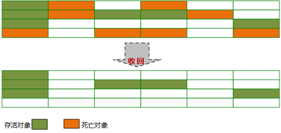

　　**优点**：基础最基础的可达性算法，后续的收集算法都是基于这种思想实现的

　　**缺点**：标记和清除效率不高，产生大量不连续的内存碎片，导致创建大对象时找不到连续的空间，不得不提前触发另一次的垃圾回收。

## 二：复制算法

　　将可用内存按容量分为大小相等的两块，每次只使用其中一块，当这一块的内存用完了，就将还存活的对象复制到另外一块内存上，然后再把已使用过的内存空间一次清理掉。

　　复制算法执行过程如下：


　　**优点**：实现简单，效率高。解决了标记-清除算法导致的内存碎片问题。

　　**缺点**：代价太大，将内存缩小了一半。效率随对象的存活率升高而降低。

 现在的商业虚拟机都采用这种算法（需要改良1:1的缺点）来回收新生代


### 1 HotSpot虚拟机的改良算法　

#### 	弱代理论　

　　分代垃圾收集基于弱代理论。具体描述如下：

- 大多说分配了内存的对象并不会存活太长时间，在处于年轻时代就会死掉。
- 很少有对象会从老年代变成年轻代。

 　其中IBM研究表明：新生代中98%的对象都是"朝生夕死"； 所以并不需要按1:1比例来划分内存（解决了缺点1）；

###  2 Hotspot虚拟机新生代内存布局及算法

　　新生代内存分配一块较大的Eden空间和两块较小的Survivor空间

　　每次使用Eden和其中一块Survivor空间

　　回收时将Eden和Survivor空间中存活的对象一次性复制到另一块Survivor空间上

　　最后清理掉Eden和使用过的Survivor空间。

​		Hotspot虚拟机默认Eden和Survivor的大小比例是8:1。

#### 	分配担保

　　如果另一块Survivor空间没有足够内存来存放上一次新生代收集下来的存活对象，那么这些对象则直接通过担保机制进入老年代。


## 三：标记-整理算法

　　标记-整理算法是根据老年代的特点应运而生。

### 1 标记

　　标记过程和标记-清理算法一致（也是基于可达性分析算法）。

### 2 整理

　　和标记-清理不同的是，该算法不是针对可回收对象进行清理，而是根据存活对象进行整理。让存活对象都向一端移动，然后直接清理掉边界以外的内存。

​	 标记-整理算法示意图

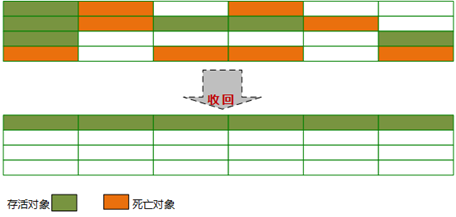

　　**优点**：不会像复制算法那样随着存活对象的升高而降低效率，不像标记-清除算法那样产生不连续的内存碎片

　　**缺点**：效率问题，除了像标记-清除算法的标记过程外，还多了一步整理过程，效率更低。


## 四：分代收集算法

### 1、为什么要对堆内存分代

​     我们先来屡屡，为什么需要把堆分代？不分代不能完成他所做的事情么？其实不分代完全可以，分代的唯一理由就是优化GC性能。你先想想，如果没有分代，那我们所有的对象都在一块，GC的时候我们要找到哪些对象没用，这样就会对堆的所有区域进行扫描。而我们的很多对象都是朝生夕死的，如果分代的话，我们把新创建的对象放到某一地方，当GC的时候先把这块存“朝生夕死”对象的区域进行回收，这样就会腾出很大的空间出来。

### 2、年轻代

​    HotSpot JVM把年轻代分为了三部分：1个Eden区和2个Survivor区（分别叫from和to）。默认比例为8：1,为啥默认会是这个比例，接下来我们会聊到。一般情况下，新创建的对象都会被分配到Eden区(一些大对象特殊处理),这些对象经过第一次Minor GC后，如果仍然存活，将会被移到Survivor区。对象在Survivor区中每熬过一次Minor GC（young GC），年龄就会增加1岁，当它的年龄增加到一定程度（15岁）时，就会被移动到年老代中。

 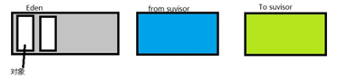 

    因为年轻代中的对象基本都是朝生夕死的(80%以上)，所以在年轻代的垃圾回收算法使用的是复制整理算法，复制整理算法的基本思想就是将内存分为两块，每次只用其中一块，当这一块内存用完，就将还活着的对象复制到另外一块上面。

#### 复制整理算法

优点：不会产生内存碎片。
缺点：（1）会开辟新的空间也就是 To survivor，用来保存有用对象（2）复制对象会花费一些时间
    在GC开始的时候，对象只会存在于Eden区和名为“From”的Survivor区，Survivor区“To”是空的。紧接着进行GC，Eden区中所有存活的对象都会被复制到“To”，而在“From”区中，仍存活的对象会根据他们的年龄值来决定去向。年龄达到一定值(年龄阈值，可以通过-XX:MaxTenuringThreshold来设置)的对象会被移动到年老代中，没有达到阈值的对象会被复制到“To”区域。经过这次GC后，Eden区和From区已经被清空。这个时候，“From”和“To”会交换他们的角色，也就是新的“To”就是上次GC前的“From”，新的“From”就是上次GC前的“To”。不管怎样，都会保证名为To的Survivor区域是空的。Minor GC会一直重复这样的过程，直到“To”区被填满，“To”区被填满之后，会将所有对象移动到年老代中。 

 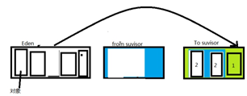 

### 3、老年代

 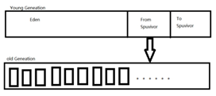 

当年轻带随着不断地Minor GC ，from survivor中的对象会不断成长，当from survivor中的对象成长大15岁的时候，就会进入老年代，随着Minor GC的持续进行，老年代中对象也会持续增长，最终老年代的空间也会不够用，此时就会执行老年代的GC-->Major GC。Major GC使用的算法是标记清除算法或者标记-压缩算法。

**标记清除**：

（1）首先会去根对象的集合中进行遍历，发现对象还存在引用，就是存活的对象并打上一个存活的标记

（2）再去根对象集合进行二次遍历，将没有被打上标记的对象清除掉。（将所有对象扫描2次比较消耗时间）

**优点**：能够进入老年代的对象，一般都相对稳定，所有被回收的数量较少，减少对磁盘的清理，如果采用复制整理算法，被复制的对象会有很多。

**缺点**：虽然垃圾得到了回收，但是回收以后，堆内存中出现了不连续的现状---内存碎片，导致大对象无法创建

**标记压缩**：和标记清除算法基本相同，唯一不同的就是，在清除完成之后，会把存活的对象向内存的一边进行压缩，这样就可以解决内存碎片问题。 


​                   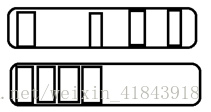 

### 4、有关年轻代的配置参数

**1) -XX:NewSize和-XX:MaxNewSize**

   用于设置年轻代的大小，建议设为整个堆大小的1/3或者1/4,两个值设为一样大。

**2) -XX:SurvivorRatio**

   用于设置Eden和其中一个Survivor的比值，这个值也比较重要。

**3) -XX:+PrintTenuringDistribution**

   这个参数用于显示每次Minor GC时Survivor区中各个年龄段的对象的大小。

**4) -XX:InitialTenuringThreshol和-XX:MaxTenuringThreshold**

   用于设置晋升到老年代的对象年龄的最小值和最大值，每个对象在坚持过一次Minor GC之后，年龄就加1。


# 终结篇

接下来我们重点研究Jvm的垃圾收集器（serial收集器、parnew收集器、parallel scavenge收集器、serial old 收集器、parallel old收集器、cms收集器、g1收集器）

**正式进入前先看下图解HotSpot虚拟机所包含的收集器：**


图中展示了7种作用于不同分代的收集器，如果两个收集器之间存在连线，则说明它们可以搭配使用。虚拟机所处的区域则表示它是属于新生代还是老年代收集器。

**新生代收集器**：Serial、ParNew、Parallel Scavenge

**老年代收集器**：CMS、Serial Old、Parallel Old

**整堆收集器**： G1


### 几个相关概念：

**并行收集**：指多条垃圾收集线程并行工作，但此时用户线程仍处于等待状态。

**并发收集**：指用户线程与垃圾收集线程同时工作（不一定是并行的可能会交替执行）。用户程序在继续运行，而垃圾收集程序运行在另一个CPU上。

**吞吐量**：即CPU用于运行用户代码的时间与CPU总消耗时间的比值（吞吐量 = 运行用户代码时间 / ( 运行用户代码时间 + 垃圾收集时间 )）。例如：虚拟机共运行100分钟，垃圾收集器花掉1分钟，那么吞吐量就是99%


## 一：Serial 收集器

Serial收集器是最基本的、发展历史最悠久的收集器。

**特点：**单线程、简单高效（与其他收集器的单线程相比），对于限定单个CPU的环境来说，Serial收集器由于没有线程交互的开销，专心做垃圾收集自然可以获得最高的单线程手机效率。收集器进行垃圾回收时，必须暂停其他所有的工作线程，直到它结束（Stop The World）。

**应用场景**：适用于Client模式下的虚拟机。

**Serial / Serial Old收集器运行示意图**

**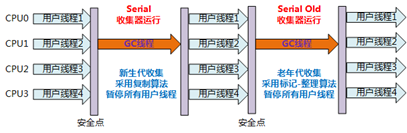**

 

## 二：ParNew收集器

ParNew收集器其实就是Serial收集器的多线程版本。

除了使用多线程外其余行为均和Serial收集器一模一样（参数控制、收集算法、Stop The World、对象分配规则、回收策略等）。

**特点**：多线程、ParNew收集器默认开启的收集线程数与CPU的数量相同，在CPU非常多的环境中，可以使用-XX:ParallelGCThreads参数来限制垃圾收集的线程数。

　　　和Serial收集器一样存在Stop The World问题

**应用场景**：ParNew收集器是许多运行在Server模式下的虚拟机中首选的新生代收集器，因为它是除了Serial收集器外，唯一一个能与CMS收集器配合工作的。

**ParNew/Serial Old组合收集器运行示意图如下：**

 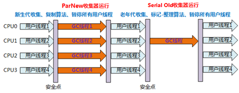

 

## 三：Parallel Scavenge 收集器

与吞吐量关系密切，故也称为吞吐量优先收集器。

**特点**：属于新生代收集器也是采用复制算法的收集器，又是并行的多线程收集器（与ParNew收集器类似）。

该收集器的目标是达到一个可控制的吞吐量。还有一个值得关注的点是：GC自适应调节策略（与ParNew收集器最重要的一个区别）

**GC自适应调节策略**：Parallel Scavenge收集器可设置-XX:+UseAdptiveSizePolicy参数。当开关打开时不需要手动指定新生代的大小（-Xmn）、Eden与Survivor区的比例（-XX:SurvivorRation）、晋升老年代的对象年龄（-XX:PretenureSizeThreshold）等，虚拟机会根据系统的运行状况收集性能监控信息，动态设置这些参数以提供最优的停顿时间和最高的吞吐量，这种调节方式称为GC的自适应调节策略。

Parallel Scavenge收集器使用两个参数控制吞吐量：

- XX:MaxGCPauseMillis 控制最大的垃圾收集停顿时间
- XX:GCRatio 直接设置吞吐量的大小。

## 四：Serial Old 收集器

Serial Old是Serial收集器的老年代版本。

**特点**：同样是单线程收集器，采用标记-整理算法。

**应用场景**：主要也是使用在Client模式下的虚拟机中。也可在Server模式下使用。

Server模式下主要的两大用途（在后续中详细讲解···）：

1. 在JDK1.5以及以前的版本中与Parallel Scavenge收集器搭配使用。
2. 作为CMS收集器的后备方案，在并发收集Concurent Mode Failure时使用。

Serial / Serial Old收集器工作过程图（Serial收集器图示相同）：

****

## **五：Parallel Old 收集器**

是Parallel Scavenge收集器的老年代版本。

**特点**：多线程，采用标记-整理算法。

**应用场景**：注重高吞吐量以及CPU资源敏感的场合，都可以优先考虑Parallel Scavenge+Parallel Old 收集器。

**Parallel Scavenge/Parallel Old收集器工作过程图：**

****

## 六：CMS收集器

一种以获取最短回收停顿时间为目标的收集器。

**特点**：基于标记-清除算法实现。并发收集、低停顿。

**应用场景**：适用于注重服务的响应速度，希望系统停顿时间最短，给用户带来更好的体验等场景下。如web程序、b/s服务。

**CMS收集器的运行过程分为下列4步：**

**初始标记**：标记GC Roots能直接到的对象。速度很快但是仍存在Stop The World问题。

**并发标记**：进行GC Roots Tracing 的过程，找出存活对象且用户线程可并发执行。

**重新标记**：为了修正并发标记期间因用户程序继续运行而导致标记产生变动的那一部分对象的标记记录。仍然存在Stop The World问题。

**并发清除**：对标记的对象进行清除回收。

 CMS收集器的内存回收过程是与用户线程一起并发执行的。

 CMS收集器的工作过程图：


CMS收集器的缺点：

- 对CPU资源非常敏感。
- 无法处理浮动垃圾，可能出现Concurrent Model Failure失败而导致另一次Full GC的产生。
- 因为采用标记-清除算法所以会存在空间碎片的问题，导致大对象无法分配空间，不得不提前触发一次Full GC。

## 七：G1收集器

一款面向服务端应用的垃圾收集器。

**特点如下：**

并行与并发：G1能充分利用多CPU、多核环境下的硬件优势，使用多个CPU来缩短Stop-The-World停顿时间。部分收集器原本需要停顿Java线程来执行GC动作，G1收集器仍然可以通过并发的方式让Java程序继续运行。

分代收集：G1能够独自管理整个Java堆，并且采用不同的方式去处理新创建的对象和已经存活了一段时间、熬过多次GC的旧对象以获取更好的收集效果。

空间整合：G1运作期间不会产生空间碎片，收集后能提供规整的可用内存。

可预测的停顿：G1除了追求低停顿外，还能建立可预测的停顿时间模型。能让使用者明确指定在一个长度为M毫秒的时间段内，消耗在垃圾收集上的时间不得超过N毫秒。

**G1为什么能建立可预测的停顿时间模型？**

因为它有计划的避免在整个Java堆中进行全区域的垃圾收集。G1跟踪各个Region里面的垃圾堆积的大小，在后台维护一个优先列表，每次根据允许的收集时间，优先回收价值最大的Region。这样就保证了在有限的时间内可以获取尽可能高的收集效率。

**G1与其他收集器的区别**：

其他收集器的工作范围是整个新生代或者老年代、G1收集器的工作范围是整个Java堆。在使用G1收集器时，它将整个Java堆划分为多个大小相等的独立区域（Region）。虽然也保留了新生代、老年代的概念，但新生代和老年代不再是相互隔离的，他们都是一部分Region（不需要连续）的集合。

**G1收集器存在的问题：**

Region不可能是孤立的，分配在Region中的对象可以与Java堆中的任意对象发生引用关系。在采用可达性分析算法来判断对象是否存活时，得扫描整个Java堆才能保证准确性。其他收集器也存在这种问题（G1更加突出而已）。会导致Minor GC效率下降。

**G1收集器是如何解决上述问题的？**

采用Remembered Set来避免整堆扫描。G1中每个Region都有一个与之对应的Remembered Set，虚拟机发现程序在对Reference类型进行写操作时，会产生一个Write Barrier暂时中断写操作，检查Reference引用对象是否处于多个Region中（即检查老年代中是否引用了新生代中的对象），如果是，便通过CardTable把相关引用信息记录到被引用对象所属的Region的Remembered Set中。当进行内存回收时，在GC根节点的枚举范围中加入Remembered Set即可保证不对全堆进行扫描也不会有遗漏。

**如果不计算维护 Remembered Set 的操作，G1收集器大致可分为如下步骤：**

**初始标记**：仅标记GC Roots能直接到的对象，并且修改TAMS（Next Top at Mark Start）的值，让下一阶段用户程序并发运行时，能在正确可用的Region中创建新对象。（需要线程停顿，但耗时很短。）

**并发标记**：从GC Roots开始对堆中对象进行可达性分析，找出存活对象。（耗时较长，但可与用户程序并发执行）

**最终标记**：为了修正在并发标记期间因用户程序执行而导致标记产生变化的那一部分标记记录。且对象的变化记录在线程Remembered Set Logs里面，把Remembered Set Logs里面的数据合并到Remembered Set中。（需要线程停顿，但可并行执行。）

**筛选回收**：对各个Region的回收价值和成本进行排序，根据用户所期望的GC停顿时间来制定回收计划。（可并发执行）

**G1收集器运行示意图：**


# 调优篇


## 一：调优步骤

### 1.  监控GC的状态

使用各种JVM工具，查看当前日志，分析当前JVM参数设置，并且分析当前堆内存快照和gc日志，根据实际的各区域内存划分和GC执行时间，觉得是否进行优化。
举一个例子： 系统崩溃前的一些现象：

每次垃圾回收的时间越来越长，由之前的10ms延长到50ms左右，FullGC的时间也有之前的0.5s延长到4、5s
FullGC的次数越来越多，最频繁时隔不到1分钟就进行一次FullGC
年老代的内存越来越大并且每次FullGC后年老代没有内存被释放
之后系统会无法响应新的请求，逐渐到达OutOfMemoryError的临界值，这个时候就需要分析JVM内存快照dump。


### 2. 生成堆的dump文件

通过JMX的MBean生成当前的堆（Heap）信息，大小为一个3G（整个堆的大小）的hprof文件，如果没有启动JMX可以通过Java的jmap命令来生成该文件。 


### 3. 分析dump文件

打开这个3G的堆信息文件，显然一般的Window系统没有这么大的内存，必须借助高配置的Linux，几种工具打开该文件：	Visual VM
、IBM HeapAnalyzer、JDK 自带的Hprof工具、Mat(Eclipse专门的静态内存分析工具)推荐使用。
 注：文件太大，建议使用Eclipse专门的静态内存分析工具Mat打开分析。


### 4. 分析结果，判断是否需要优化

如果各项参数设置合理，系统没有超时日志出现，GC频率不高，GC耗时不高，那么没有必要进行GC优化，如果GC时间超过1-3秒，或者频繁GC，则必须优化。
　　 注：如果满足下面的指标，则一般不需要进行GC：

Minor GC执行时间不到50ms；
Minor GC执行不频繁，约10秒一次；
Full GC执行时间不到1s；
Full GC执行频率不算频繁，不低于10分钟1次


### 5. 调整GC类型和内存分配

如果内存分配过大或过小，或者采用的GC收集器比较慢，则应该优先调整这些参数，并且先找1台或几台机器进行beta，然后比较优化过的机器和没有优化的机器的性能对比，并有针对性的做出最后选择 。


### 6. 不断分析和调整

 通过不断的试验和试错，分析并找到最合适的参数，如果找到了最合适的参数，则将这些参数应用到所有服务器。
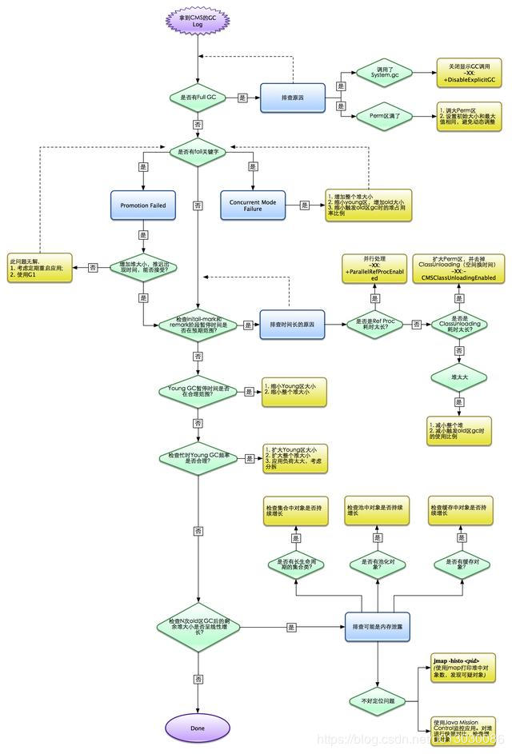 


### 7. 调优实例

实例1：

部分开发测试机器出现异常：java.lang.OutOfMemoryError: GC overhead limit exceeded，这个异常代表：

GC为了释放很小的空间却耗费了太多的时间，其原因一般有两个：1，堆太小，2，有死循环或大对象；

笔者首先排除了第2个原因，因为这个应用同时是在线上运行的，如果有问题，早就挂了。所以怀疑是这台机器中堆设置太小；

使用ps -ef |grep "java"查看，发现：

   


该应用的堆区设置只有768m，而机器内存有2g，机器上只跑这一个java应用，没有其他需要占用内存的地方。另外，这个应用比较大，需要占用的内存也比较多；

通过上面的情况判断，只需要改变堆中各区域的大小设置即可，于是改成下面的情况：

  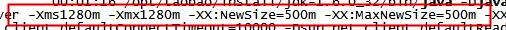 

跟踪运行情况发现，相关异常没有再出现；

 

实例2：

一个服务系统，经常出现卡顿，分析原因，发现Full GC时间太长：

jstat -gcutil:

S0     S1    E     O       P        YGC YGCT FGC FGCT  GCT

12.16 0.00 5.18 63.78 20.32  54   2.047 5     6.946  8.993 

分析上面的数据，发现Young GC执行了54次，耗时2.047秒，每次Young GC耗时37ms，在正常范围，而Full GC执行了5次，耗时6.946秒，每次平均1.389s，数据显示出来的问题是：Full GC耗时较长，分析该系统的是指发现，NewRatio=9，也就是说，新生代和老生代大小之比为1:9，这就是问题的原因：

1，新生代太小，导致对象提前进入老年代，触发老年代发生Full GC；

2，老年代较大，进行Full GC时耗时较大；

优化的方法是调整NewRatio的值，调整到4，发现Full GC没有再发生，只有Young GC在执行。这就是把对象控制在新生代就清理掉，没有进入老年代（这种做法对一些应用是很有用的，但并不是对所有应用都要这么做）

 

实例3：

一应用在性能测试过程中，发现内存占用率很高，Full GC频繁，使用sudo -u admin -H  jmap -dump:format=b,file=文件名.hprof pid 来dump内存，生成dump文件，并使用Eclipse下的mat差距进行分析，发现：

  


从图中可以看出，这个线程存在问题，队列LinkedBlockingQueue所引用的大量对象并未释放，导致整个线程占用内存高达378m，此时通知开发人员进行代码优化，将相关对象释放掉即可


## 二：JVM调优参数参考

针对JVM堆的设置，一般可以通过-Xms -Xmx限定其最小、最大值，为了防止垃圾收集器在最小、最大之间收缩堆而产生额外的时间，通常把最大、最小设置为相同的值;
年轻代和年老代将根据默认的比例（1：2）分配堆内存， 可以通过调整二者之间的比率NewRadio来调整二者之间的大小，也可以针对回收代。比如年轻代，通过 -XX:newSize -XX:MaxNewSize来设置其绝对大小。同样，为了防止年轻代的堆收缩，我们通常会把-XX:newSize -XX:MaxNewSize设置为同样大小。

**年轻代和年老代设置多大才算合理**
更大的年轻代必然导致更小的年老代，大的年轻代会延长普通GC的周期，但会增加每次GC的耗时；小的年老代会导致更频繁的Full GC

更小的年轻代必然导致更大年老代，小的年轻代会导致普通GC很频繁，但每次的GC时间会更短；大的年老代会减少Full GC的频率

**如何选择应该依赖应用程序对象生命周期的分布情况** 

如果应用存在大量的临时对象，应该选择更大的年轻代；如果存在相对较多的持久对象，年老代应该适当增大。但很多应用都没有这样明显的特性。
　　 在抉择时应该根据以下两点：
	（1）本着Full GC尽量少的原则，让年老代尽量缓存常用对象，JVM的默认比例1：2也是这个道理 。
    （2）通过观察应用一段时间，看其他在峰值时年老代会占多少内存，在不影响Full GC的前提下，根据实际情况加大年轻代，比如可以把比例控制在1：1。但应该给年老代至少预留1/3的增长空间。
在配置较好的机器上（比如多核、大内存），可以为年老代选择并行收集算法： -XX:+UseParallelOldGC 。
线程堆栈的设置：每个线程默认会开启1M的堆栈，用于存放栈帧、调用参数、局部变量等，对大多数应用而言这个默认值太了，一般256K就足用。
　　 理论上，在内存不变的情况下，减少每个线程的堆栈，可以产生更多的线程，但这实际上还受限于操作系统。

## 二：堆大小设置

JVM 中最大堆大小有三方面限制：相关操作系统的数据模型（32-bt还是64-bit）限制；系统的可用虚拟内存限制；系统的可用物理内存限制。

**32位系统下，一般限制在1.5G~2G；64为操作系统对内存无限制。**

我在Windows Server 2003 系统，3.5G物理内存，JDK5.0下测试，最大可设置为1478m。

典型设置：

- java -Xmx3550m -Xms3550m -Xmn2g -Xss128k
  -Xmx3550m：设置JVM最大可用内存为3550M。
  -Xms3550m：设置JVM促使内存为3550m。此值可以设置与-Xmx相同，以避免每次垃圾回收完成后JVM重新分配内存。
  -Xmn2g：设置年轻代大小为2G。整个JVM内存大小=年轻代大小 + 年老代大小 + 持久代大小。持久代一般固定大小为64m，所以增大年轻代后，将会减小年老代大小。此值对系统性能影响较大，Sun官方推荐配置为整个堆的3/8。
  -Xss128k：设置每个线程的堆栈大小。JDK5.0以后每个线程堆栈大小为1M，以前每个线程堆栈大小为256K。更具应用的线程所需内存大小进行调整。在相同物理内存下，减小这个值能生成更多的线程。但是操作系统对一个进程内的线程数还是有限制的，不能无限生成，经验值在3000~5000左右。
- java -Xmx3550m -Xms3550m -Xss128k -XX:NewRatio=4 -XX:SurvivorRatio=4 -XX:MaxPermSize=16m -XX:MaxTenuringThreshold=0
  -XX:NewRatio=4:设置年轻代（包括Eden和两个Survivor区）与年老代的比值（除去持久代）。设置为4，则年轻代与年老代所占比值为1：4，年轻代占整个堆栈的1/5
  -XX:SurvivorRatio=4：设置年轻代中Eden区与Survivor区的大小比值。设置为4，则两个Survivor区与一个Eden区的比值为2:4，一个Survivor区占整个年轻代的1/6
  -XX:MaxPermSize=16m:设置持久代大小为16m。
  -XX:MaxTenuringThreshold=0：设置垃圾最大年龄。如果设置为0的话，则年轻代对象不经过Survivor区，直接进入年老代。对于年老代比较多的应用，可以提高效率。如果将此值设置为一个较大值，则年轻代对象会在Survivor区进行多次复制，这样可以增加对象再年轻代的存活时间，增加在年轻代即被回收的概论。


## 三：**回收器选择**

JVM给了三种选择：串行收集器、并行收集器、并发收集器，但是串行收集器只适用于小数据量的情况，所以这里的选择主要针对并行收集器和并发收集器。默认情况下，JDK5.0以前都是使用串行收集器，如果想使用其他收集器需要在启动时加入相应参数。JDK5.0以后，JVM会根据当前系统配置进行判断。

### 1. 吞吐量优先的并行收集器

如上文所述，并行收集器主要以到达一定的吞吐量为目标，适用于科学技术和后台处理等。

典型配置：

- java -Xmx3800m -Xms3800m -Xmn2g -Xss128k -XX:+UseParallelGC -XX:ParallelGCThreads=20
  -XX:+UseParallelGC：选择垃圾收集器为并行收集器。此配置仅对年轻代有效。即上述配置下，年轻代使用并发收集，而年老代仍旧使用串行收集。
  -XX:ParallelGCThreads=20：配置并行收集器的线程数，即：同时多少个线程一起进行垃圾回收。此值最好配置与处理器数目相等。
- java -Xmx3550m -Xms3550m -Xmn2g -Xss128k -XX:+UseParallelGC -XX:ParallelGCThreads=20 -XX:+UseParallelOldGC
  -XX:+UseParallelOldGC：配置年老代垃圾收集方式为并行收集。JDK6.0支持对年老代并行收集。
- java -Xmx3550m -Xms3550m -Xmn2g -Xss128k -XX:+UseParallelGC -XX:MaxGCPauseMillis=100
  -XX:MaxGCPauseMillis=100:设置每次年轻代垃圾回收的最长时间，如果无法满足此时间，JVM会自动调整年轻代大小，以满足此值。
- java -Xmx3550m -Xms3550m -Xmn2g -Xss128k -XX:+UseParallelGC -XX:MaxGCPauseMillis=100 -XX:+UseAdaptiveSizePolicy
  -XX:+UseAdaptiveSizePolicy：设置此选项后，并行收集器会自动选择年轻代区大小和相应的Survivor区比例，以达到目标系统规定的最低相应时间或者收集频率等，此值建议使用并行收集器时，一直打开。

### 2. 响应时间优先的并发收集器

如上文所述，并发收集器主要是保证系统的响应时间，减少垃圾收集时的停顿时间。适用于应用服务器、电信领域等。

典型配置：

- java -Xmx3550m -Xms3550m -Xmn2g -Xss128k -XX:ParallelGCThreads=20 -XX:+UseConcMarkSweepGC -XX:+UseParNewGC
  -XX:+UseConcMarkSweepGC：设置年老代为并发收集。测试中配置这个以后，-XX:NewRatio=4的配置失效了，原因不明。所以，此时年轻代大小最好用-Xmn设置。
  -XX:+UseParNewGC:设置年轻代为并行收集。可与CMS收集同时使用。JDK5.0以上，JVM会根据系统配置自行设置，所以无需再设置此值。
- java -Xmx3550m -Xms3550m -Xmn2g -Xss128k -XX:+UseConcMarkSweepGC -XX:CMSFullGCsBeforeCompaction=5 -XX:+UseCMSCompactAtFullCollection
  -XX:CMSFullGCsBeforeCompaction：由于并发收集器不对内存空间进行压缩、整理，所以运行一段时间以后会产生“碎片”，使得运行效率降低。此值设置运行多少次GC以后对内存空间进行压缩、整理。
  -XX:+UseCMSCompactAtFullCollection：打开对年老代的压缩。可能会影响性能，但是可以消除碎片

1. 辅助信息

   JVM提供了大量命令行参数，打印信息，供调试使用。主要有以下一些：

   - -XX:+PrintGC

     输出形式：[GC 118250K->113543K(130112K), 0.0094143 secs]

     ​        [Full GC 121376K->10414K(130112K), 0.0650971 secs]

   - -XX:+PrintGCDetails

     输出形式：[GC [DefNew: 8614K->781K(9088K), 0.0123035 secs] 118250K->113543K(130112K), 0.0124633 secs]

     ​        [GC [DefNew: 8614K->8614K(9088K), 0.0000665 secs][Tenured: 112761K->10414K(121024K), 0.0433488 secs] 121376K->10414K(130112K), 0.0436268 secs]

   - -XX:+PrintGCTimeStamps -XX:+PrintGC：PrintGCTimeStamps可与上面两个混合使用
     输出形式：11.851: [GC 98328K->93620K(130112K), 0.0082960 secs]

   - -XX:+PrintGCApplicationConcurrentTime:打印每次垃圾回收前，程序未中断的执行时间。可与上面混合使用
     输出形式：Application time: 0.5291524 seconds

   - -XX:+PrintGCApplicationStoppedTime：打印垃圾回收期间程序暂停的时间。可与上面混合使用
     输出形式：Total time for which application threads were stopped: 0.0468229 seconds

   - -XX:PrintHeapAtGC:打印GC前后的详细堆栈信息
     输出形式：
     34.702: [GC {Heap before gc invocations=7:
      def new generation  total 55296K, used 52568K [0x1ebd0000, 0x227d0000, 0x227d0000)
     eden space 49152K, 99% used [0x1ebd0000, 0x21bce430, 0x21bd0000)
     from space 6144K, 55% used [0x221d0000, 0x22527e10, 0x227d0000)
      to  space 6144K,  0% used [0x21bd0000, 0x21bd0000, 0x221d0000)
      tenured generation  total 69632K, used 2696K [0x227d0000, 0x26bd0000, 0x26bd0000)
     the space 69632K,  3% used [0x227d0000, 0x22a720f8, 0x22a72200, 0x26bd0000)
      compacting perm gen total 8192K, used 2898K [0x26bd0000, 0x273d0000, 0x2abd0000)
       the space 8192K, 35% used [0x26bd0000, 0x26ea4ba8, 0x26ea4c00, 0x273d0000)
       ro space 8192K, 66% used [0x2abd0000, 0x2b12bcc0, 0x2b12be00, 0x2b3d0000)
       rw space 12288K, 46% used [0x2b3d0000, 0x2b972060, 0x2b972200, 0x2bfd0000)
     34.735: [DefNew: 52568K->3433K(55296K), 0.0072126 secs] 55264K->6615K(124928K)Heap after gc invocations=8:
      def new generation  total 55296K, used 3433K [0x1ebd0000, 0x227d0000, 0x227d0000)
     eden space 49152K,  0% used [0x1ebd0000, 0x1ebd0000, 0x21bd0000)
      from space 6144K, 55% used [0x21bd0000, 0x21f2a5e8, 0x221d0000)
      to  space 6144K,  0% used [0x221d0000, 0x221d0000, 0x227d0000)
      tenured generation  total 69632K, used 3182K [0x227d0000, 0x26bd0000, 0x26bd0000)
     the space 69632K,  4% used [0x227d0000, 0x22aeb958, 0x22aeba00, 0x26bd0000)
      compacting perm gen total 8192K, used 2898K [0x26bd0000, 0x273d0000, 0x2abd0000)
       the space 8192K, 35% used [0x26bd0000, 0x26ea4ba8, 0x26ea4c00, 0x273d0000)
       ro space 8192K, 66% used [0x2abd0000, 0x2b12bcc0, 0x2b12be00, 0x2b3d0000)
       rw space 12288K, 46% used [0x2b3d0000, 0x2b972060, 0x2b972200, 0x2bfd0000)
     }
     , 0.0757599 secs]

   - -Xloggc:filename:与上面几个配合使用，把相关日志信息记录到文件以便分析。

2. 常见配置汇总

   1. 堆设置
      - -Xms:初始堆大小
      - -Xmx:最大堆大小
      - -XX:NewSize=n:设置年轻代大小
      - -XX:NewRatio=n:设置年轻代和年老代的比值。如:为3，表示年轻代与年老代比值为1：3，年轻代占整个年轻代年老代和的1/4
      - -XX:SurvivorRatio=n:年轻代中Eden区与两个Survivor区的比值。注意Survivor区有两个。如：3，表示Eden：Survivor=3：2，一个Survivor区占整个年轻代的1/5
      - -XX:MaxPermSize=n:设置持久代大小
   2. 收集器设置
      - -XX:+UseSerialGC:设置串行收集器
      - -XX:+UseParallelGC:设置并行收集器
      - -XX:+UseParalledlOldGC:设置并行年老代收集器
      - -XX:+UseConcMarkSweepGC:设置并发收集器
   3. 垃圾回收统计信息
      - -XX:+PrintGC
      - -XX:+PrintGCDetails
      - -XX:+PrintGCTimeStamps
      - -Xloggc:filename
   4. 并行收集器设置
      - -XX:ParallelGCThreads=n:设置并行收集器收集时使用的CPU数。并行收集线程数。
      - -XX:MaxGCPauseMillis=n:设置并行收集最大暂停时间
      - -XX:GCTimeRatio=n:设置垃圾回收时间占程序运行时间的百分比。公式为1/(1+n)
   5. 并发收集器设置
      - -XX:+CMSIncrementalMode:设置为增量模式。适用于单CPU情况。
      - -XX:ParallelGCThreads=n:设置并发收集器年轻代收集方式为并行收集时，使用的CPU数。并行收集线程数。


### 3. 回收器搭配方案

  

#### 1）年轻代收集器

**Serial收集器：** Serial收集器是在client模式下默认的新生代收集器，其收集效率大约是100M左右的内存需要几十到100多毫秒；在client模式下，收集桌面应用的内存垃圾，基本上不影响用户体验。所以，一般的Java桌面应用中，直接使用Serial收集器（不需要配置参数，用默认即可）。

**ParNew收集器：**Serial收集器的多线程版本，这种收集器默认开通的线程数与CPU数量相同，-XX:ParallelGCThreads可以用来设置开通的线程数。
可以与CMS收集器配合使用，事实上用-XX:+UseConcMarkSweepGC选择使用CMS收集器时，默认使用的就是ParNew收集器，所以不需要额外设置-XX:+UseParNewGC，设置了也不会冲突，因为会将ParNew+Serial Old作为一个备选方案；
如果单独使用-XX:+UseParNewGC参数，则选择的是ParNew+Serial Old收集器组合收集器。
一般情况下，在server模式下，如果选择CMS收集器，则优先选择ParNew收集器。

**Parallel Scavenge收集器：**关注的是吞吐量（关于吞吐量的含义见上一篇博客），可以这么理解，关注吞吐量，意味着强调任务更快的完成，而如CMS等关注停顿时间短的收集器，强调的是用户交互体验。
在需要关注吞吐量的场合，比如数据运算服务器等，就可以使用Parallel Scavenge收集器。

#### 2）老年代收集器

**Serial Old收集器：**在1.5版本及以前可以与 Parallel Scavenge结合使用（事实上，也是当时Parallel Scavenge唯一能用的版本），另外就是在使用CMS收集器时的备用方案，发生 Concurrent Mode Failure时使用。
如果是单独使用，Serial Old一般用在client模式中。

**Parallel Old收集器：**在1.6版本之后，与 Parallel Scavenge结合使用，以更好的贯彻吞吐量优先的思想，如果是关注吞吐量的服务器，建议使用Parallel Scavenge + Parallel Old 收集器。

**CMS收集器：**这是当前阶段使用很广的一种收集器，国内很多大的互联网公司线上服务器都使用这种垃圾收集器（http://blog.csdn.net/wisgood/article/details/17067203），笔者公司的收集器也是这种，CMS收集器以获取最短回收停顿时间为目标，非常适合对用户响应比较高的B/S架构服务器。

 **CMSIncrementalMode：** CMS收集器变种，属增量式垃圾收集器，在并发标记和并发清理时交替运行垃圾收集器和用户线程。

 **G1 收集器：**面向服务器端应用的垃圾收集器，计划未来替代CMS收集器。


- 一般来说，如果是Java桌面应用，建议采用Serial+Serial Old收集器组合，即：-XX:+UseSerialGC（-client下的默认参数）
- 在开发/测试环境，可以采用默认参数，即采用Parallel Scavenge+Serial Old收集器组合，即：-XX:+UseParallelGC（-server下的默认参数）
- 在线上运算优先的环境，建议采用Parallel Scavenge+Serial Old收集器组合，即：-XX:+UseParallelGC
- 在线上服务响应优先的环境，建议采用ParNew+CMS+Serial Old收集器组合，即：-XX:+UseConcMarkSweepGC


另外在选择了垃圾收集器组合之后，还要配置一些辅助参数，以保证收集器可以更好的工作。关于这些参数，请在http://kenwublog.com/docs/java6-jvm-options-chinese-edition.htm中查询其意义和用法，如：

- 选用了ParNew收集器，你可能需要配置4个参数： -XX:SurvivorRatio, -XX:PretenureSizeThreshold, -XX:+HandlePromotionFailure,-XX:MaxTenuringThreshold；
- 选用了 Parallel Scavenge收集器，你可能需要配置3个参数： -XX:MaxGCPauseMillis，-XX:GCTimeRatio， -XX:+UseAdaptiveSizePolicy ；
- 选用了CMS收集器，你可能需要配置3个参数： -XX:CMSInitiatingOccupancyFraction， -XX:+UseCMSCompactAtFullCollection, -XX:CMSFullGCsBeforeCompaction；

