<!-- TOC -->

- [kettle入门](#kettle入门)
    - [kettle简介](#kettle简介)
    - [Kettle下载安装](#kettle下载安装)
    - [kettle输入控件](#kettle输入控件)
        - [CSV文件输入](#csv文件输入)
        - [文本文件输入](#文本文件输入)
        - [Excel输入](#excel输入)
        - [Get data from xml](#get-data-from-xml)
        - [json input](#json-input)
        - [生成记录](#生成记录)
        - [表输入](#表输入)
            - [Mysql表输入](#mysql表输入)
            - [Oracle表输入](#oracle表输入)
    - [kettle输出控件](#kettle输出控件)
        - [Excel输出](#excel输出)
        - [文本文件输出](#文本文件输出)
        - [SQL文件输出](#sql文件输出)
        - [表输出](#表输出)
        - [更新](#更新)
        - [插入更新](#插入更新)
        - [删除](#删除)

<!-- /TOC -->

# kettle入门

## kettle简介

Kettle是一款国外开源的ETL工具，纯java编写，可以在Windows、Linux、Unix上运行，数据抽取高效稳定。

Kettle 中文名称叫水壶，该项目的主程序员MATT 希望把各种数据放到一个壶里，然后以一种指定的格式流出。


Kettle这个ETL工具集，它允许你管理来自不同数据库的数据，通过提供一个图形化的用户环境来描述你想做什么，而不是你想怎么做。

Kettle中有两种脚本文件，**transformation**和**job**，**transformation完成针对数据的基础转换，job则完成整个工作流的控制。**

- ETL是数据抽取、转换、加载。
- Spoon是图形界面接口。
- kettle包含job和transformation。


## Kettle下载安装

下载地址： [https://community.hitachivantara.com/s/article/data-integration-kettle](https://community.hitachivantara.com/s/article/data-integration-kettle)

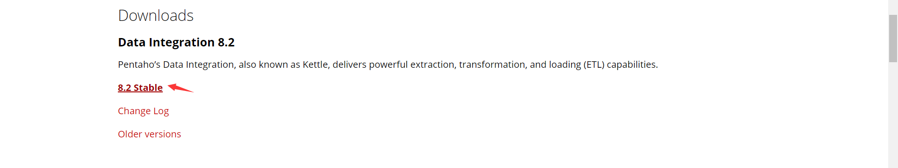


## kettle输入控件

### CSV文件输入

**例子: 将csv文案数据导入到excel中**


1. 添加**CSV文件输入控件**和**Excel输出控件**


2.  **配置CSV文件输入控件**，浏览csv文件，点击获取字段，可以进行数据格式、精度等的修改。


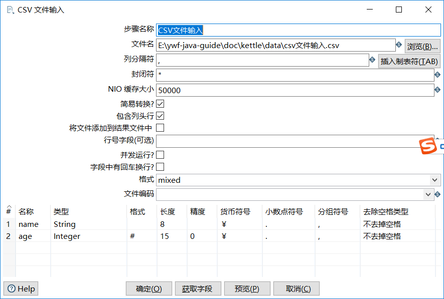


3. **配置Excel输出控件**，指定excel输出路径,点击字段=>获取字段，修改输出字段的格式。

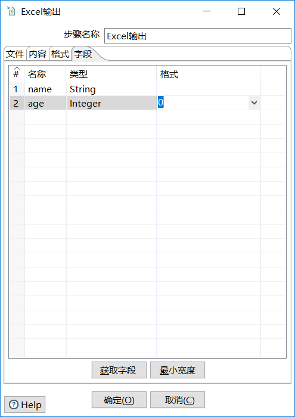

4.  点击运行,点击启动。

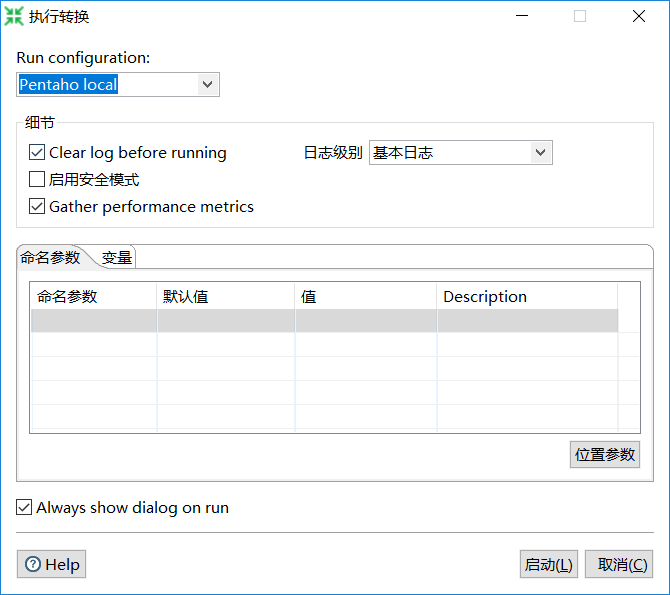

5. 查看执行日志和执行结果。

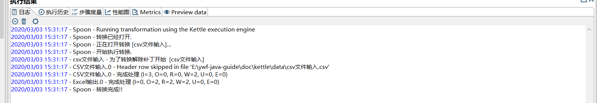

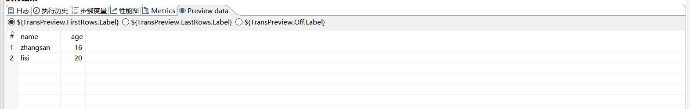


### 文本文件输入


**例子：将txt文件输入到Excel**

1. 添加**文本文件输入控件**和**Excel输出控件**


2. **配置文本文件输入控件**,选择文件目录或者文件，点击添加

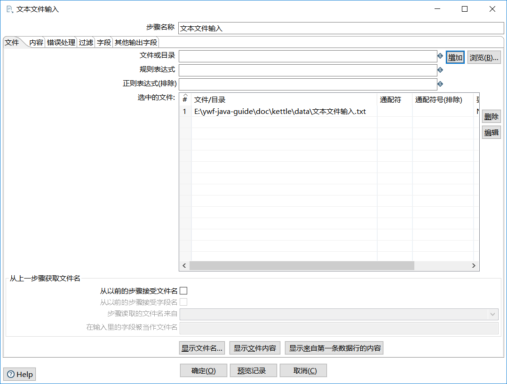

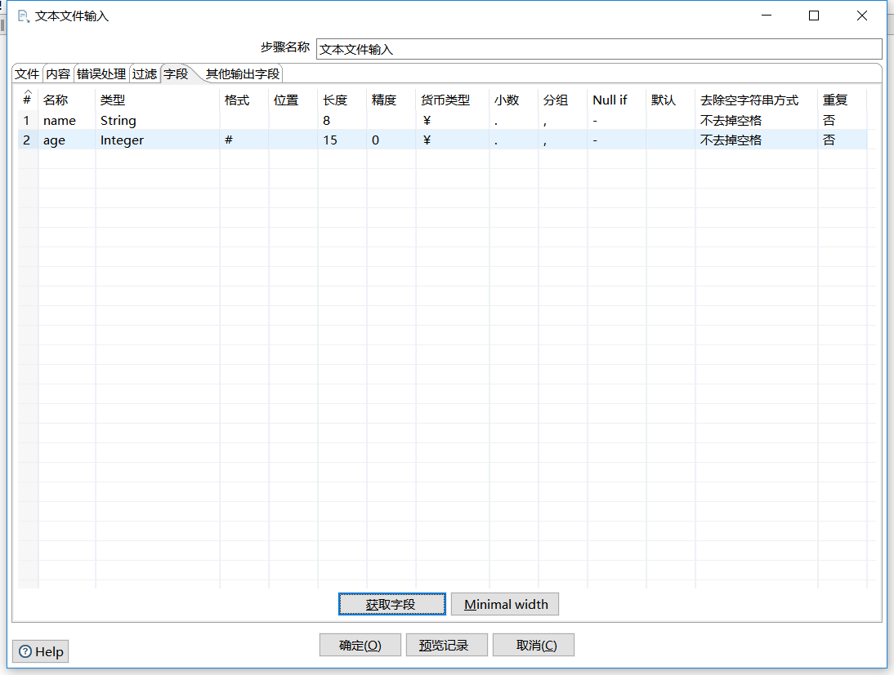


### Excel输入

**例子：将Excel文件输入到Excel文件**

1. 添加**Excel输入控件**和**Excel输出控件**


2. **配置Excel输入控件**，选择excel文件，点击添加。点击字段，获取来自头部数据的字段.

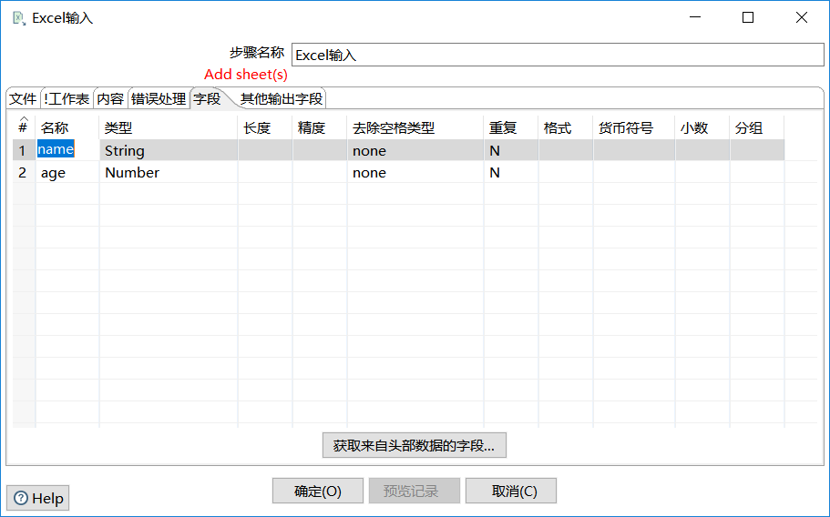


### Get data from xml

**XPath语法:**

| 表达式   | 描述                                                     |
| -------- | -------------------------------------------------------- |
| nodename | 选取此节点的所有子节点                                   |
| /        | 从根节点开始选取                                         |
| //       | 从匹配选择的当前节点选择文档中的节点，而不考虑它们的位置 |
| .        | 选择当前节点                                             |
| ..       | 选择当前节点的父节点                                     |
| @        | 选取属性                                                 |


**例子：将xml里面的信息输入到excel**，其中xml数据格式如下:

```xml
<?xml version="1.0" encoding="UTF-8"?>
<Server port="8005" shutdown="SHUTDOWN">
  <Listener className="org.apache.catalina.startup.VersionLoggerListener" />
  <Listener className="org.apache.catalina.core.AprLifecycleListener" SSLEngine="on" />
  <Listener className="org.apache.catalina.core.JreMemoryLeakPreventionListener" />
  <Listener className="org.apache.catalina.mbeans.GlobalResourcesLifecycleListener" />
  <Listener className="org.apache.catalina.core.ThreadLocalLeakPreventionListener" />
</Server>

```


1. 添**加Get data from xml控件**和**excel输出控件**
2. 选择xml文件，**点击内容，配置循环读取路径**

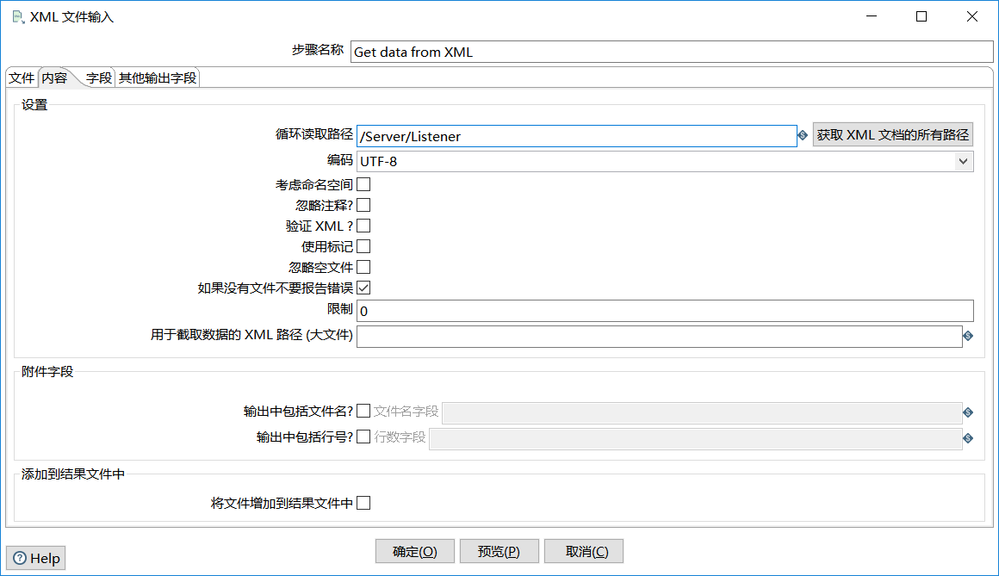

3. 配置字段。

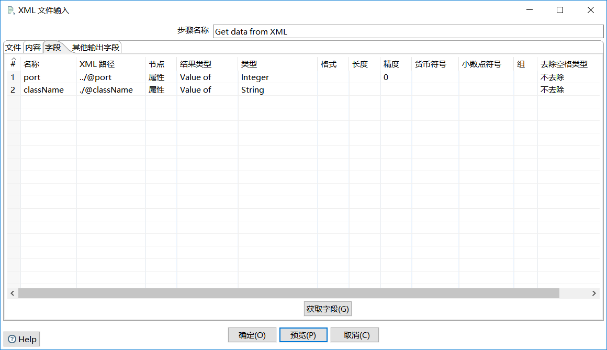


### json input

**JSONPath语法:**

| JsonPath             | 说明                                                         |
| -------------------- | ------------------------------------------------------------ |
| $                    | 文档根元素                                                   |
| @                    | 当前元素                                                     |
| .`或`[]              | 匹配下级元素                                                 |
| ..                   | 递归匹配所有子元素                                           |
| *                    | 通配符，匹配下级元素                                         |
| []                   | 下标运算符，根据索引获取元素，**XPath索引从1开始，JsonPath索引从0开始** |
| [,]                  | 连接操作符，将多个结果拼接成数组返回，可以使用索引或别名     |
| [start​ ​：end：​ step] | 数据切片操作，XPath不支持                                    |
| ?()                  | 过滤表达式                                                   |
| ()                   | 脚本表达式，使用底层脚本引擎，XPath不支持                    |


**例子：将json数据插入到excel**，json数据如下

```json
{
    "store": {
        "book": [{
                "category": "reference",
                "author": "Nigel Rees",
                "title": "Sayings of the Century",
                "price": 8.95
            }, {
                "category": "fiction",
                "author": "Evelyn Waugh",
                "title": "Sword of Honour",
                "price": 12.99
            }, {
                "category": "fiction",
                "author": "Herman Melville",
                "title": "Moby Dick",
                "isbn": "0-553-21311-3",
                "price": 8.99
            }, {
                "category": "fiction",
                "author": "J. R. R. Tolkien",
                "title": "The Lord of the Rings",
                "isbn": "0-395-19395-8",
                "price": 22.99
            }
        ],
        "bicycle": {
            "color": "red",
            "price": 19.95
        }
    }
}
```

1.  添加**JSON input控件**和**Excel输出控件**

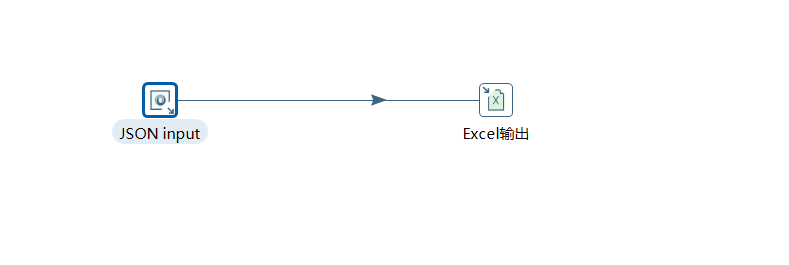

2. 配置JSON input控件，选择上传的json文件，配置字段.

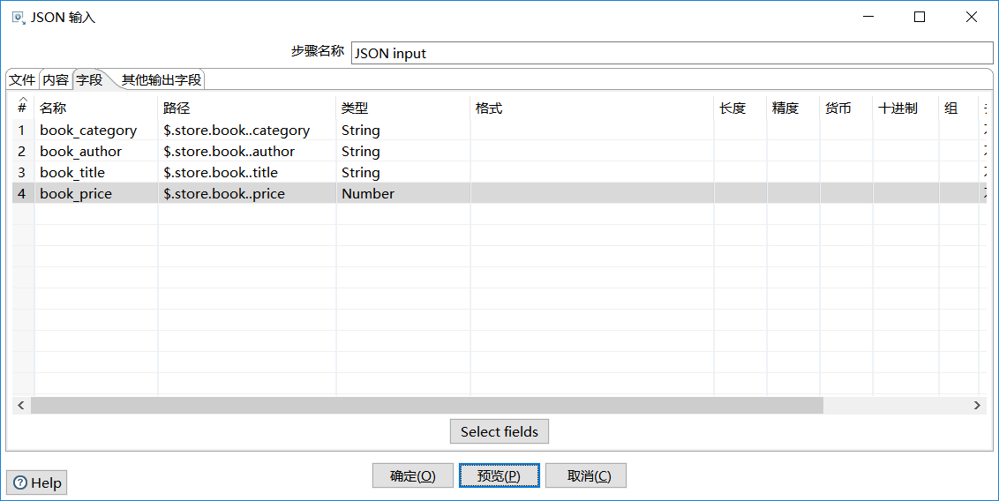

3.  点击预览。

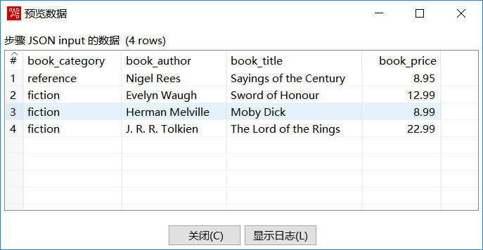


### 生成记录

**例子：使用生成记录将数据输出到excel中**

1. 添加**生成记录控件**和**Excel输出控件**。

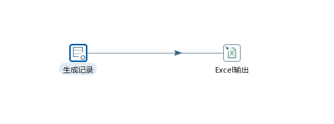

2. **配置生成记录控件**，填写模拟数据

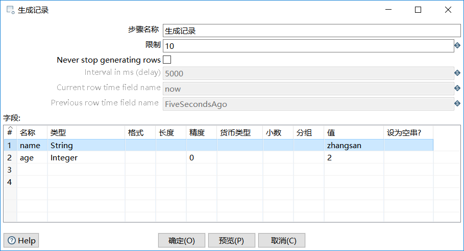


### 表输入

#### Mysql表输入

1. 添加mysql数据驱动（选择合适的版本，如:mysql-connector-java-5.1.48-bin.jar）, 放入到**data-intergration/lib**目录下，重启spoon。
2. 添加**表输入控件**和**Excel输出**控件。


3. 配置表输入控件，点击新建，配置mysql信息,点击测试。

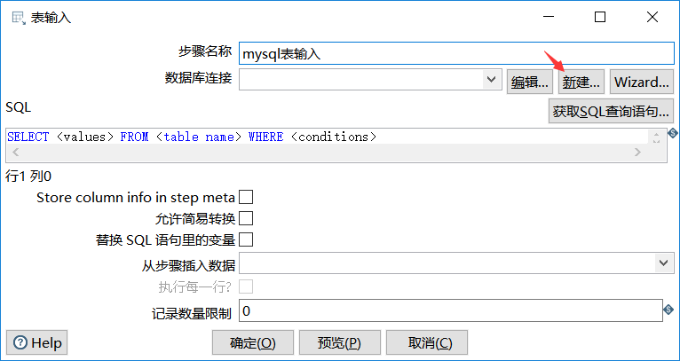

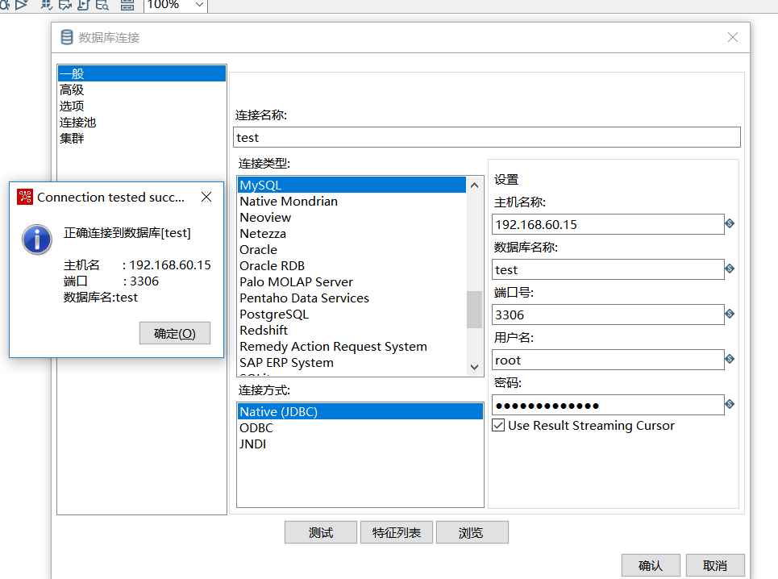

4.点击获取查询条件，选择要查询的表.

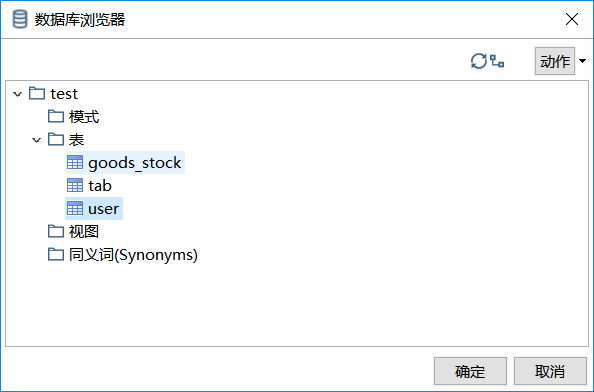


#### Oracle表输入

操作等同mysql表输入，jar包(ojdbc14-10.2.0.1.0.jar)放入到**data-intergration/lib**目录下


## kettle输出控件

### Excel输出

配置输出文件路径

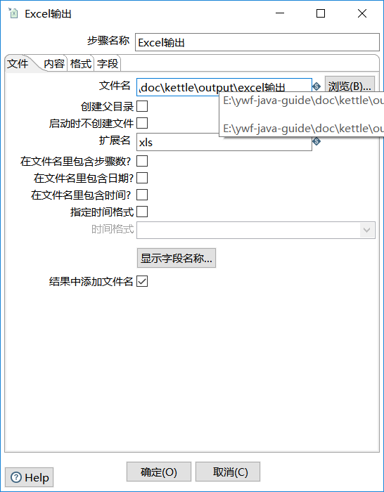

选择excel格式

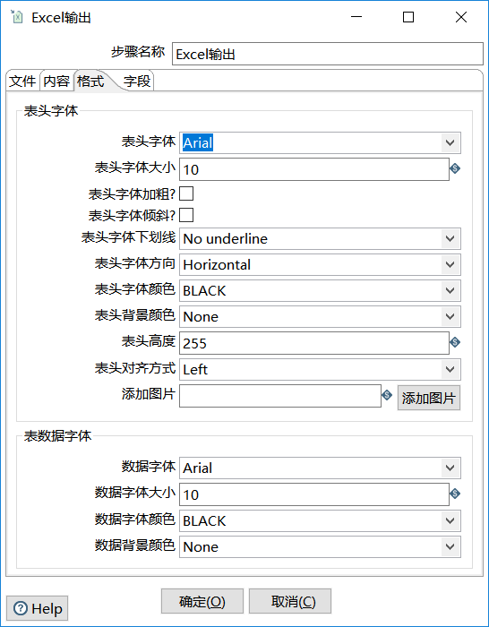

点击字段，点击获取字段，对字段格式进行设置

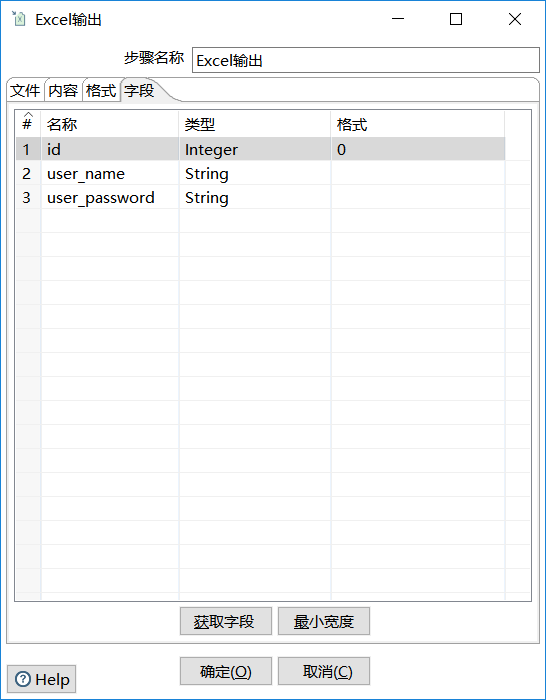


### 文本文件输出

配置输出文件路径和文件名, 点击内容，配置**分隔符**等信息

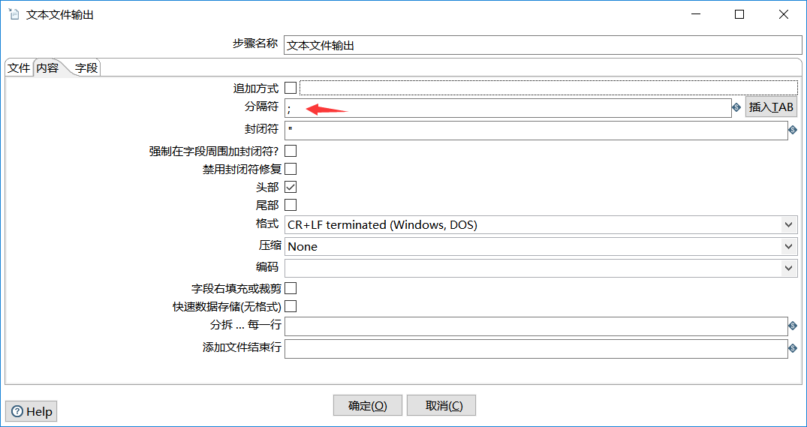

点击字段，点击获取字段，配置字段信息。

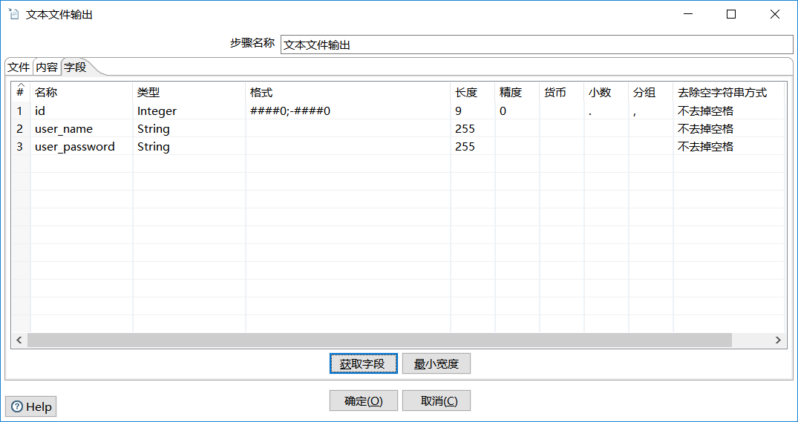


### SQL文件输出

选择SQL文件输出目录和文件名，**选择目标表**

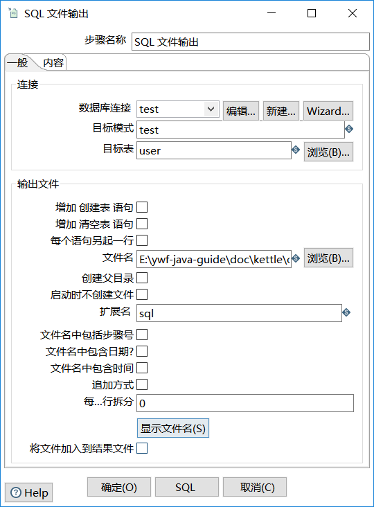


### 表输出

如果已存在，则直接选择目标表，若表不存在，输入目标表名，点击SQL，执行建表语句命令。

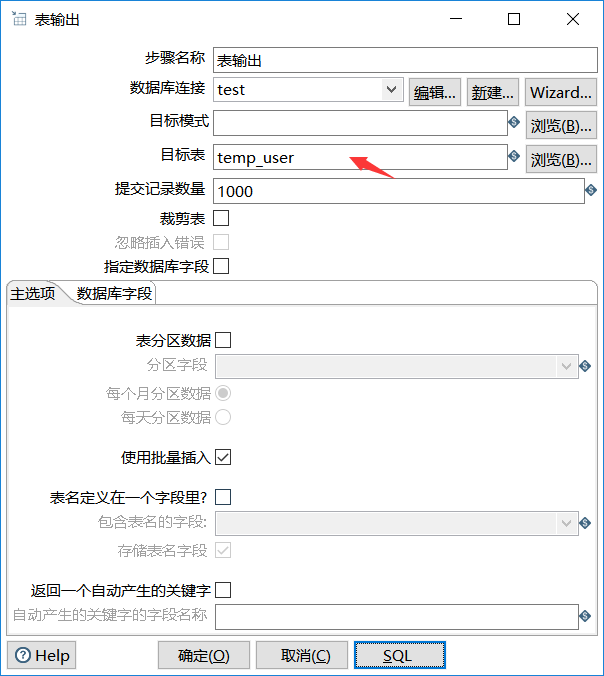

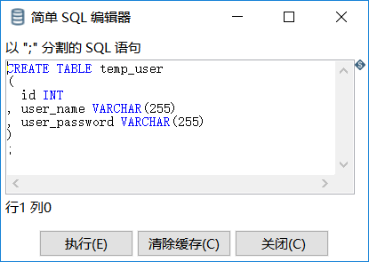


### 更新

配置目标表，**选中忽略查询失败**(可能要更新的数据在目标表不存在)，配置查询关联字段和更新字段

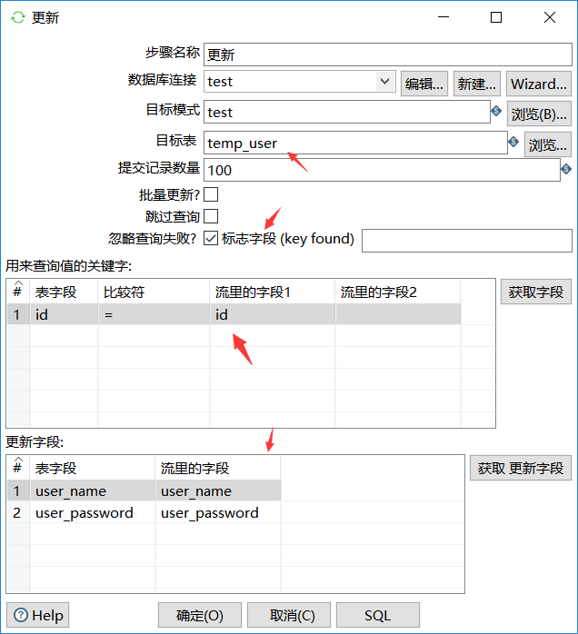


### 插入更新

目标表如果存在则更新，不存在则插入数据

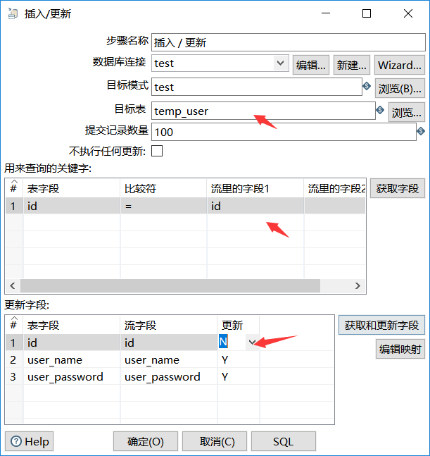


### 删除

选择目标表，添加查询所需的关键字

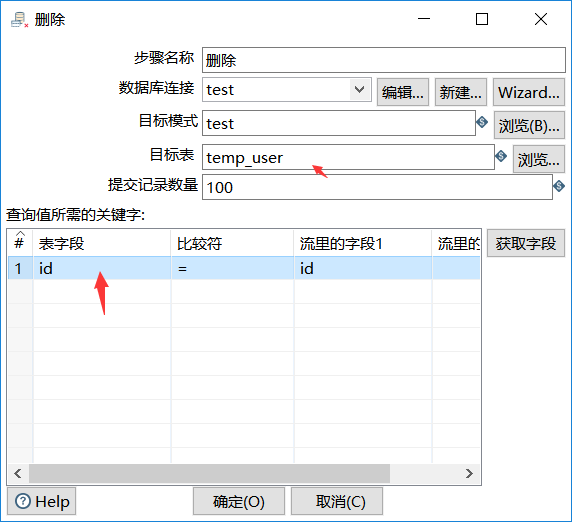


