<!-- TOC -->

- [流程控件和查询控件](#流程控件和查询控件)
    - [流程控件](#流程控件)
        - [switch case](#switch-case)
        - [过滤记录](#过滤记录)
        - [空操作](#空操作)
        - [中止](#中止)
    - [查询控件](#查询控件)
        - [http client](#http-client)
        - [http post](#http-post)
        - [数据库查询](#数据库查询)
        - [数据库连接](#数据库连接)
        - [流查询](#流查询)

<!-- /TOC -->

# 流程控件和查询控件

## 流程控件

### switch case

> 根据匹配的switch条件，走不同的流程

案例：读取Excel数据, sex是male，输出到male.xls，sex是female，输出到female.xls。

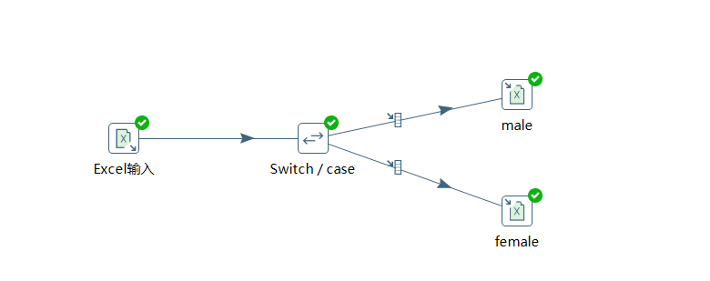

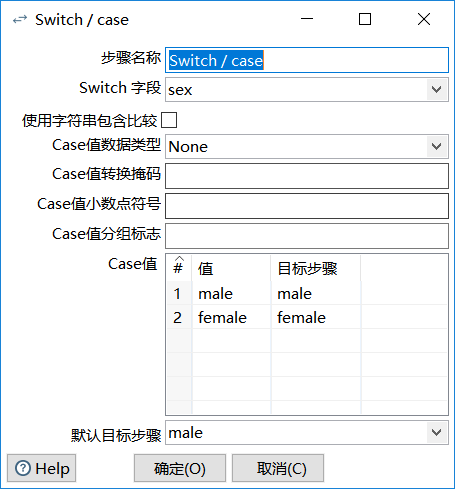


### 过滤记录

> 类似java的if条件过滤

案例：读取excel数据，判断sex是否为male,是则输出到male.xls,否则输出到female.xls

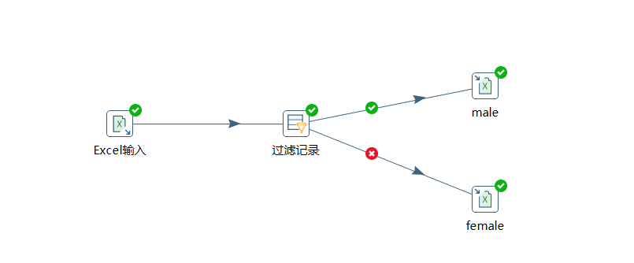

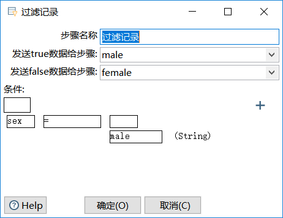


### 空操作

> 空操作一般作为数据流的终点。（实际开发现场少用）

案例：读取excel数据，判断sex是否为male,是则输出到male.xls,否则进入空操作。

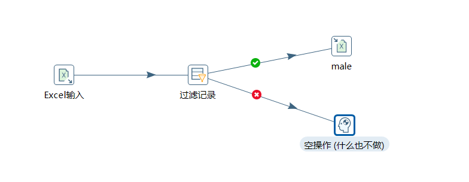


### 中止

> 中止是数据流的终点，如果有数据走到这里，将会报错。（用来校验数据的时候使用）

案例：读取excel数据，判断name字段是否有值，如果有，打印到控制台，否则，中止。


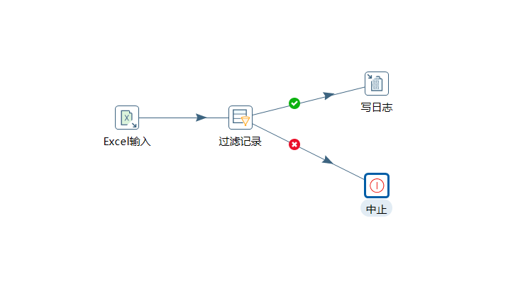

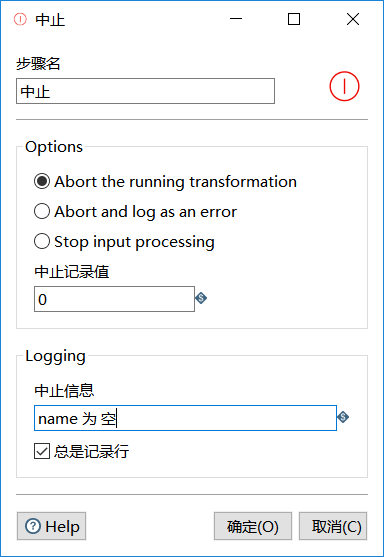


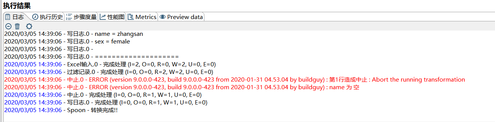


## 查询控件

### http client

> 使用http **Get请求 ** 获取数据

案例：使用百度地图路径规划接口，获取json返回值, 并获取路名等信息输出到Excel。

```
接口url：http://api.map.baidu.com/direction/v2/driving?origin=40.01116,116.339303&destination=39.936404,116.452562&ak=&ak=eUXVDgtYT7m39pNGiup5xpSbFOPMh1Th
```


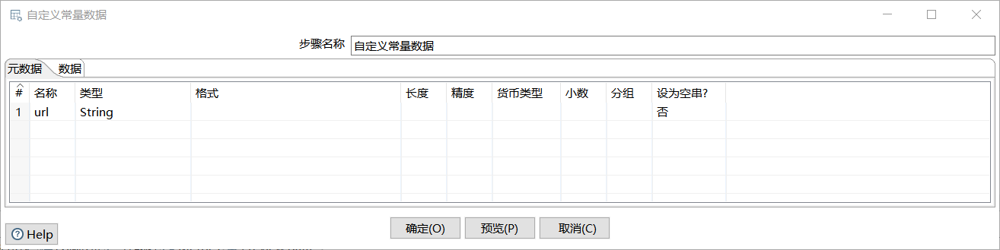


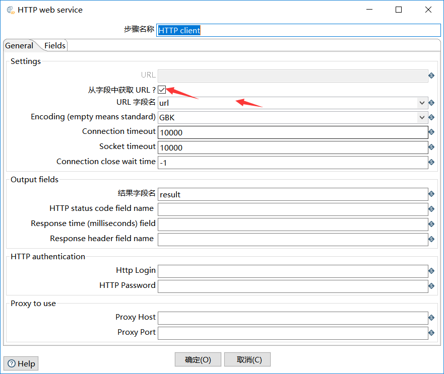


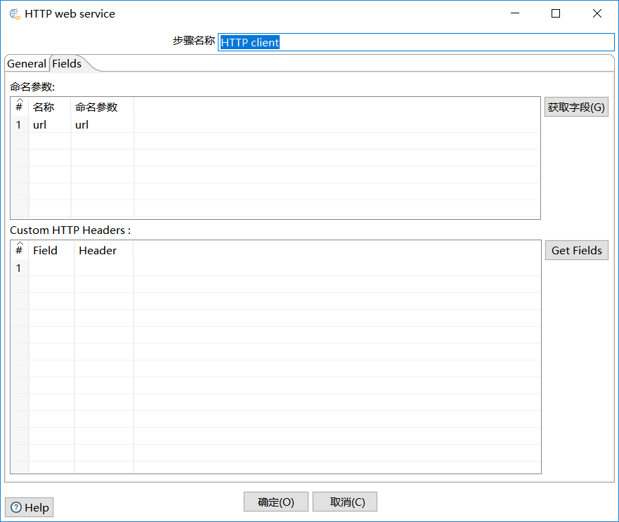


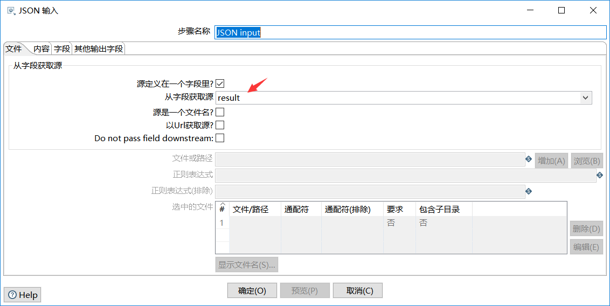


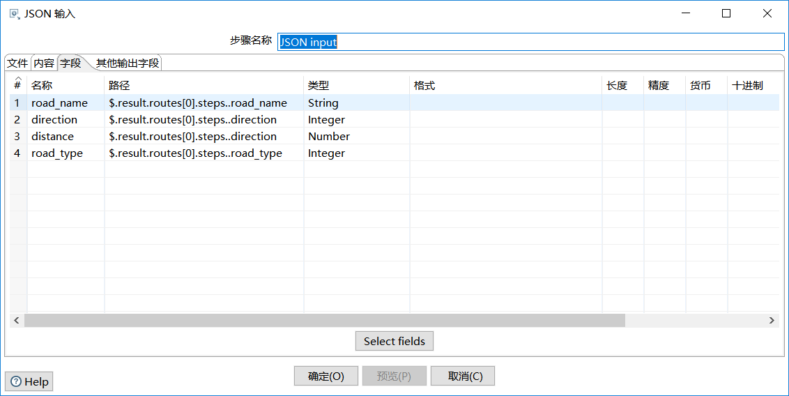


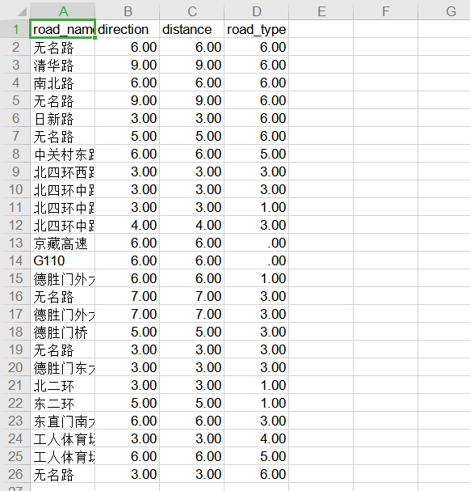


### http post

> 使用http **Post请求 ** 请求数据, 操作等同http client

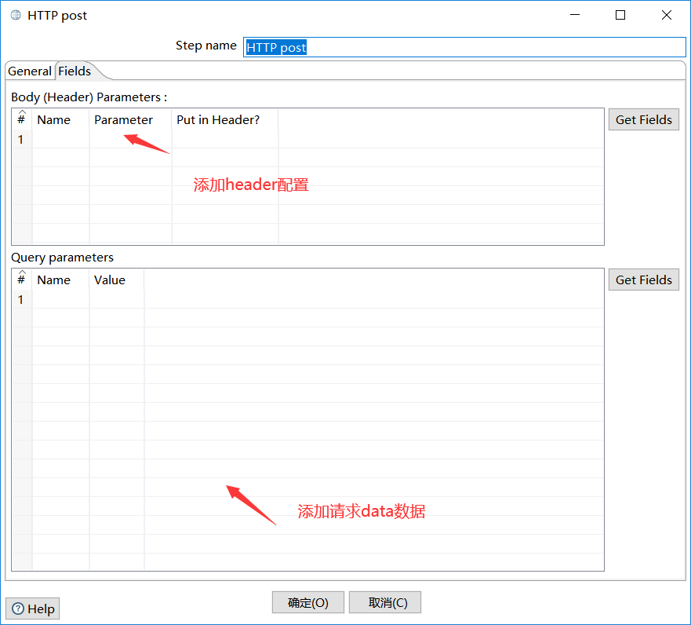


### 数据库查询

> 数据库查询就是数据库里面的**左连接**

案例：现在有test_user表和test_dept表，根据test_user的id左关联test_dept获取部门名称。表数据如下：

test_user：

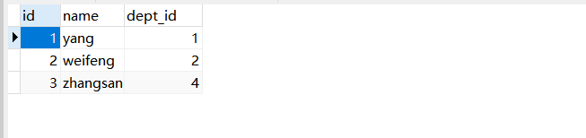

test_dept：

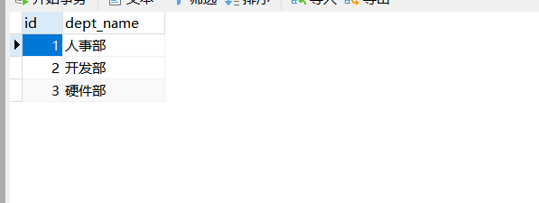


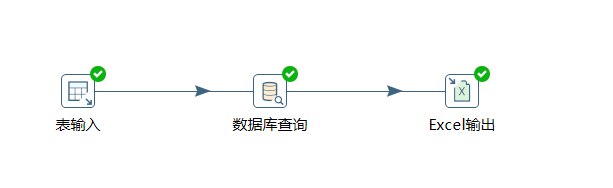

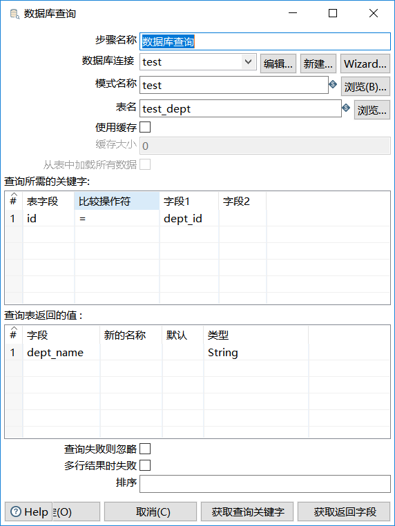


### 数据库连接

> 数据库连接可以连接两个库（不需要都是mysql或者oracle）的查询和但参数的表输入。

案例：test库的test_user和test库的test_dept，查询出用户的部门名称。

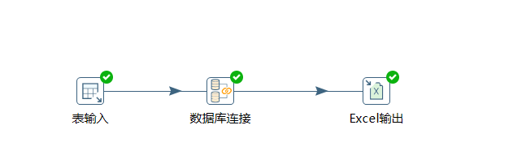

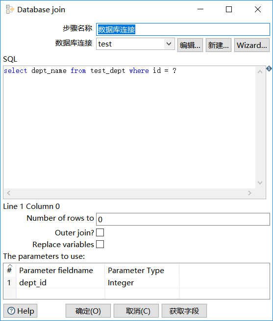


### 流查询

> 流查询在数据查询前把数据加载到内存，再进行等值比较。

案例：将test_user和test_dept的数据加载到内存，等值比较，输出部门名称到excel。

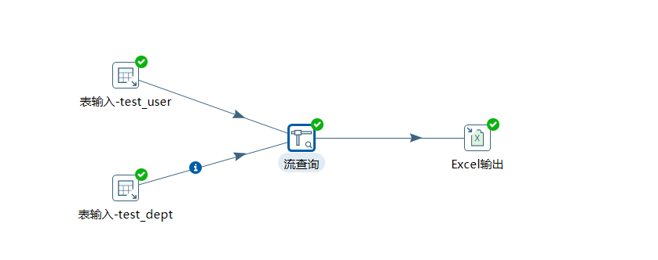

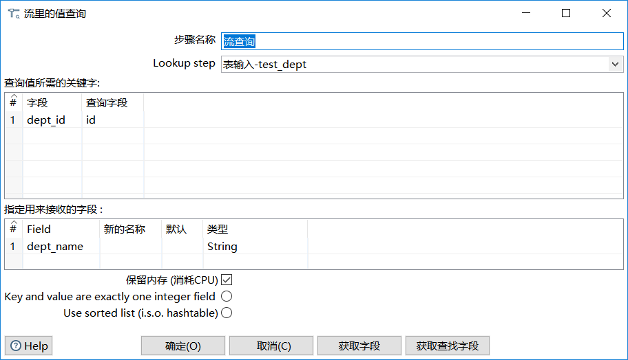