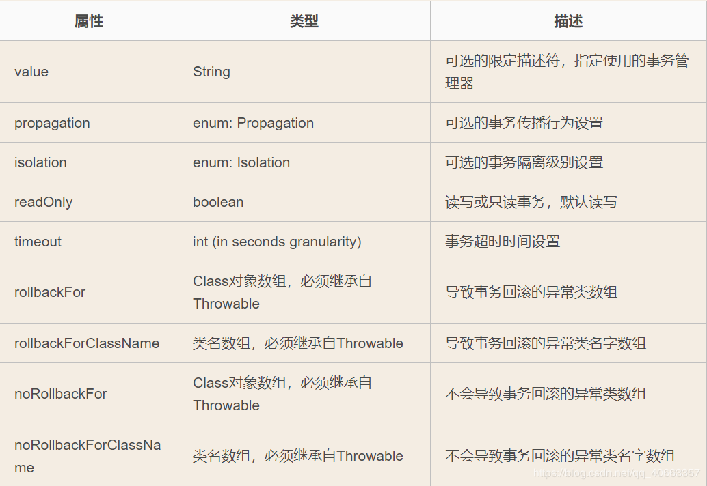

# mybatis相关概念

## mybatis 事务管理

**@Transactional注解属性如下**




### 隔离级别

隔离级别是指若干个并发的事务之间的隔离程度，与我们开发时候主要相关的场景包括：脏读取、重复读、幻读。

我们可以看`org.springframework.transaction.annotation.Isolation`枚举类中定义了五个表示隔离级别的值：

```java
public enum Isolation {
    DEFAULT(-1),
    READ_UNCOMMITTED(1),
    READ_COMMITTED(2),
    REPEATABLE_READ(4),
    SERIALIZABLE(8);
}
```

- `DEFAULT`：这是默认值，表示使用底层数据库的默认隔离级别。对大部分数据库而言，通常这值就是：`READ_COMMITTED`。
- `READ_UNCOMMITTED`：该隔离级别表示一个事务可以读取另一个事务修改但还没有提交的数据。该级别不能防止脏读和不可重复读，因此很少使用该隔离级别。
- `READ_COMMITTED`：该隔离级别表示一个事务只能读取另一个事务已经提交的数据。该级别可以防止脏读，这也是大多数情况下的推荐值。
- `REPEATABLE_READ`：该隔离级别表示一个事务在整个过程中可以多次重复执行某个查询，并且每次返回的记录都相同。即使在多次查询之间有新增的数据满足该查询，这些新增的记录也会被忽略。该级别可以防止脏读和不可重复读。
- `SERIALIZABLE`：所有的事务依次逐个执行，这样事务之间就完全不可能产生干扰，也就是说，该级别可以防止脏读、不可重复读以及幻读。但是这将严重影响程序的性能。通常情况下也不会用到该级别。

指定方法：通过使用**isolation**属性设置，例如：

```java
@Transactional(isolation = Isolation.DEFAULT)
```


### 传播行为

所谓事务的传播行为是指，如果在开始当前事务之前，一个事务上下文已经存在，此时有若干选项可以指定一个事务性方法的执行行为。

我们可以看`org.springframework.transaction.annotation.Propagation`枚举类中定义了6个表示传播行为的枚举值：

```java
public enum Propagation {
    REQUIRED(0),
    SUPPORTS(1),
    MANDATORY(2),
    REQUIRES_NEW(3),
    NOT_SUPPORTED(4),
    NEVER(5),
    NESTED(6);
}
```

- REQUIRED：如果当前存在事务，则加入该事务；如果当前没有事务，则创建一个新的事务。
- SUPPORTS：如果当前存在事务，则加入该事务；如果当前没有事务，则以非事务的方式继续运行。
- MANDATORY：如果当前存在事务，则加入该事务；如果当前没有事务，则抛出异常。
- REQUIRES_NEW：创建一个新的事务，如果当前存在事务，则把当前事务挂起。
- NOT_SUPPORTED：以非事务方式运行，如果当前存在事务，则把当前事务挂起。
- NEVER：以非事务方式运行，如果当前存在事务，则抛出异常。
- NESTED：如果当前存在事务，则创建一个事务作为当前事务的嵌套事务来运行；如果当前没有事务，则该取值等价于REQUIRED。

指定方法：通过使用**propagation**属性设置，例如：

```java
@Transactional(propagation = Propagation.REQUIRED)
```


### 用法

@Transactional 可以作用于接口、接口方法、类以及类方法上。当作用于类上时，该类的所有 **public** 方法将都具有该类型的事务属性，同时，我们也可以在方法级别使用该标注来覆盖类级别的定义。

虽然 @Transactional 注解可以作用于接口、接口方法、类以及类方法上，但是 Spring 建议不要在接口或者接口方法上使用该注解，因为这只有在使用基于接口的代理时它才会生效。另外， @Transactional 注解应该只被**应用到 public 方法上**，这是由 Spring AOP 的本质决定的。如果你在 protected、private 或者默认可见性的方法上使用 @Transactional 注解，这将被忽略，也不会抛出任何异常。

默认情况下，只有来自外部的方法调用才会被AOP代理捕获，也就是，类内部方法调用本类内部的其他方法并不会引起事务行为，即使被调用方法使@Transactional注解进行修饰。

在使用@Transactional注解前，请在**启动类**上加上注解@**EnableTransactionManagement**来开启事务。

```java
@EnableTransactionManagement  //开启事务
public class AdminApplication {

    public static void main(String[] args) {
        SpringApplication.run(AdminApplication.class, args);
    }

}
```

使用示例：

```java
@Transactional(isolation = Isolation.REPEATABLE_READ,propagation = Propagation.REQUIRED,rollbackFor = Exception.class)
```


## mybatis 延迟加载

###  什么是延迟加载

- 就是在需要用到数据的时候才进行加载，不需要用到数据的时候就不加载数据。延迟加载也称为懒加载。 

- **优点：**先从单表查询，需要时再从关联表去关联查询，大大提高数据库的性能，因为查询单表要比关联查询多张表的速度快很多。

- **缺点：**因为只有当需要用到数据时，才会进行数据库查询，这样在大批量数据查询时，因为查询工作也需要耗费时间，所以可能造成用户等待时间变长，造成用户体验下降。


### 如何实现延迟加载

#### 一对多实现延迟加载

> 场景：打印出所有部门的部门名称，此时不想加载用户信息

- **方式一：配置延迟加载的全局开关,参考配置**

```xml
<?xml version="1.0" encoding="UTF-8"?>
<!DOCTYPE configuration PUBLIC "-//mybatis.org//DTD SQL Map Config 3.0//EN"
        "http://mybatis.org/dtd/mybatis-3-config.dtd">
<configuration>
    <settings>
        <!-- 延迟加载的全局开关 -->
        <setting name="lazyLoadingEnabled" value="true"/>
        <setting name="aggressiveLazyLoading" value="false"/>
    </settings>
</configuration>
```

- **DeptMapper.xml**

```xml
<?xml version="1.0" encoding="UTF-8" ?>
<!DOCTYPE mapper PUBLIC "-//mybatis.org//DTD Mapper 3.0//EN" "http://mybatis.org/dtd/mybatis-3-mapper.dtd" >
<mapper namespace="com.ywf.mybatis.mapper.IDeptMapper">
    <resultMap id="lazyDeptResultMap" type="Dept">
        <result column="d_id" property="id" />
        <result column="dept_name" property="deptName" />
        <collection property="employList" ofType="Employ" column="d_id"
                    select="com.ywf.mybatis.mapper.IEmployMapper.findByDeptId"
        />
    </resultMap>

    <!-- 获取所有部门信息，延迟加载部门底下的员工信息 -->
    <select id="lazyFindAll" resultMap="lazyDeptResultMap">
        SELECT d.id as d_id, d.dept_name FROM dept d
    </select>
</mapper>
```

- **IEmployMapper.java**

```java
package com.ywf.mybatis.mapper;

import com.ywf.mybatis.entity.Employ;
import org.apache.ibatis.annotations.Mapper;
import org.apache.ibatis.annotations.Param;

import java.util.List;

/**
 * @Author:ywf
 */
@Mapper
public interface IEmployMapper {
    /**
     * 根据部门Id 获取员工信息
     * @param deptId 部门ID
     * @return
     */
    List<Employ> findByDeptId(@Param("deptId") int deptId);
}

```

- **EmployMapper.xml**

```xml
<?xml version="1.0" encoding="UTF-8" ?>
<!DOCTYPE mapper PUBLIC "-//mybatis.org//DTD Mapper 3.0//EN" "http://mybatis.org/dtd/mybatis-3-mapper.dtd" >
<mapper namespace="com.ywf.mybatis.mapper.IEmployMapper">

    <!-- 根据部门ID获取员工信息 -->
    <select id="findByDeptId" resultType="Employ" parameterType="Integer">
        SELECT * FROM employ where dept_id = #{deptId}
    </select>
</mapper>
```

- **调用**

```java
/**
  * 一对多 延迟加载
  */
@Test
void lazyOne2Many() {
    List<Dept> deptList = deptService.lazyFindAll();
    for (Dept dept : deptList) {
        log.info(dept.getDeptName());
    }
}
```


- **方式二：fetchType="lazy"**

- **DeptMapper.xml**

```xml
<?xml version="1.0" encoding="UTF-8" ?>
<!DOCTYPE mapper PUBLIC "-//mybatis.org//DTD Mapper 3.0//EN" "http://mybatis.org/dtd/mybatis-3-mapper.dtd" >
<mapper namespace="com.ywf.mybatis.mapper.IDeptMapper">
    <resultMap id="lazyDeptResultMap" type="Dept">
        <result column="d_id" property="id" />
        <result column="dept_name" property="deptName" />
        <collection property="employList" ofType="Employ" column="d_id"
                    select="com.ywf.mybatis.mapper.IEmployMapper.findByDeptId"
                    fetchType="lazy"
        />
    </resultMap>

    <!-- 获取所有部门信息，延迟加载部门底下的员工新 -->
    <select id="lazyFindAll" resultMap="lazyDeptResultMap">
        SELECT d.id as d_id, d.dept_name FROM dept d
    </select>
</mapper>
```


#### 多对一实现延迟加载

> 场景：打印出所有员工名称，此时不想加载部门信息

- **方式一：配置延迟加载的全局开关,参考配置**

```xml
<?xml version="1.0" encoding="UTF-8"?>
<!DOCTYPE configuration PUBLIC "-//mybatis.org//DTD SQL Map Config 3.0//EN"
        "http://mybatis.org/dtd/mybatis-3-config.dtd">
<configuration>
    <settings>
        <!-- 延迟加载的全局开关 -->
        <setting name="lazyLoadingEnabled" value="true"/>
        <setting name="aggressiveLazyLoading" value="false"/>
    </settings>
</configuration>
```

- **EmloyMapper.xml**

```xml
<?xml version="1.0" encoding="UTF-8" ?>
<!DOCTYPE mapper PUBLIC "-//mybatis.org//DTD Mapper 3.0//EN" "http://mybatis.org/dtd/mybatis-3-mapper.dtd" >
<mapper namespace="com.ywf.mybatis.mapper.IEmployMapper">
    <resultMap id="lazyEmployResultMap" type="Employ">
        <result property="id" column="e_id" />
        <result property="employName" column="employ_name" />
        <association property="dept" column="dept_id"
            select="com.ywf.mybatis.mapper.IDeptMapper.getById"
        />
    </resultMap>

    <!--获取所有员工信息， 懒加载部门信息 -->
    <select id="lazyFindAll" resultMap="lazyEmployResultMap">
        SELECT * FROM employ e
    </select>
</mapper>
```

- **IDeptMapper.java**

```java
package com.ywf.mybatis.mapper;

import com.ywf.mybatis.entity.Dept;
import org.apache.ibatis.annotations.Mapper;
import org.apache.ibatis.annotations.Param;

import java.util.List;
import java.util.Map;

/**
 * @Author:ywf
 */
@Mapper
public interface IDeptMapper {
    /**
     * 根据部门id获取部门详情
     * @param id
     * @return
     */
    Dept getById(@Param("id") int id);
}
```

- **DeptMapper.xml**

```xml
<?xml version="1.0" encoding="UTF-8" ?>
<!DOCTYPE mapper PUBLIC "-//mybatis.org//DTD Mapper 3.0//EN" "http://mybatis.org/dtd/mybatis-3-mapper.dtd" >
<mapper namespace="com.ywf.mybatis.mapper.IDeptMapper">
    <!-- 根据ID获取部门信息 -->
    <select id="getById" resultType="Dept">
        SELECT * FROM dept WHERE id = #{id}
    </select>
</mapper>
```

- **调用**

```java
/**
 * 多对一 延迟加载
 */
@Test
void lazyMany2One() {
    List<Employ> employList = employService.lazyFindAll();
    for (Employ employ : employList) {
        log.info(employ.getEmployName());
    }
}
```

**方式二：fetchType="lazy"**

- **EmployMapper.xml**

```xml
<?xml version="1.0" encoding="UTF-8" ?>
<!DOCTYPE mapper PUBLIC "-//mybatis.org//DTD Mapper 3.0//EN" "http://mybatis.org/dtd/mybatis-3-mapper.dtd" >
<mapper namespace="com.ywf.mybatis.mapper.IEmployMapper">
    <resultMap id="lazyEmployResultMap" type="Employ">
        <result property="id" column="e_id" />
        <result property="employName" column="employ_name" />
        <association property="dept" column="dept_id" fetchType="lazy"
            select="com.ywf.mybatis.mapper.IDeptMapper.getById"
        />
    </resultMap>

    <!--获取所有员工信息， 懒加载部门信息 -->
    <select id="lazyFindAll" resultMap="lazyEmployResultMap">
        SELECT * FROM employ e
    </select>
</mapper>
```


#### 多对多实现延迟加载

> 场景：打印出所有学生名称，此时不想关联课程信息

**方式一：配置延迟加载的全局开关,参考配置**

```xml
<?xml version="1.0" encoding="UTF-8"?>
<!DOCTYPE configuration PUBLIC "-//mybatis.org//DTD SQL Map Config 3.0//EN"
        "http://mybatis.org/dtd/mybatis-3-config.dtd">
<configuration>
    <settings>
        <!-- 延迟加载的全局开关 -->
        <setting name="lazyLoadingEnabled" value="true"/>
        <setting name="aggressiveLazyLoading" value="false"/>
    </settings>
</configuration>
```

- **StudentMapper.xml**

```xml
<?xml version="1.0" encoding="UTF-8" ?>
<!DOCTYPE mapper PUBLIC "-//mybatis.org//DTD Mapper 3.0//EN" "http://mybatis.org/dtd/mybatis-3-mapper.dtd" >
<mapper namespace="com.ywf.mybatis.mapper.IStudentMapper">
    <resultMap type="Student" id="lazyStudentResultMap">
        <result property="id" column="student_id"/>
        <result property="studentName" column="student_name"/>
        <collection property="courseList" ofType="Course" column="course_id"
            select="com.ywf.mybatis.mapper.ICourseMapper.getById"
        />
    </resultMap>
    <!-- 获取所有学生信息，懒加载学生学习的课程信息 -->
    <select id="lazyFindAll" resultMap="lazyStudentResultMap">
        SELECT s.*, sc.course_id FROM student s, student_to_course sc
    </select>
</mapper>
```

- **ICourseMapper.java**

```java
package com.ywf.mybatis.mapper;

import com.ywf.mybatis.entity.Course;
import org.apache.ibatis.annotations.Mapper;
import org.apache.ibatis.annotations.Param;

/**
 * @Author:ywf
 */
@Mapper
public interface ICourseMapper {

    /**
     * 根据ID获取课程详情
     * @param id 课程ID
     * @return
     */
    Course getById(@Param("id") int id);
}
```

- **CourseMapper.xml**

```xml
<?xml version="1.0" encoding="UTF-8" ?>
<!DOCTYPE mapper PUBLIC "-//mybatis.org//DTD Mapper 3.0//EN" "http://mybatis.org/dtd/mybatis-3-mapper.dtd" >
<mapper namespace="com.ywf.mybatis.mapper.ICourseMapper">
    <select id="getById" resultType="Course">
        SELECT * FROM course WHERE id = #{id}
    </select>
</mapper>
```

- **调用**

```java
/**
  * 多对多 延迟加载
  */
@Test
void lazyMany2Many() {
    List<Student> studentList = studentService.lazyFindAll();
    for (Student student : studentList) {
        log.info(student.getStudentName());
    }
}
```

**方式二：fetchType="lazy"**

```xml
<?xml version="1.0" encoding="UTF-8" ?>
<!DOCTYPE mapper PUBLIC "-//mybatis.org//DTD Mapper 3.0//EN" "http://mybatis.org/dtd/mybatis-3-mapper.dtd" >
<mapper namespace="com.ywf.mybatis.mapper.IStudentMapper">
    <resultMap type="Student" id="lazyStudentResultMap">
        <result property="id" column="student_id"/>
        <result property="studentName" column="student_name"/>
        <collection property="courseList" ofType="Course" column="course_id"
                    fetchType="lazy"
            select="com.ywf.mybatis.mapper.ICourseMapper.getById"
        />
    </resultMap>
    <!-- 获取所有学生信息，懒加载学生学习的课程信息 -->
    <select id="lazyFindAll" resultMap="lazyStudentResultMap">
        SELECT s.*, sc.course_id FROM student s, student_to_course sc
    </select>
</mapper>
```


## mybatis 一级缓存

Mybatis的一级缓存是指Session缓存。一级缓存的作用域默认是一个SqlSession。Mybatis默认开启一级缓存。
也就是在同一个SqlSession中，执行相同的查询SQL，第一次会去数据库进行查询，并写到缓存中；
第二次以后是直接去缓存中取。
当执行SQL查询中间发生了增删改的操作，MyBatis会把SqlSession的缓存清空。

一级缓存的范围有**SESSION**和**STATEMENT**两种，默认是SESSION，如果不想使用一级缓存，可以把一级缓存的范围指定为STATEMENT，这样每次执行完一个Mapper中的语句后都会将一级缓存清除。
如果需要更改一级缓存的范围，可以在Mybatis的配置文件中，在下通过localCacheScope指定。

**建议不需要修改！**

**需要注意的是**
当Mybatis整合Spring后，直接通过Spring注入Mapper的形式，如果不是在同一个事务中每个Mapper的每次查询操作都对应一个全新的SqlSession实例，这个时候就不会有一级缓存的命中，但是在**同一个事务中时共用的是同一个SqlSession。**

- **启动类添加@EnableTransactionManagement**

```java
package com.ywf.mybatis;

import org.springframework.boot.SpringApplication;
import org.springframework.boot.autoconfigure.SpringBootApplication;
import org.springframework.transaction.annotation.EnableTransactionManagement;

@SpringBootApplication
@EnableTransactionManagement
public class MybatisApplication {

    public static void main(String[] args) {
        SpringApplication.run(MybatisApplication.class, args);
    }

}
```

- **实现类添加@Transactional**

```java
package com.ywf.mybatis.service.impl;

import com.ywf.mybatis.entity.User;
import com.ywf.mybatis.mapper.IDeptMapper;
import com.ywf.mybatis.mapper.IUserMapper;
import com.ywf.mybatis.service.IUserService;
import org.springframework.beans.factory.annotation.Autowired;
import org.springframework.stereotype.Service;
import org.springframework.transaction.annotation.Isolation;
import org.springframework.transaction.annotation.Transactional;

import java.util.List;

/**
 * @Author:ywf
 */
@Service
@Transactional(isolation = Isolation.DEFAULT, rollbackFor = Error.class)
public class UserServiceImpl implements IUserService {

    @Autowired
    private IUserMapper userMapper;

    @Autowired
    private IDeptMapper deptMapper;


    @Override
    public List<User> findAll() {
        // 重复查询
        userMapper.findAll();
        deptMapper.findAll();
        deptMapper.findAll();
        return userMapper.findAll();
    }
}

```

**!!! 结果只执行一次查询用户，一次查询部门的SQL语句**


- **如果中间添加了添加、修改、删除操作的SQL语句**

```java
package com.ywf.mybatis.service.impl;

import com.ywf.mybatis.entity.User;
import com.ywf.mybatis.mapper.IUserMapper;
import com.ywf.mybatis.service.IUserService;
import org.springframework.beans.factory.annotation.Autowired;
import org.springframework.stereotype.Service;
import org.springframework.transaction.annotation.Isolation;
import org.springframework.transaction.annotation.Transactional;

import java.util.List;

/**
 * @Author:ywf
 */
@Service
@Transactional(isolation = Isolation.DEFAULT, rollbackFor = Error.class)
public class UserServiceImpl implements IUserService {

    @Autowired
    private IUserMapper userMapper;

    @Override
    public List<User> findAll() {
        userMapper.findAll();
        User u = new User();
        u.setUserName("new");
        userMapper.insert(u);
        return userMapper.findAll();
    }
}
```

**!!! 结果执行两次查询用户，一次新增用户的SQL语句**


## mybatis 二级缓存

MyBatis并不是简单地对整个Application就只有一个Cache缓存对象，它将缓存划分的更细，即是Mapper级别的，即每一个Mapper都可以拥有一个Cache对象，具体如下：

- 为每一个Mapper分配一个Cache缓存对象（使用<cache>节点配置）；

- 多个Mapper共用一个Cache缓存对象（使用<cache-ref>节点配置）；
   如果你想让多个Mapper公用一个Cache的话，你可以使用<cache-ref namespace="">节点，来指定你的这个Mapper使用到了哪一个Mapper的Cache缓存。


**二级缓存配置**

- **mybatis-config.xml**

```xml
<?xml version="1.0" encoding="UTF-8"?>
<!DOCTYPE configuration PUBLIC "-//mybatis.org//DTD SQL Map Config 3.0//EN"
        "http://mybatis.org/dtd/mybatis-3-config.dtd">
<configuration>
    <settings>
        <!-- 开启二级缓存 -->
        <setting name="cacheEnabled" value="true"/>
    </settings>
</configuration>
```

- ***Mapper.xml**

```xml
<?xml version="1.0" encoding="UTF-8" ?>
<!DOCTYPE mapper PUBLIC "-//mybatis.org//DTD Mapper 3.0//EN" "http://mybatis.org/dtd/mybatis-3-mapper.dtd" >
<mapper namespace="com.ywf.mybatis.mapper.IUserMapper">
    <!-- 二级缓存 -->
    <cache />
    
    <!-- 获取所有用户信息 -->
    <select id="findAll" resultType="User">
        SELECT * FROM user
    </select>
</mapper>
```

cache标签用于声明这个namespace使用二级缓存，并且可以自定义配置。可以配置的属性如下:

**type:**  cache使用的类型，默认是PerpetualCache，这在一级缓存中提到过。

**eviction:** 定义回收的策略

- **LRU** - 最近最少回收，移除最长时间不被使用的对象
- **FIFO** - 先进先出，按照缓存进入的顺序来移除它们
- **SOFT** - 软引用，移除基于垃圾回收器状态和软引用规则的对象
- **WEAK** - 弱引用，更积极的移除基于垃圾收集器和弱引用规则的对象

**flushInterval:** 配置一定时间自动刷新缓存，单位是毫秒

**size:**  最多缓存对象的个数

**readOnly:**  是否只读，若配置可读写，则需要对应的实体类能够序列化。

**blocking:**  若缓存中找不到对应的key，是否会一直blocking，直到有对应的数据进入缓存。

**cache-ref：**代表引用别的命名空间的Cache配置，两个命名空间的操作使用的是同一个Cache


- **POJO类必须实现Serializable** !!!

```java
package com.ywf.mybatis.entity;

import java.io.Serializable;

/**
 * @Author:ywf
 */
public class User implements Serializable {
    private int id;
    private String userName;
    private String userPassword;

    public int getId() {
        return id;
    }

    public void setId(int id) {
        this.id = id;
    }

    public String getUserName() {
        return userName;
    }

    public void setUserName(String userName) {
        this.userName = userName;
    }

    public String getUserPassword() {
        return userPassword;
    }

    public void setUserPassword(String userPassword) {
        this.userPassword = userPassword;
    }

    @Override
    public String toString() {
        return "User{" +
                "id=" + id +
                ", userName='" + userName + '\'' +
                ", userPassword='" + userPassword + '\'' +
                '}';
    }
}
```


**一级缓存和二级缓存的使用顺序**

​        二级缓存  ———>  一级缓存  ——>   数据库

**二级缓存注意的点**

**1.当sqlsession没有调用commit()或者close()方法时，二级缓存不会起到作用。**

**2.update操作会刷新该namespace下的二级缓存。**

**3.Mybatis的二级缓存不适应用于映射文件中存在多表查询的情况。
**由于Mybatis的二级缓存是基于namespace的，多表查询语句所在的namspace无法感应到其他namespace中的语句对多表查询中涉及的表进行了修改，引发脏数据问题。

**4.为了解决第3点的问题，可以使用Cache ref，让ClassMapper引用StudenMapper命名空间**，这样两个映射文件对应的Sql操作都使用的是同一块缓存了。不过这样做的后果是，缓存的粒度变粗了，多个Mapper namespace下的所有操作都会对缓存使用造成影响，


**总结**

> Mybatis的二级缓存相对于一级缓存来说，实现了SqlSession之间缓存数据的共享，同时粒度更加的细，能够到Mapper级别，通过Cache接口实现类不同的组合，对Cache的可控性也更强。

> Mybatis在多表查询时，极大可能会出现脏数据，有设计上的缺陷，安全使用的条件比较苛刻。

> 在分布式环境下，由于默认的Mybatis Cache实现都是基于本地的，分布式环境下必然会出现读取到脏数据，需要使用集中式缓存将Mybatis的Cache接口实现，有一定的开发成本，不如直接用Redis，Memcache实现业务上的缓存就好了。

> **最终的结论是Mybatis的缓存机制设计的不是很完善，在使用上容易引起脏数据问题，建议不要使用Mybatis缓存，在业务层面上使用其他机制实现需要的缓存功能，**

