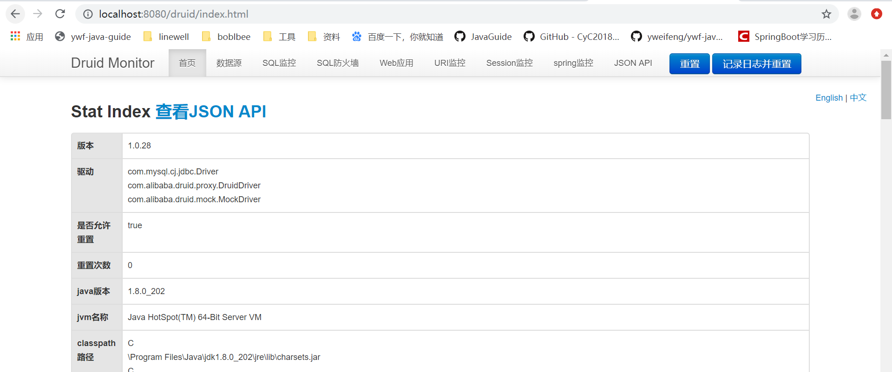

# SpringBoot整合Druid监控

### pom.xml添加依赖

```xml
<dependency>
    <groupId>com.alibaba</groupId>
    <artifactId>druid</artifactId>
    <version>1.0.28</version>
</dependency>
<dependency>
    <groupId>log4j</groupId>
    <artifactId>log4j</artifactId>
    <version>1.2.17</version>
</dependency>
```

### 修改application.properties

```properties
spring.datasource.type=com.alibaba.druid.pool.DruidDataSource 
# 连接池的配置信息
# 初始化大小，最小，最大
spring.datasource.initialSize=5  
spring.datasource.minIdle=5  
spring.datasource.maxActive=20  
# 配置获取连接等待超时的时间
spring.datasource.maxWait=60000  
# 配置间隔多久才进行一次检测，检测需要关闭的空闲连接，单位是毫秒
spring.datasource.timeBetweenEvictionRunsMillis=60000  
# 配置一个连接在池中最小生存的时间，单位是毫秒
spring.datasource.minEvictableIdleTimeMillis=300000  
spring.datasource.validationQuery=SELECT 1 FROM DUAL  
spring.datasource.testWhileIdle=true  
spring.datasource.testOnBorrow=false  
spring.datasource.testOnReturn=false  
# 打开PSCache，并且指定每个连接上PSCache的大小
spring.datasource.poolPreparedStatements=true  
spring.datasource.maxPoolPreparedStatementPerConnectionSize=20  
# 配置监控统计拦截的filters，去掉后监控界面sql无法统计，'wall'用于防火墙
spring.datasource.filters=stat,wall,log4j
# 通过connectProperties属性来打开mergeSql功能；慢SQL记录
```

### 新建DruidConfig 

```java
package com.ywf.srpingbootproject.configuration;

import com.alibaba.druid.pool.DruidDataSource;
import org.springframework.beans.factory.annotation.Value;
import org.springframework.context.annotation.Bean;
import org.springframework.context.annotation.Configuration;
import org.springframework.context.annotation.Primary;

import javax.sql.DataSource;
import java.sql.SQLException;

@Configuration
public class DruidConfig {

    @Value("${spring.datasource.url}")
    private String dbUrl;

    @Value("${spring.datasource.username}")
    private String username;

    @Value("${spring.datasource.password}")
    private String password;

    @Value("${spring.datasource.driver-class-name}")
    private String driverClassName;

    @Value("${spring.datasource.initialSize}")
    private int initialSize;

    @Value("${spring.datasource.minIdle}")
    private int minIdle;

    @Value("${spring.datasource.maxActive}")
    private int maxActive;

    @Value("${spring.datasource.maxWait}")
    private int maxWait;

    @Value("${spring.datasource.timeBetweenEvictionRunsMillis}")
    private int timeBetweenEvictionRunsMillis;

    @Value("${spring.datasource.minEvictableIdleTimeMillis}")
    private int minEvictableIdleTimeMillis;

    @Value("${spring.datasource.validationQuery}")
    private String validationQuery;

    @Value("${spring.datasource.testWhileIdle}")
    private boolean testWhileIdle;

    @Value("${spring.datasource.testOnBorrow}")
    private boolean testOnBorrow;

    @Value("${spring.datasource.testOnReturn}")
    private boolean testOnReturn;

    @Value("${spring.datasource.poolPreparedStatements}")
    private boolean poolPreparedStatements;

    @Value("${spring.datasource.maxPoolPreparedStatementPerConnectionSize}")
    private int maxPoolPreparedStatementPerConnectionSize;

    @Value("${spring.datasource.filters}")
    private String filters;

    @Value("{spring.datasource.connectionProperties}")
    private String connectionProperties;

    @Bean
    @Primary  //主数据源
    public DataSource dataSource(){
        DruidDataSource datasource = new DruidDataSource();

        datasource.setUrl(this.dbUrl);
        datasource.setUsername(username);
        datasource.setPassword(password);
        datasource.setDriverClassName(driverClassName);

        //configuration
        datasource.setInitialSize(initialSize);
        datasource.setMinIdle(minIdle);
        datasource.setMaxActive(maxActive);
        datasource.setMaxWait(maxWait);
        datasource.setTimeBetweenEvictionRunsMillis(timeBetweenEvictionRunsMillis);
        datasource.setMinEvictableIdleTimeMillis(minEvictableIdleTimeMillis);
        datasource.setValidationQuery(validationQuery);
        datasource.setTestWhileIdle(testWhileIdle);
        datasource.setTestOnBorrow(testOnBorrow);
        datasource.setTestOnReturn(testOnReturn);
        datasource.setPoolPreparedStatements(poolPreparedStatements);
        datasource.setMaxPoolPreparedStatementPerConnectionSize(maxPoolPreparedStatementPerConnectionSize);
        try {
            datasource.setFilters(filters);
        } catch (SQLException e) {
            e.printStackTrace();
        }
        datasource.setConnectionProperties(connectionProperties);

        return datasource;
    }
}
```

### 新建DruidFilter 

```java
package com.ywf.srpingbootproject.filter;

import com.alibaba.druid.support.http.WebStatFilter;

import javax.servlet.annotation.WebFilter;
import javax.servlet.annotation.WebInitParam;

@WebFilter(filterName="druidWebStatFilter",urlPatterns="/*",
        initParams={
                @WebInitParam(name="exclusions",value="*.js,*.gif,*.jpg,*.bmp,*.png,*.css,*.ico,/druid/*")//忽略资源
        }
)
public class DruidFilter extends WebStatFilter {
}
```

### 新建DruidServlet 

```java
package com.ywf.srpingbootproject.servlet;

import com.alibaba.druid.support.http.StatViewServlet;

import javax.servlet.annotation.WebInitParam;
import javax.servlet.annotation.WebServlet;


@WebServlet(urlPatterns="/druid/*",
        initParams={
                @WebInitParam(name="allow",value=""),// IP白名单(没有配置或者为空，则允许所有访问)
                @WebInitParam(name="deny",value=""),// IP黑名单 (deny优先于allow)
                @WebInitParam(name="loginUsername",value="admin"),// 登录druid管理页面用户名
                @WebInitParam(name="loginPassword",value="admin")// 登录druid管理页面密码
        })
public class DruidServlet extends StatViewServlet {
}
```

### 启动类添加注解

```java
package com.ywf.srpingbootproject;

import org.springframework.boot.SpringApplication;
import org.springframework.boot.autoconfigure.SpringBootApplication;
import org.springframework.boot.web.servlet.ServletComponentScan;

@SpringBootApplication
//@EnableScheduling
@ServletComponentScan
public class SrpingbootProjectApplication {

    public static void main(String[] args) {
        SpringApplication.run(SrpingbootProjectApplication.class, args);
    }

}
```

### 启动项目访问

[localhost:8080/druid](localhost:8080/druid)

