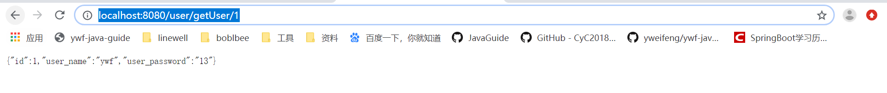

# SpringBoot整合Mybatis

介绍一下**SpringBoot**整合**mybatis**，数据库选用的是**mysql**。

### **首先创建数据库**

```mysql
CREATE DATABASE test;
```

### **建表以及插入初始数据** 

```mysql
SET NAMES utf8mb4;
SET FOREIGN_KEY_CHECKS = 0;

-- ----------------------------
-- Table structure for user
-- ----------------------------
DROP TABLE IF EXISTS `user`;
CREATE TABLE `user` (
  `id` int(11) NOT NULL AUTO_INCREMENT,
  `user_name` varchar(255) NOT NULL,
  `user_password` varchar(255) DEFAULT NULL,
  PRIMARY KEY (`id`)
) ENGINE=InnoDB AUTO_INCREMENT=13 DEFAULT CHARSET=latin1;

-- ----------------------------
-- Records of user
-- ----------------------------
BEGIN;
INSERT INTO `user` VALUES (1, 'ywf', '13');
INSERT INTO `user` VALUES (2, 'zhangsan', '123');
INSERT INTO `user` VALUES (3, 'lisi', '123');
COMMIT;

SET FOREIGN_KEY_CHECKS = 1;
```

### pom.xml新增依赖

```xml
<dependency>
    <groupId>mysql</groupId>
    <artifactId>mysql-connector-java</artifactId>
</dependency>
<dependency>
    <groupId>org.mybatis.spring.boot</groupId>
    <artifactId>mybatis-spring-boot-starter</artifactId>
    <version>1.3.1</version>
</dependency>
```

### **修改application.properties**

```properties
##数据库地址
spring.datasource.url=jdbc:mysql://192.168.60.15:3306/test?characterEncoding=utf8&useSSL=false
##数据库用户名
spring.datasource.username=root
##数据库密码
spring.datasource.password=linewell@2016
##数据库驱动
spring.datasource.driver-class-name=com.mysql.jdbc.Driver

##检查 mybatis 配置是否存在，一般命名为 mybatis-config.xml
mybatis.check-config-location=true
##配置文件位置
mybatis.config-location=classpath:mybatis/mybatis-config.xml
## mapper xml 文件地址
mybatis.mapper-locations=classpath*:mapper/*Mapper.xml
##日志级别
logging.level.com.yang.dao=debug
```

### **新建mybatis-config.xml**

```xml
<?xml version="1.0" encoding="UTF-8"?>
<!DOCTYPE configuration PUBLIC "-//mybatis.org//DTD SQL Map Config 3.0//EN"
        "http://mybatis.org/dtd/mybatis-3-config.dtd">
<configuration>

    <typeAliases>
        <typeAlias alias="Integer" type="java.lang.Integer" />
        <typeAlias alias="Long" type="java.lang.Long" />
        <typeAlias alias="HashMap" type="java.util.HashMap" />
        <typeAlias alias="LinkedHashMap" type="java.util.LinkedHashMap" />
        <typeAlias alias="ArrayList" type="java.util.ArrayList" />
        <typeAlias alias="LinkedList" type="java.util.LinkedList" />
        <typeAlias alias="user" type="com.ywf.srpingbootproject.entity.User"/>
    </typeAliases>
</configuration>
```

### 新建实体类User

```java
package com.ywf.srpingbootproject.entity;

public class User {

    private int id;
    private String user_name;
    private String user_password;

    public int getId() {
        return id;
    }

    public void setId(int id) {
        this.id = id;
    }

    public String getUser_name() {
        return user_name;
    }

    public void setUser_name(String user_name) {
        this.user_name = user_name;
    }

    public String getUser_password() {
        return user_password;
    }

    public void setUser_password(String user_password) {
        this.user_password = user_password;
    }
}
```

### 新建UserController

```java
package com.ywf.srpingbootproject.controller;

import com.ywf.srpingbootproject.entity.User;
import com.ywf.srpingbootproject.service.IUserService;
import org.springframework.beans.factory.annotation.Autowired;
import org.springframework.web.bind.annotation.PathVariable;
import org.springframework.web.bind.annotation.RequestMapping;
import org.springframework.web.bind.annotation.RestController;

@RestController
@RequestMapping("/user")
public class UserController {

    @Autowired
    private IUserService userService;

    @RequestMapping("/getUser/{id}")
    public User getUser(@PathVariable int id) {
        User user = userService.getUser(id);
        return user;
    }
}
```

### 新建 IUserService 接口

```java
public interface IUserService {
    User getUser(int id);
}
```

### 新建 UserServiceImpl

```java
package com.ywf.srpingbootproject.service.impl;

import com.ywf.srpingbootproject.dao.UserMapper;
import com.ywf.srpingbootproject.entity.User;
import com.ywf.srpingbootproject.service.IUserService;
import org.springframework.beans.factory.annotation.Autowired;
import org.springframework.stereotype.Service;

@Service
public class UserServiceImpl implements IUserService {

    @Autowired
    private UserMapper userMapper;

    @Override
    public User getUser(int id) {
        return userMapper.getUser(id);
    }
}
```

### 新建UserMapper

```java
package com.ywf.srpingbootproject.dao;

import com.ywf.srpingbootproject.entity.User;
import org.apache.ibatis.annotations.Mapper;

@Mapper
public interface UserMapper {

    User getUser(int id);
}
```

### 新建UserMapper.xml

```xml
<?xml version="1.0" encoding="UTF-8" ?>
<!DOCTYPE mapper PUBLIC "-//mybatis.org//DTD Mapper 3.0//EN" "http://mybatis.org/dtd/mybatis-3-mapper.dtd" >
<mapper namespace="com.ywf.srpingbootproject.dao.UserMapper">
    <select id="getUser" resultType="com.ywf.srpingbootproject.entity.User">
        SELECT * FROM user
        WHERE id=#{id}
    </select>
</mapper>
```

### 启动应用访问

[ http://localhost:8080/user/getUser/1]( http://localhost:8080/user/getUser/1 )



