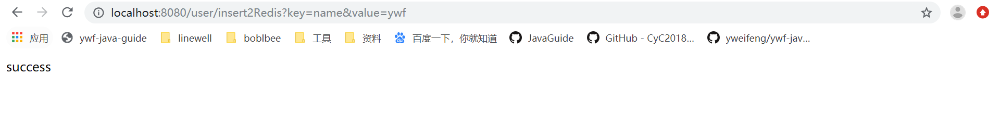
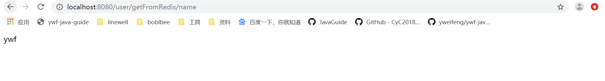

<!-- TOC -->

- [SpringBoot整合redis](#springboot整合redis)
    - [单机版](#单机版)
        - [pom.xml引入依赖](#pomxml引入依赖)
        - [application.properties](#applicationproperties)
        - [新建 RedisConfig](#新建-redisconfig)
        - [UserController](#usercontroller)
        - [RedisUtil](#redisutil)
        - [启动应用，浏览器访问](#启动应用浏览器访问)
    - [集群版](#集群版)
        - [pom.xml](#pomxml)
        - [application.yml](#applicationyml)
        - [RedisClusterConfig](#redisclusterconfig)
        - [TestController](#testcontroller)
        - [启动应用测试](#启动应用测试)

<!-- /TOC -->
# SpringBoot整合redis

## 单机版

### pom.xml引入依赖

```xml
<dependency>
    <groupId>org.springframework.boot</groupId>
    <artifactId>spring-boot-starter-data-redis</artifactId>
</dependency>
```


### application.properties

```properties
# Redis数据库索引（默认为0）
spring.redis.database=0 
# Redis服务器地址
spring.redis.host=localhost
# Redis服务器连接端口
spring.redis.port=6379 
# Redis服务器连接密码（默认为空）
spring.redis.password=
# 连接超时时间（毫秒）
spring.redis.timeout=0
```


### 新建 RedisConfig 

```java
package com.ywf.srpingbootproject.configuration;

import com.fasterxml.jackson.annotation.JsonAutoDetect;
import com.fasterxml.jackson.annotation.PropertyAccessor;
import com.fasterxml.jackson.databind.ObjectMapper;
import org.springframework.cache.annotation.CachingConfigurerSupport;
import org.springframework.cache.annotation.EnableCaching;
import org.springframework.context.annotation.Bean;
import org.springframework.context.annotation.Configuration;
import org.springframework.data.redis.connection.RedisConnectionFactory;
import org.springframework.data.redis.core.*;
import org.springframework.data.redis.serializer.Jackson2JsonRedisSerializer;
import org.springframework.data.redis.serializer.StringRedisSerializer;

@Configuration
@EnableCaching
public class RedisConfig extends CachingConfigurerSupport {

    /**
     * retemplate相关配置
     * @param factory
     * @return
     */
    @Bean
    public RedisTemplate<String, Object> redisTemplate(RedisConnectionFactory factory) {

        RedisTemplate<String, Object> template = new RedisTemplate<>();
        // 配置连接工厂
        template.setConnectionFactory(factory);

        //使用Jackson2JsonRedisSerializer来序列化和反序列化redis的value值（默认使用JDK的序列化方式）
        Jackson2JsonRedisSerializer jacksonSeial = new Jackson2JsonRedisSerializer(Object.class);

        ObjectMapper om = new ObjectMapper();
        // 指定要序列化的域，field,get和set,以及修饰符范围，ANY是都有包括private和public
        om.setVisibility(PropertyAccessor.ALL, JsonAutoDetect.Visibility.ANY);
        // 指定序列化输入的类型，类必须是非final修饰的，final修饰的类，比如String,Integer等会跑出异常
        om.enableDefaultTyping(ObjectMapper.DefaultTyping.NON_FINAL);
        jacksonSeial.setObjectMapper(om);

        // 值采用json序列化
        template.setValueSerializer(jacksonSeial);
        //使用StringRedisSerializer来序列化和反序列化redis的key值
        template.setKeySerializer(new StringRedisSerializer());

        // 设置hash key 和value序列化模式
        template.setHashKeySerializer(new StringRedisSerializer());
        template.setHashValueSerializer(jacksonSeial);
        template.afterPropertiesSet();

        return template;
    }

    /**
     * 对hash类型的数据操作
     *
     * @param redisTemplate
     * @return
     */
    @Bean
    public HashOperations<String, String, Object> hashOperations(RedisTemplate<String, Object> redisTemplate) {
        return redisTemplate.opsForHash();
    }

    /**
     * 对redis字符串类型数据操作
     *
     * @param redisTemplate
     * @return
     */
    @Bean
    public ValueOperations<String, Object> valueOperations(RedisTemplate<String, Object> redisTemplate) {
        return redisTemplate.opsForValue();
    }

    /**
     * 对链表类型的数据操作
     *
     * @param redisTemplate
     * @return
     */
    @Bean
    public ListOperations<String, Object> listOperations(RedisTemplate<String, Object> redisTemplate) {
        return redisTemplate.opsForList();
    }

    /**
     * 对无序集合类型的数据操作
     *
     * @param redisTemplate
     * @return
     */
    @Bean
    public SetOperations<String, Object> setOperations(RedisTemplate<String, Object> redisTemplate) {
        return redisTemplate.opsForSet();
    }

    /**
     * 对有序集合类型的数据操作
     *
     * @param redisTemplate
     * @return
     */
    @Bean
    public ZSetOperations<String, Object> zSetOperations(RedisTemplate<String, Object> redisTemplate) {
        return redisTemplate.opsForZSet();
    }

}
```

### UserController

```java
package com.ywf.srpingbootproject.controller;

import com.github.pagehelper.Page;
import com.ywf.srpingbootproject.util.RedisUtil;
import io.swagger.annotations.Api;
import io.swagger.annotations.ApiOperation;
import org.springframework.beans.factory.annotation.Autowired;
import org.springframework.web.bind.annotation.PathVariable;
import org.springframework.web.bind.annotation.RequestMapping;
import org.springframework.web.bind.annotation.RequestParam;
import org.springframework.web.bind.annotation.RestController;

import java.util.List;

@RestController
@RequestMapping("/user")
@Api(value = "用户控制层",tags = {"用户操作"})
public class UserController {


    @Autowired
    private RedisUtil redisUtil;

    @ApiOperation(value = "插入到redis",notes = "插入到redis")
    @RequestMapping("/insert2Redis")
    public String insert2Redis(@RequestParam String key, @RequestParam String value) {
        redisUtil.set(key, value);
        return "success";
    }

    @ApiOperation(value = "根据key从redis中获取",notes = "根据key从redis中获取")
    @RequestMapping("/getFromRedis/{key}")
    public String getFromRedis(@PathVariable String key) {
        return (String) redisUtil.get(key);
    }
}
```


### RedisUtil

```java
package com.ywf.srpingbootproject.util;

import org.springframework.beans.factory.annotation.Autowired;
import org.springframework.data.redis.core.BoundListOperations;
import org.springframework.data.redis.core.RedisTemplate;
import org.springframework.stereotype.Component;
import org.springframework.util.CollectionUtils;

import java.util.List;
import java.util.Map;
import java.util.Set;
import java.util.concurrent.TimeUnit;

@Component
public class RedisUtil {

    @Autowired
    private RedisTemplate<String, Object> redisTemplate;

    public RedisUtil(RedisTemplate<String, Object> redisTemplate) {
        this.redisTemplate = redisTemplate;
    }

    /**
     * 指定缓存失效时间
     * @param key 键
     * @param time 时间(秒)
     * @return
     */
    public boolean expire(String key,long time){
        try {
            if(time>0){
                redisTemplate.expire(key, time, TimeUnit.SECONDS);
            }
            return true;
        } catch (Exception e) {
            e.printStackTrace();
            return false;
        }
    }

    /**
     * 根据key 获取过期时间
     * @param key 键 不能为null
     * @return 时间(秒) 返回0代表为永久有效
     */
    public long getExpire(String key){
        return redisTemplate.getExpire(key,TimeUnit.SECONDS);
    }

    /**
     * 判断key是否存在
     * @param key 键
     * @return true 存在 false不存在
     */
    public boolean hasKey(String key){
        try {
            return redisTemplate.hasKey(key);
        } catch (Exception e) {
            e.printStackTrace();
            return false;
        }
    }

    /**
     * 删除缓存
     * @param key 可以传一个值 或多个
     */
    @SuppressWarnings("unchecked")
    public void del(String ... key){
        if(key!=null&&key.length>0){
            if(key.length==1){
                redisTemplate.delete(key[0]);
            }else{
                redisTemplate.delete(CollectionUtils.arrayToList(key));
            }
        }
    }

    //============================String=============================
    /**
     * 普通缓存获取
     * @param key 键
     * @return 值
     */
    public Object get(String key){
        return key==null?null:redisTemplate.opsForValue().get(key);
    }

    /**
     * 普通缓存放入
     * @param key 键
     * @param value 值
     * @return true成功 false失败
     */
    public boolean set(String key,Object value) {
        try {
            redisTemplate.opsForValue().set(key, value);
            return true;
        } catch (Exception e) {
            e.printStackTrace();
            return false;
        }
    }

    /**
     * 普通缓存放入并设置时间
     * @param key 键
     * @param value 值
     * @param time 时间(秒) time要大于0 如果time小于等于0 将设置无限期
     * @return true成功 false 失败
     */
    public boolean set(String key,Object value,long time){
        try {
            if(time>0){
                redisTemplate.opsForValue().set(key, value, time, TimeUnit.SECONDS);
            }else{
                set(key, value);
            }
            return true;
        } catch (Exception e) {
            e.printStackTrace();
            return false;
        }
    }

    /**
     * 递增
     * @param key 键
     * @param delta 要增加几(大于0)
     * @return
     */
    public long incr(String key, long delta){
        if(delta<0){
            throw new RuntimeException("递增因子必须大于0");
        }
        return redisTemplate.opsForValue().increment(key, delta);
    }

    /**
     * 递减
     * @param key 键
     * @param delta 要减少几(小于0)
     * @return
     */
    public long decr(String key, long delta){
        if(delta<0){
            throw new RuntimeException("递减因子必须大于0");
        }
        return redisTemplate.opsForValue().increment(key, -delta);
    }

    //================================Map=================================
    /**
     * HashGet
     * @param key 键 不能为null
     * @param item 项 不能为null
     * @return 值
     */
    public Object hget(String key,String item){
        return redisTemplate.opsForHash().get(key, item);
    }

    /**
     * 获取hashKey对应的所有键值
     * @param key 键
     * @return 对应的多个键值
     */
    public Map<Object,Object> hmget(String key){
        return redisTemplate.opsForHash().entries(key);
    }

    /**
     * HashSet
     * @param key 键
     * @param map 对应多个键值
     * @return true 成功 false 失败
     */
    public boolean hmset(String key, Map<String,Object> map){
        try {
            redisTemplate.opsForHash().putAll(key, map);
            return true;
        } catch (Exception e) {
            e.printStackTrace();
            return false;
        }
    }

    /**
     * HashSet 并设置时间
     * @param key 键
     * @param map 对应多个键值
     * @param time 时间(秒)
     * @return true成功 false失败
     */
    public boolean hmset(String key, Map<String,Object> map, long time){
        try {
            redisTemplate.opsForHash().putAll(key, map);
            if(time>0){
                expire(key, time);
            }
            return true;
        } catch (Exception e) {
            e.printStackTrace();
            return false;
        }
    }

    /**
     * 向一张hash表中放入数据,如果不存在将创建
     * @param key 键
     * @param item 项
     * @param value 值
     * @return true 成功 false失败
     */
    public boolean hset(String key,String item,Object value) {
        try {
            redisTemplate.opsForHash().put(key, item, value);
            return true;
        } catch (Exception e) {
            e.printStackTrace();
            return false;
        }
    }

    /**
     * 向一张hash表中放入数据,如果不存在将创建
     * @param key 键
     * @param item 项
     * @param value 值
     * @param time 时间(秒)  注意:如果已存在的hash表有时间,这里将会替换原有的时间
     * @return true 成功 false失败
     */
    public boolean hset(String key,String item,Object value,long time) {
        try {
            redisTemplate.opsForHash().put(key, item, value);
            if(time>0){
                expire(key, time);
            }
            return true;
        } catch (Exception e) {
            e.printStackTrace();
            return false;
        }
    }

    /**
     * 删除hash表中的值
     * @param key 键 不能为null
     * @param item 项 可以使多个 不能为null
     */
    public void hdel(String key, Object... item){
        redisTemplate.opsForHash().delete(key,item);
    }

    /**
     * 判断hash表中是否有该项的值
     * @param key 键 不能为null
     * @param item 项 不能为null
     * @return true 存在 false不存在
     */
    public boolean hHasKey(String key, String item){
        return redisTemplate.opsForHash().hasKey(key, item);
    }

    /**
     * hash递增 如果不存在,就会创建一个 并把新增后的值返回
     * @param key 键
     * @param item 项
     * @param by 要增加几(大于0)
     * @return
     */
    public double hincr(String key, String item,double by){
        return redisTemplate.opsForHash().increment(key, item, by);
    }

    /**
     * hash递减
     * @param key 键
     * @param item 项
     * @param by 要减少记(小于0)
     * @return
     */
    public double hdecr(String key, String item,double by){
        return redisTemplate.opsForHash().increment(key, item,-by);
    }

    //============================set=============================
    /**
     * 根据key获取Set中的所有值
     * @param key 键
     * @return
     */
    public Set<Object> sGet(String key){
        try {
            return redisTemplate.opsForSet().members(key);
        } catch (Exception e) {
            e.printStackTrace();
            return null;
        }
    }

    /**
     * 根据value从一个set中查询,是否存在
     * @param key 键
     * @param value 值
     * @return true 存在 false不存在
     */
    public boolean sHasKey(String key,Object value){
        try {
            return redisTemplate.opsForSet().isMember(key, value);
        } catch (Exception e) {
            e.printStackTrace();
            return false;
        }
    }

    /**
     * 将数据放入set缓存
     * @param key 键
     * @param values 值 可以是多个
     * @return 成功个数
     */
    public long sSet(String key, Object...values) {
        try {
            return redisTemplate.opsForSet().add(key, values);
        } catch (Exception e) {
            e.printStackTrace();
            return 0;
        }
    }

    /**
     * 将set数据放入缓存
     * @param key 键
     * @param time 时间(秒)
     * @param values 值 可以是多个
     * @return 成功个数
     */
    public long sSetAndTime(String key,long time,Object...values) {
        try {
            Long count = redisTemplate.opsForSet().add(key, values);
            if(time>0) {
                expire(key, time);
            }
            return count;
        } catch (Exception e) {
            e.printStackTrace();
            return 0;
        }
    }

    /**
     * 获取set缓存的长度
     * @param key 键
     * @return
     */
    public long sGetSetSize(String key){
        try {
            return redisTemplate.opsForSet().size(key);
        } catch (Exception e) {
            e.printStackTrace();
            return 0;
        }
    }

    /**
     * 移除值为value的
     * @param key 键
     * @param values 值 可以是多个
     * @return 移除的个数
     */
    public long setRemove(String key, Object ...values) {
        try {
            Long count = redisTemplate.opsForSet().remove(key, values);
            return count;
        } catch (Exception e) {
            e.printStackTrace();
            return 0;
        }
    }
    //===============================list=================================

    /**
     * 获取list缓存的内容
     * @param key 键
     * @param start 开始
     * @param end 结束  0 到 -1代表所有值
     * @return
     */
    public List<Object> lGet(String key, long start, long end){
        try {
            return redisTemplate.opsForList().range(key, start, end);
        } catch (Exception e) {
            e.printStackTrace();
            return null;
        }
    }

    /**
     * 获取list缓存的长度
     * @param key 键
     * @return
     */
    public long lGetListSize(String key){
        try {
            return redisTemplate.opsForList().size(key);
        } catch (Exception e) {
            e.printStackTrace();
            return 0;
        }
    }

    /**
     * 通过索引 获取list中的值
     * @param key 键
     * @param index 索引  index>=0时， 0 表头，1 第二个元素，依次类推；index<0时，-1，表尾，-2倒数第二个元素，依次类推
     * @return
     */
    public Object lGetIndex(String key,long index){
        try {
            return redisTemplate.opsForList().index(key, index);
        } catch (Exception e) {
            e.printStackTrace();
            return null;
        }
    }

    /**
     * 将list放入缓存
     * @param key 键
     * @param value 值
     * @return
     */
    public boolean lSet(String key, Object value) {
        try {
            redisTemplate.opsForList().rightPush(key, value);
            return true;
        } catch (Exception e) {
            e.printStackTrace();
            return false;
        }
    }

    /**
     * 将list放入缓存
     * @param key 键
     * @param value 值
     * @param time 时间(秒)
     * @return
     */
    public boolean lSet(String key, Object value, long time) {
        try {
            redisTemplate.opsForList().rightPush(key, value);
            if (time > 0) {
                expire(key, time);
            }
            return true;
        } catch (Exception e) {
            e.printStackTrace();
            return false;
        }
    }

    /**
     * 将list放入缓存
     * @param key 键
     * @param value 值
     * @return
     */
    public boolean lSet(String key, List<Object> value) {
        try {
            redisTemplate.opsForList().rightPushAll(key, value);
            return true;
        } catch (Exception e) {
            e.printStackTrace();
            return false;
        }
    }

    /**
     * 将list放入缓存
     * @param key 键
     * @param value 值
     * @param time 时间(秒)
     * @return
     */
    public boolean lSet(String key, List<Object> value, long time) {
        try {
            redisTemplate.opsForList().rightPushAll(key, value);
            if (time > 0) {
                expire(key, time);
            }
            return true;
        } catch (Exception e) {
            e.printStackTrace();
            return false;
        }
    }

    /**
     * 根据索引修改list中的某条数据
     * @param key 键
     * @param index 索引
     * @param value 值
     * @return
     */
    public boolean lUpdateIndex(String key, long index,Object value) {
        try {
            redisTemplate.opsForList().set(key, index, value);
            return true;
        } catch (Exception e) {
            e.printStackTrace();
            return false;
        }
    }

    /**
     * 移除N个值为value
     * @param key 键
     * @param count 移除多少个
     * @param value 值
     * @return 移除的个数
     */
    public long lRemove(String key,long count,Object value) {
        try {
            Long remove = redisTemplate.opsForList().remove(key, count, value);
            return remove;
        } catch (Exception e) {
            e.printStackTrace();
            return 0;
        }
    }

    /**
     * 模糊查询获取key值
     * @param pattern
     * @return
     */
    public Set keys(String pattern){
        return redisTemplate.keys(pattern);
    }

    /**
     * 使用Redis的消息队列
     * @param channel
     * @param message 消息内容
     */
    public void convertAndSend(String channel, Object message){
        redisTemplate.convertAndSend(channel,message);
    }


    //=========BoundListOperations 用法 start============

    /**
     *将数据添加到Redis的list中（从右边添加）
     * @param listKey
     * @param expireEnum 有效期的枚举类
     * @param values 待添加的数据
     */
//    public void addToListRight(String listKey, Status.ExpireEnum expireEnum, Object... values) {
//        //绑定操作
//        BoundListOperations<String, Object> boundValueOperations = redisTemplate.boundListOps(listKey);
//        //插入数据
//        boundValueOperations.rightPushAll(values);
//        //设置过期时间
//        boundValueOperations.expire(expireEnum.getTime(),expireEnum.getTimeUnit());
//    }
    /**
     * 根据起始结束序号遍历Redis中的list
     * @param listKey
     * @param start  起始序号
     * @param end  结束序号
     * @return
     */
    public List<Object> rangeList(String listKey, long start, long end) {
        //绑定操作
        BoundListOperations<String, Object> boundValueOperations = redisTemplate.boundListOps(listKey);
        //查询数据
        return boundValueOperations.range(start, end);
    }
    /**
     * 弹出右边的值 --- 并且移除这个值
     * @param listKey
     */
    public Object rifhtPop(String listKey){
        //绑定操作
        BoundListOperations<String, Object> boundValueOperations = redisTemplate.boundListOps(listKey);
        return boundValueOperations.rightPop();
    }

}
```


### 启动应用，浏览器访问

[ http://localhost:8080/user/insert2Redis?key=name&value=ywf ]( http://localhost:8080/user/insert2Redis?key=name&value=ywf )



[localhost:8080/user/getFromRedis/name](localhost:8080/user/getFromRedis/name)




## 集群版

### pom.xml

```xml
<?xml version="1.0" encoding="UTF-8"?>
<project xmlns="http://maven.apache.org/POM/4.0.0" xmlns:xsi="http://www.w3.org/2001/XMLSchema-instance"
         xsi:schemaLocation="http://maven.apache.org/POM/4.0.0 https://maven.apache.org/xsd/maven-4.0.0.xsd">
    <modelVersion>4.0.0</modelVersion>
    <parent>
        <groupId>org.springframework.boot</groupId>
        <artifactId>spring-boot-starter-parent</artifactId>
        <version>2.2.2.RELEASE</version>
        <relativePath/> <!-- lookup parent from repository -->
    </parent>
    <groupId>com.ywf</groupId>
    <artifactId>redis-lua</artifactId>
    <version>0.0.1-SNAPSHOT</version>
    <name>redis-lua</name>
    <description>Demo project for Spring Boot</description>

    <properties>
        <java.version>1.8</java.version>
    </properties>

    <dependencies>
        <dependency>
            <groupId>org.springframework.boot</groupId>
            <artifactId>spring-boot-starter</artifactId>
        </dependency>
        <dependency>
            <groupId>org.springframework.boot</groupId>
            <artifactId>spring-boot-starter-web</artifactId>
        </dependency>
        <dependency>
            <groupId>org.springframework.boot</groupId>
            <artifactId>spring-boot-starter-test</artifactId>
            <scope>test</scope>
            <exclusions>
                <exclusion>
                    <groupId>org.junit.vintage</groupId>
                    <artifactId>junit-vintage-engine</artifactId>
                </exclusion>
            </exclusions>
        </dependency>
        <dependency>
            <groupId>org.springframework.boot</groupId>
            <artifactId>spring-boot-starter-data-redis</artifactId>
        </dependency>
        <dependency>
            <groupId>redis.clients</groupId>
            <artifactId>jedis</artifactId>
        </dependency>
    </dependencies>

    <build>
        <plugins>
            <plugin>
                <groupId>org.springframework.boot</groupId>
                <artifactId>spring-boot-maven-plugin</artifactId>
            </plugin>
        </plugins>
    </build>

</project>
```


### application.yml

```properties
spring:
  application:
    name: redis-cluster
  redis:
    cluster:
      nodes: node1:6379,node1:6380,node2:6379,node2:6380,node3:6379,node3:6380
      max-redirects: 6
redis:
  timeout: 10000 #客户端超时时间单位是毫秒 默认是2000
  maxIdle: 300 #最大空闲数
  maxTotal: 1000 #控制一个pool可分配多少个jedis实例,用来替换上面的redis.maxActive,如果是jedis 2.4以后用该属性
  maxWaitMillis: 1000 #最大建立连接等待时间。如果超过此时间将接到异常。设为-1表示无限制。
  minEvictableIdleTimeMillis: 300000 #连接的最小空闲时间 默认1800000毫秒(30分钟)
  numTestsPerEvictionRun: 1024 #每次释放连接的最大数目,默认3
  timeBetweenEvictionRunsMillis: 30000 #逐出扫描的时间间隔(毫秒) 如果为负数,则不运行逐出线程, 默认-1
  testOnBorrow: true #是否在从池中取出连接前进行检验,如果检验失败,则从池中去除连接并尝试取出另一个
  testWhileIdle: true #在空闲时检查有效性, 默认false
server:
  port: 8080
```


### RedisClusterConfig

```java
package com.ywf.redislua.config;

import org.springframework.beans.factory.annotation.Value;
import org.springframework.context.annotation.Bean;
import org.springframework.context.annotation.Configuration;
import org.springframework.data.redis.connection.RedisClusterConfiguration;
import org.springframework.data.redis.connection.RedisNode;
import org.springframework.data.redis.connection.RedisPassword;
import org.springframework.data.redis.connection.jedis.JedisConnectionFactory;
import org.springframework.data.redis.core.RedisTemplate;
import org.springframework.data.redis.serializer.JdkSerializationRedisSerializer;
import org.springframework.data.redis.serializer.StringRedisSerializer;
import redis.clients.jedis.JedisPoolConfig;

import java.util.HashSet;
import java.util.Set;

/**
 * @Author:ywf
 */

@Configuration
public class RedisClusterConfig {
    @Value("${spring.redis.cluster.nodes}")
    private String clusterNodes;
    @Value("${spring.redis.cluster.max-redirects}")
    private int maxRedirects;
    @Value("${redis.timeout}")
    private int timeout;
    @Value("${redis.maxIdle}")
    private int maxIdle;
    @Value("${redis.maxTotal}")
    private int maxTotal;
    @Value("${redis.maxWaitMillis}")
    private int maxWaitMillis;
    @Value("${redis.minEvictableIdleTimeMillis}")
    private int minEvictableIdleTimeMillis;
    @Value("${redis.numTestsPerEvictionRun}")
    private int numTestsPerEvictionRun;
    @Value("${redis.timeBetweenEvictionRunsMillis}")
    private int timeBetweenEvictionRunsMillis;
    @Value("${redis.testOnBorrow}")
    private boolean testOnBorrow;
    @Value("${redis.testWhileIdle}")
    private boolean testWhileIdle;
    @Bean
    public JedisPoolConfig getJedisPoolConfig() {
        JedisPoolConfig jedisPoolConfig = new JedisPoolConfig();
        // 最大空闲数
        jedisPoolConfig.setMaxIdle(maxIdle);
        // 连接池的最大数据库连接数
        jedisPoolConfig.setMaxTotal(maxTotal);
        // 最大建立连接等待时间
        jedisPoolConfig.setMaxWaitMillis(maxWaitMillis);
        // 逐出连接的最小空闲时间 默认1800000毫秒(30分钟)
        jedisPoolConfig.setMinEvictableIdleTimeMillis(minEvictableIdleTimeMillis);
        // 每次逐出检查时 逐出的最大数目 如果为负数就是 : 1/abs(n), 默认3
        jedisPoolConfig.setNumTestsPerEvictionRun(numTestsPerEvictionRun);
        // 逐出扫描的时间间隔(毫秒) 如果为负数,则不运行逐出线程, 默认-1
        jedisPoolConfig.setTimeBetweenEvictionRunsMillis(timeBetweenEvictionRunsMillis);
        // 是否在从池中取出连接前进行检验,如果检验失败,则从池中去除连接并尝试取出另一个
        jedisPoolConfig.setTestOnBorrow(testOnBorrow);
        // 在空闲时检查有效性, 默认false
        jedisPoolConfig.setTestWhileIdle(testWhileIdle);
        return jedisPoolConfig;
    }

    /**
     * Redis集群的配置
     * @return RedisClusterConfiguration
     * @throws
     */
    @Bean
    public RedisClusterConfiguration redisClusterConfiguration(){
        RedisClusterConfiguration redisClusterConfiguration = new RedisClusterConfiguration();
        //Set<RedisNode> clusterNodes
        String[] serverArray = clusterNodes.split(",");
        Set<RedisNode> nodes = new HashSet<RedisNode>();
        for(String ipPort:serverArray){
            String[] ipAndPort = ipPort.split(":");
            nodes.add(new RedisNode(ipAndPort[0].trim(),Integer.valueOf(ipAndPort[1])));
        }
        redisClusterConfiguration.setClusterNodes(nodes);
        redisClusterConfiguration.setMaxRedirects(maxRedirects);
//        redisClusterConfiguration.setPassword(RedisPassword.of(password));
        return redisClusterConfiguration;
    }

    /**
     * @param
     * @return
     * @Description:redis连接工厂类
     * @date 2018/10/25 19:45
     */
    @Bean
    public JedisConnectionFactory jedisConnectionFactory() {
        //集群模式
        JedisConnectionFactory  factory = new JedisConnectionFactory(redisClusterConfiguration(),getJedisPoolConfig());
        factory.setDatabase(0);
        factory.setTimeout(timeout);
        factory.setUsePool(true);
        return factory;
    }

    /**
     * 实例化 RedisTemplate 对象
     *
     * @return
     */
    @Bean
    public RedisTemplate<String, Object> redisTemplate() {
        RedisTemplate<String, Object> redisTemplate = new RedisTemplate<>();
        initDomainRedisTemplate(redisTemplate);
        return redisTemplate;
    }

    /**
     * 设置数据存入 redis 的序列化方式,并开启事务
     * 使用默认的序列化会导致key乱码
     *
     */
    private void initDomainRedisTemplate(RedisTemplate<String, Object> redisTemplate) {
        //如果不配置Serializer，那么存储的时候缺省使用String，如果用User类型存储，那么会提示错误User can't cast to String！
        redisTemplate.setKeySerializer(new StringRedisSerializer());
        //这个地方有一个问题，这种序列化器会将value序列化成对象存储进redis中，如果
        //你想取出value，然后进行自增的话，这种序列化器是不可以的，因为对象不能自增；
        //需要改成StringRedisSerializer序列化器。
        redisTemplate.setValueSerializer(new JdkSerializationRedisSerializer());
        redisTemplate.setEnableTransactionSupport(false);
        redisTemplate.setConnectionFactory(jedisConnectionFactory());
    }
}
```


### TestController

```java
package com.ywf.redislua.controller;

import org.springframework.beans.factory.annotation.Autowired;
import org.springframework.data.redis.core.HashOperations;
import org.springframework.data.redis.core.RedisTemplate;
import org.springframework.web.bind.annotation.GetMapping;
import org.springframework.web.bind.annotation.RestController;

/**
 * @Author:ywf
 */

@RestController
public class TestController {
    @Autowired
    private RedisTemplate redisTemplate;

    @GetMapping("/test")
    public void test(){
        System.out.println(redisTemplate.hasKey("name"));
        redisTemplate.opsForValue().set("name","wyp");
        String name = (String) redisTemplate.opsForValue().get("name");
        System.out.println(name);
    }
}
```


### 启动应用测试

[localhost:8080/test](localhost:8080/test)

**控制台打印**

```bash
true
wyp
```

