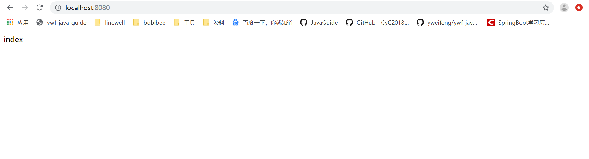
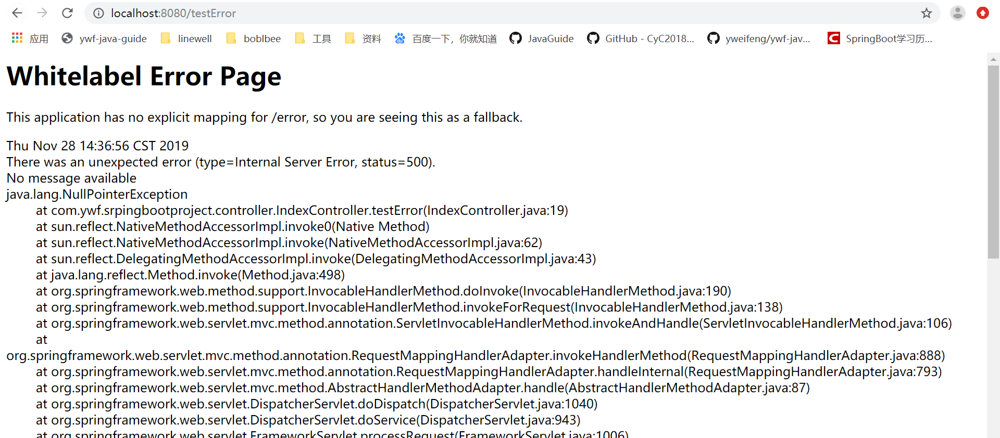
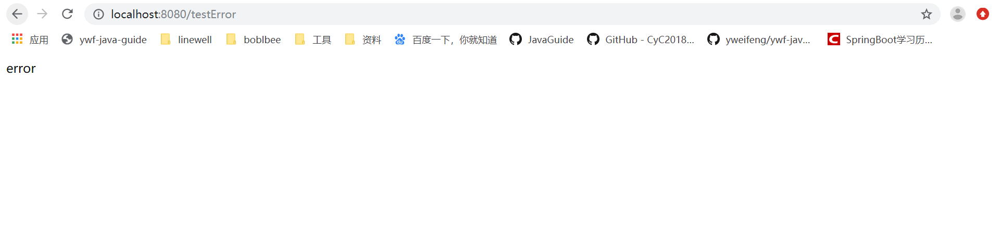

# SpringBoot统一处理异常

 pom.xml 新增web依赖： 

```xml
<dependency>
    <groupId>org.springframework.boot</groupId>
    <artifactId>spring-boot-starter-web</artifactId>
</dependency>
```

新建IndexController:

```java
package com.ywf.srpingbootproject.controller;

import org.springframework.web.bind.annotation.RequestMapping;
import org.springframework.web.bind.annotation.RestController;

import java.util.Map;

@RestController
public class IndexController {

    @RequestMapping("/")
    public String index() {
        return "index";
    }

    @RequestMapping("/testError")
    public String testError() {
        Map map = null;
        return map.toString();
    }
}
```


启动应用并浏览器访问:[localhost:8080](localhost:8080)



 浏览器访问: [localhost:8080/testError](localhost:8080/testError)




新建 CommonErrorController 处理异常

```java
package com.ywf.srpingbootproject.controller;

import org.springframework.boot.web.servlet.error.ErrorController;
import org.springframework.web.bind.annotation.RequestMapping;
import org.springframework.web.bind.annotation.RestController;

@RestController
public class CommonErrorController implements ErrorController {

    public final String ERROR_PATH = "/error";

    @Override
    public String getErrorPath() {
        return ERROR_PATH;
    }

    @RequestMapping(ERROR_PATH)
    public String handleError() {
        System.out.println("handle error");
        return "error";
    }
}
```

再重新访问[localhost:8080/testError](localhost:8080/testError)



