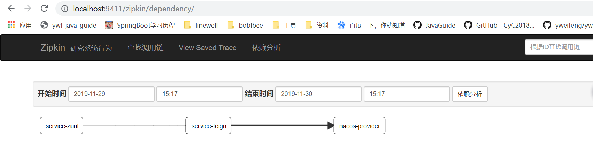
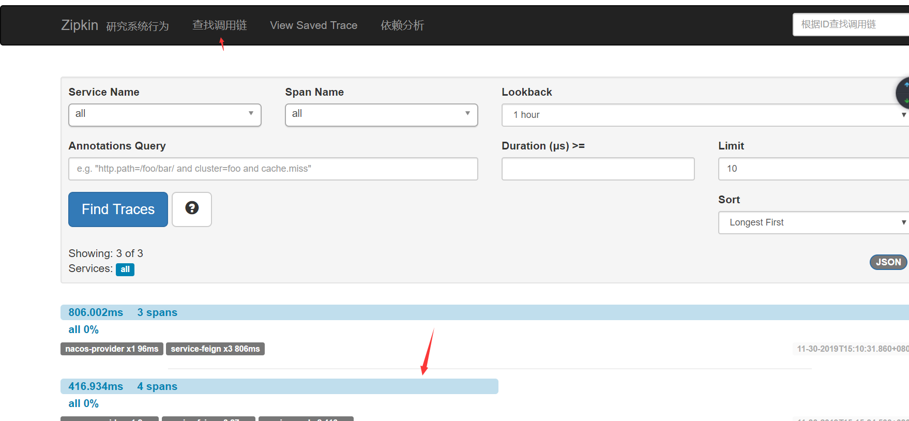

# SpringCloud整合Sleuth(服务链路追踪)

## 术语

- Span：基本工作单元，例如，在一个新建的span中发送一个RPC等同于发送一个回应请求给RPC，span通过一个64位ID唯一标识，trace以另一个64位ID表示，span还有其他数据信息，比如摘要、时间戳事件、关键值注释(tags)、span的ID、以及进度ID(通常是IP地址) span在不断的启动和停止，同时记录了时间信息，当你创建了一个span，你必须在未来的某个时刻停止它。
- Trace：一系列spans组成的一个树状结构，例如，如果你正在跑一个分布式大数据工程，你可能需要创建一个trace。
- Annotation：用来及时记录一个事件的存在，一些核心annotations用来定义一个请求的开始和结束
  - cs - Client Sent -客户端发起一个请求，这个annotion描述了这个span的开始
  - sr - Server Received -服务端获得请求并准备开始处理它，如果将其sr减去cs时间戳便可得到网络延迟
  - ss - Server Sent -注解表明请求处理的完成(当请求返回客户端)，如果ss减去sr时间戳便可得到服务端需要的处理请求时间
  - cr - Client Received -表明span的结束，客户端成功接收到服务端的回复，如果cr减去cs时间戳便可得到客户端从服务端获取回复的所有所需时间 将Span和Trace在一个系统中使用Zipkin注解的过程图形化：

将Span和Trace在一个系统中使用Zipkin注解的过程图形化：


## 项目构建

### 构建server-zipkin

在spring Cloud为F版本的时候，已经不需要自己构建Zipkin Server了，只需要下载jar即可，下载地址：

https://dl.bintray.com/openzipkin/maven/io/zipkin/java/zipkin-server/

也可以在这里https://github.com/forezp/SpringCloudLearning/tree/master/sc-f-chapter9 下载。下载完成jar 包之后，需要运行jar，如下：

> java -jar zipkin-server-2.10.4-exec.jar

访问浏览器localhost:9411

### 项目引入zipkin

项目如下：

- service-zuul

- service-feign
- nacos-provider

**pom.xml**

```xml
<dependency>
    <groupId>org.springframework.cloud</groupId>
    <artifactId>spring-cloud-starter-zipkin</artifactId>
</dependency>
```

**application.yml/bootstrap.yml**

```properties
spring.zipkin.base-url=http://localhost:9411
```

**对外暴露接口**

**三个启动类提供暴露对外接口defaultSampler**

```java
package com.ywf.nacosprovider;

import brave.sampler.Sampler;
import org.springframework.boot.SpringApplication;
import org.springframework.boot.autoconfigure.SpringBootApplication;
import org.springframework.cloud.client.discovery.EnableDiscoveryClient;
import org.springframework.context.annotation.Bean;

@SpringBootApplication
@EnableDiscoveryClient
public class NacosProviderApplication {

    public static void main(String[] args) {
        SpringApplication.run(NacosProviderApplication.class, args);
    }

    @Bean
    public Sampler defaultSampler() {
        return Sampler.ALWAYS_SAMPLE;
    }
}
```

访问 http://localhost:9999/api-feign/hi-feign?name=ywf&token=1

打开 http://localhost:9411/zipkin/ 依赖分析



点击查找调用链,可以看到具体服务相互调用的数据

