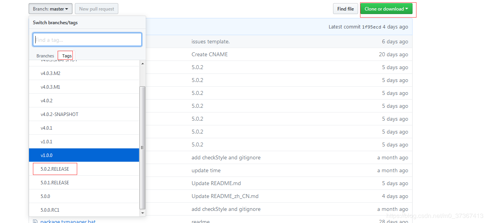

# TX-LCN

TX-LCN官方地址：http://www.txlcn.org/zh-cn/index.html

## 解决方案

  在一个分布式系统下存在多个模块协调来完成一次业务。那么就存在一次业务事务下可能横跨多种数据源节点的可能。TX-LCN将可以解决这样的问题。

  例如存在服务模块A 、B、 C。A模块是mysql作为数据源的服务，B模块是基于redis作为数据源的服务，C模块是基于mongo作为数据源的服务。若需要解决他们的事务一致性就需要针对不同的节点采用不同的方案，并且统一协调完成分布式事务的处理。


 若采用TX-LCN分布式事务框架，则可以将A模块采用LCN模式、B/C采用TCC模式就能完美解决。

## 事务控制原理

TX-LCN由两大模块组成, TxClient、TxManager，TxClient作为模块的依赖框架，提供TX-LCN的标准支持，TxManager作为分布式事务的控制放。事务发起方或者参与反都由TxClient端来控制。

原理图:


### 核心步骤

- 创建事务组
  是指在事务发起方开始执行业务代码之前先调用TxManager创建事务组对象，然后拿到事务标示GroupId的过程。
- 加入事务组
  添加事务组是指参与方在执行完业务方法以后，将该模块的事务信息通知给TxManager的操作。
- 通知事务组
  是指在发起方执行完业务代码以后，将发起方执行结果状态通知给TxManager,TxManager将根据事务最终状态和事务组的信息来通知相应的参与模块提交或回滚事务，并返回结果给事务发起方。


## LCN事务模式

### 一、原理介绍:

LCN模式是通过代理Connection的方式实现对本地事务的操作，然后在由TxManager统一协调控制事务。当本地事务提交回滚或者关闭连接时将会执行假操作，该代理的连接将由LCN连接池管理。

### 二、模式特点:

- 该模式对代码的嵌入性为低。
- 该模式仅限于本地存在连接对象且可通过连接对象控制事务的模块。
- 该模式下的事务提交与回滚是由本地事务方控制，对于数据一致性上有较高的保障。
- 该模式缺陷在于代理的连接需要随事务发起方一共释放连接，增加了连接占用的时间。


## TCC事务模式

### 一、原理介绍:

TCC事务机制相对于传统事务机制（X/Open XA Two-Phase-Commit），其特征在于它不依赖资源管理器(RM)对XA的支持，而是通过对（由业务系统提供的）业务逻辑的调度来实现分布式事务。主要由三步操作，Try: 尝试执行业务、 Confirm:确认执行业务、 Cancel: 取消执行业务。

### 二、模式特点:

- 该模式对代码的嵌入性高，要求每个业务需要写三种步骤的操作。
- 该模式对有无本地事务控制都可以支持使用面广。
- 数据一致性控制几乎完全由开发者控制，对业务开发难度要求高。


## TXC事务模式

### 一、原理介绍：

TXC模式命名来源于淘宝，实现原理是在执行SQL之前，先查询SQL的影响数据，然后保存执行的SQL快走信息和创建锁。当需要回滚的时候就采用这些记录数据回滚数据库，目前锁实现依赖redis分布式锁控制。

### 二、模式特点:

- 该模式同样对代码的嵌入性低。
- 该模式仅限于对支持SQL方式的模块支持。
- 该模式由于每次执行SQL之前需要先查询影响数据，因此相比LCN模式消耗资源与时间要多。
- 该模式不会占用数据库的连接资源。


## TM配置与启动

### TM的准备环境

1. 安装TM需要依赖的中间件： JRE1.8+, Mysql5.6+, Redis3.2+

> 如果需要手动编译源码， 还需要Git, Maven, JDK1.8+

1. 创建MySQL数据库, 名称为: tx-manager
2. 创建数据表

```sql
CREATE TABLE `t_tx_exception`  (
  `id` bigint(20) NOT NULL AUTO_INCREMENT,
  `group_id` varchar(64) CHARACTER SET utf8mb4 COLLATE utf8mb4_general_ci NULL DEFAULT NULL,
  `unit_id` varchar(32) CHARACTER SET utf8mb4 COLLATE utf8mb4_general_ci NULL DEFAULT NULL,
  `mod_id` varchar(128) CHARACTER SET utf8mb4 COLLATE utf8mb4_general_ci NULL DEFAULT NULL,
  `transaction_state` tinyint(4) NULL DEFAULT NULL,
  `registrar` tinyint(4) NULL DEFAULT NULL,
  `remark` varchar(4096) NULL DEFAULT  NULL,
  `ex_state` tinyint(4) NULL DEFAULT NULL COMMENT '0 未解决 1已解决',
  `create_time` datetime(0) NULL DEFAULT NULL,
  PRIMARY KEY (`id`) USING BTREE
) ENGINE = InnoDB AUTO_INCREMENT = 1 CHARACTER SET = utf8mb4 COLLATE = utf8mb4_general_ci ROW_FORMAT = Dynamic;
```

### TM下载与配置

1.下载源码：[https://github.com/codingapi/tx-lcn 选择分支](https://github.com/codingapi/tx-lcn)



2.执行tx-manager.sql的sql，创建tx-manager库及t_tx_exception表

3.修改pom文件增加springboot maven插件

```xml
<plugins>
    <plugin>
        <groupId>org.springframework.boot</groupId>
        <artifactId>spring-boot-maven-plugin</artifactId>
    </plugin>
</plugins>
```

修改txlcn-tm\src\main\resources\application.properties配置文件数据库信息

4.进入txlcn-tm路径下执行【mvn clean package -Dmaven.test.skip=true】命令

5.执行成功后进入target文件夹下。执行 `java -jar txlcn-tm-5.0.2.RELEASE.jar`

6.访问[http://localhost:7970，密码为](http://localhost:7970/)codingapi，

## SpringCloud整合TX-LCN

| 服务名          | 角色   |
| --------------- | ------ |
| txlcn-service-a | 发起方 |
| txlcn-service-b | 参与方 |
| txlcn-service-c | 参与方 |

**父项目pom.xml引入依赖**

```xml
<?xml version="1.0" encoding="UTF-8"?>
<project xmlns="http://maven.apache.org/POM/4.0.0"
         xmlns:xsi="http://www.w3.org/2001/XMLSchema-instance"
         xsi:schemaLocation="http://maven.apache.org/POM/4.0.0 http://maven.apache.org/xsd/maven-4.0.0.xsd">
    <modelVersion>4.0.0</modelVersion>

    <groupId>com.ywf</groupId>
    <artifactId>ywf-springcloud</artifactId>
    <version>1.0-SNAPSHOT</version>
    <packaging>pom</packaging>
    <parent>
        <groupId>org.springframework.boot</groupId>
        <artifactId>spring-boot-starter-parent</artifactId>
        <version>2.1.3.RELEASE</version>
        <relativePath/> <!-- lookup parent from repository -->
    </parent>
    <properties>
        <java.version>1.8</java.version>
        <spring-cloud.version>Greenwich.RELEASE</spring-cloud.version>
        <codingapi.txlcn.version>5.0.2.RELEASE</codingapi.txlcn.version>
    </properties>
    <modules>
        <module>txlcn-service-a</module>
        <module>txlcn-service-b</module>
        <module>txlcn-service-c</module>
    </modules>
    <dependencies>
        <dependency>
            <groupId>org.springframework.boot</groupId>
            <artifactId>spring-boot-devtools</artifactId>
            <scope>runtime</scope>
            <optional>true</optional>
        </dependency>
        <dependency>
            <groupId>org.springframework.boot</groupId>
            <artifactId>spring-boot-starter-test</artifactId>
            <scope>test</scope>
            <exclusions>
                <exclusion>
                    <groupId>org.junit.vintage</groupId>
                    <artifactId>junit-vintage-engine</artifactId>
                </exclusion>
            </exclusions>
        </dependency>
        <dependency>
            <groupId>org.springframework.cloud</groupId>
            <artifactId>spring-cloud-starter-alibaba-nacos-discovery</artifactId>
            <version>0.9.0.RELEASE</version>
        </dependency>
        <!-- txlcn 分布式事务-->
        <dependency>
            <groupId>com.codingapi.txlcn</groupId>
            <artifactId>txlcn-tc</artifactId>
            <version>${codingapi.txlcn.version}</version>
        </dependency>

        <dependency>
            <groupId>com.codingapi.txlcn</groupId>
            <artifactId>txlcn-tm</artifactId>
            <version>${codingapi.txlcn.version}</version>
        </dependency>

        <dependency>
            <groupId>com.codingapi.txlcn</groupId>
            <artifactId>txlcn-txmsg-netty</artifactId>
            <version>${codingapi.txlcn.version}</version>
        </dependency>

    </dependencies>
    <dependencyManagement>
        <dependencies>
            <dependency>
                <groupId>org.springframework.cloud</groupId>
                <artifactId>spring-cloud-dependencies</artifactId>
                <version>${spring-cloud.version}</version>
                <type>pom</type>
                <scope>import</scope>
            </dependency>
        </dependencies>
    </dependencyManagement>
</project>
```

### txlcn-service-a

**pom.xml**

```xml
<?xml version="1.0" encoding="UTF-8"?>
<project xmlns="http://maven.apache.org/POM/4.0.0"
         xmlns:xsi="http://www.w3.org/2001/XMLSchema-instance"
         xsi:schemaLocation="http://maven.apache.org/POM/4.0.0 http://maven.apache.org/xsd/maven-4.0.0.xsd">
    <parent>
        <artifactId>ywf-springcloud</artifactId>
        <groupId>com.ywf</groupId>
        <version>1.0-SNAPSHOT</version>
    </parent>
    <modelVersion>4.0.0</modelVersion>

    <artifactId>txlcn-service-a</artifactId>
    <dependencies>
        <dependency>
            <groupId>org.springframework.boot</groupId>
            <artifactId>spring-boot-starter-web</artifactId>
        </dependency>
        <dependency>
            <groupId>org.springframework.cloud</groupId>
            <artifactId>spring-cloud-starter-openfeign</artifactId>
        </dependency>

        <dependency>
            <groupId>mysql</groupId>
            <artifactId>mysql-connector-java</artifactId>
        </dependency>
        <dependency>
            <groupId>org.mybatis.spring.boot</groupId>
            <artifactId>mybatis-spring-boot-starter</artifactId>
            <version>1.3.1</version>
        </dependency>
    </dependencies>

</project>
```

**bootstrap.yml**

```properties
server:
  port: 7101
spring:
  application:
    name: txlcn-service-a
  cloud:
    nacos:
      discovery:
        server-addr: 127.0.0.1:8848
        # 命名空间
        namespace: c2efbc9a-03c3-46ab-9487-94b6e9e6fc53
  profiles:
    active: dev
  datasource:
    driver-class-name: com.mysql.jdbc.Driver
    password: linewell@2016
    url: jdbc:mysql://192.168.60.15:3306/test?characterEncoding=utf8&useSSL=false
    username: root
feign:
  hystrix:
    enabled: true
mybatis:
  check-config-location: true
  config-location: classpath:mybatis/mybatis-config.xml
  mapper-locations: classpath*:mapper/*Mapper.xml
# 分布式事务
tx-lcn:
  client:
    manager-address: 127.0.0.1:8070
```

**启动类配置@EnableDistributedTransaction**

```java
package com.ywf;

import com.codingapi.txlcn.tc.config.EnableDistributedTransaction;
import org.springframework.boot.SpringApplication;
import org.springframework.boot.autoconfigure.SpringBootApplication;
import org.springframework.cloud.client.discovery.EnableDiscoveryClient;
import org.springframework.cloud.openfeign.EnableFeignClients;

/**
 * @Author:ywf
 */
@SpringBootApplication
@EnableFeignClients
@EnableDiscoveryClient
@EnableDistributedTransaction
public class ServiceAApp {
    public static void main(String[] args) {
        SpringApplication.run(ServiceAApp.class, args);
    }
}
```

**controller**

```java
package com.ywf.controller;

import com.ywf.service.ITxLcnService;
import org.springframework.beans.factory.annotation.Autowired;
import org.springframework.web.bind.annotation.RequestMapping;
import org.springframework.web.bind.annotation.RequestParam;
import org.springframework.web.bind.annotation.RestController;

/**
 * @Author:ywf
 */
@RestController
public class TxLcnController {

    @Autowired
    private ITxLcnService txLcnService;

    /**
     * 测试txlcn 分布式事务
     * @param flag
     *  flag:0 不发生异常
     *  flag:1 txlcn-service-a发生异常
     *  flag:2 txlcn-service-b发生异常
     *  flag:3 txlcn-service-c发生异常
     * @return
     */
    @RequestMapping("/testRpc")
    public String testRpc(@RequestParam String flag) {
        return txLcnService.rpc(flag);
    }
}
```

**核心service注入**

```java
package com.ywf.service.impl;

import com.codingapi.txlcn.tc.annotation.LcnTransaction;
import com.mysql.cj.log.LogFactory;
import com.ywf.client.TxLcnServiceBClient;
import com.ywf.client.TxLcnServiceCClient;
import com.ywf.entity.User;
import com.ywf.mapper.UserMapper;
import com.ywf.service.ITxLcnService;
import org.springframework.beans.factory.annotation.Autowired;
import org.springframework.stereotype.Service;
import org.springframework.transaction.annotation.Transactional;

import java.util.Date;
import java.util.Objects;
import java.util.logging.Logger;

/**
 * @Author:ywf
 */

@Service
public class TxLcnServiceImpl implements ITxLcnService {

    @Autowired
    private UserMapper userMapper;

    @Autowired
    private TxLcnServiceBClient serviceBClient;

    @Autowired
    private TxLcnServiceCClient serviceCClient;

    @Override
    @LcnTransaction
    @Transactional
    public String rpc(String flag) {

        // 调用txlcn-service-b
        String bResult = serviceBClient.testRpc(flag);

        // 调用txlcn-service-c
        String cResult = serviceCClient.testRpc(flag);

        User u = new User();
        u.setUser_name("txlcn-service-a:" + new Date());
        u.setUser_password("1");
        userMapper.insertUser(u);
        // txlcn-service-a 发生异常
        if (Objects.equals(flag, "1")) {
            int i = 1/0;
        }
        return bResult + ">>" + cResult + ">>" + " all success";
    }
}
```

**TxLcnServiceBClient**

```java
package com.ywf.client;

import com.ywf.hystrix.TxLcnServiceBClientHystrix;
import org.springframework.cloud.openfeign.FeignClient;
import org.springframework.web.bind.annotation.RequestMapping;
import org.springframework.web.bind.annotation.RequestParam;

/**
 * @Author:ywf
 */
@FeignClient(value = "txlcn-service-b", fallback = TxLcnServiceBClientHystrix.class)
public interface TxLcnServiceBClient {

    @RequestMapping(value = "/testRpcB")
    String testRpc(@RequestParam String flag);
}
```

**TxLcnServiceCClient**

```java
package com.ywf.client;

import com.ywf.hystrix.TxLcnServiceCClientHystrix;
import org.springframework.cloud.openfeign.FeignClient;
import org.springframework.web.bind.annotation.RequestMapping;
import org.springframework.web.bind.annotation.RequestParam;

/**
 * @Author:ywf
 */
@FeignClient(value = "txlcn-service-c", fallback = TxLcnServiceCClientHystrix.class)
public interface TxLcnServiceCClient {

    @RequestMapping(value = "/testRpcC")
    String testRpc(@RequestParam String flag);
}
```

### txlcn-service-b

**controller**

```java
package com.ywf.controller;

import com.ywf.service.ITxLcnService;
import org.springframework.beans.factory.annotation.Autowired;
import org.springframework.web.bind.annotation.RequestMapping;
import org.springframework.web.bind.annotation.RequestParam;
import org.springframework.web.bind.annotation.RestController;

/**
 * @Author:ywf
 */
@RestController
public class TxLcnController {

    @Autowired
    private ITxLcnService txLcnService;

    /**
     * 测试txlcn 分布式事务
     * @param flag
     *  flag:0 不发生异常
     *  flag:1 txlcn-service-a发生异常
     *  flag:2 txlcn-service-b发生异常
     *  flag:3 txlcn-service-c发生异常
     * @return
     */
    @RequestMapping("/testRpcB")
    public String testRpc(@RequestParam String flag) {
        return txLcnService.rpc(flag);
    }
}
```

**核心service**

```java
package com.ywf.service.impl;

import com.codingapi.txlcn.tc.annotation.DTXPropagation;
import com.codingapi.txlcn.tc.annotation.LcnTransaction;
import com.codingapi.txlcn.tc.annotation.TxcTransaction;
import com.ywf.entity.User;
import com.ywf.mapper.UserMapper;
import com.ywf.service.ITxLcnService;
import org.springframework.beans.factory.annotation.Autowired;
import org.springframework.stereotype.Service;
import org.springframework.transaction.annotation.Transactional;

import java.util.Date;
import java.util.Objects;

/**
 * @Author:ywf
 */

@Service
public class TxLcnServiceImpl implements ITxLcnService {

    @Autowired
    private UserMapper userMapper;

    @Override
    @Transactional
    @LcnTransaction
    public String rpc(String flag) {

        User u = new User();
        u.setUser_name("txlcn-service-b:" + new Date());
        u.setUser_password("1");
        userMapper.insertUser(u);
        // txlcn-service-a 发生异常
        if (Objects.equals(flag, "2")) {
            int i = 1/0;
        }
        return "txlcn-service-b success";
    }
}
```

### txlcn-service-c

**controller**

```java
package com.ywf.controller;

import com.ywf.service.ITxLcnService;
import org.springframework.beans.factory.annotation.Autowired;
import org.springframework.web.bind.annotation.RequestMapping;
import org.springframework.web.bind.annotation.RequestParam;
import org.springframework.web.bind.annotation.RestController;

/**
 * @Author:ywf
 */
@RestController
public class TxLcnController {

    @Autowired
    private ITxLcnService txLcnService;

    /**
     * 测试txlcn 分布式事务
     * @param flag
     *  flag:0 不发生异常
     *  flag:1 txlcn-service-a发生异常
     *  flag:2 txlcn-service-b发生异常
     *  flag:3 txlcn-service-c发生异常
     * @return
     */
    @RequestMapping("/testRpcC")
    public String testRpc(@RequestParam String flag) {
        return txLcnService.rpc(flag);
    }
}
```

**service**

```java
package com.ywf.service.impl;

import com.codingapi.txlcn.tc.annotation.DTXPropagation;
import com.codingapi.txlcn.tc.annotation.LcnTransaction;
import com.codingapi.txlcn.tc.annotation.TccTransaction;
import com.codingapi.txlcn.tc.annotation.TxcTransaction;
import com.ywf.entity.User;
import com.ywf.mapper.UserMapper;
import com.ywf.service.ITxLcnService;
import org.springframework.beans.factory.annotation.Autowired;
import org.springframework.stereotype.Service;
import org.springframework.transaction.annotation.Transactional;

import java.util.Date;
import java.util.Objects;

/**
 * @Author:ywf
 */

@Service
public class TxLcnServiceImpl implements ITxLcnService {

    @Autowired
    private UserMapper userMapper;

    @Override
    @Transactional
    @LcnTransaction
    public String rpc(String flag) {

        User u = new User();
        u.setUser_name("txlcn-service-c:" + new Date());
        u.setUser_password("1");
        userMapper.insertUser(u);
        // txlcn-service-a 发生异常
        if (Objects.equals(flag, "3")) {
            int i = 1/0;
        }
        return "txlcn-service-c success";
    }
}
```

**浏览器调用**

| 浏览器地址                           | 结果                       |
| ------------------------------------ | -------------------------- |
| http://localhost:7101/testRpc?flag=0 | 数据库插入3条数据          |
| http://localhost:7101/testRpc?flag=1 | 异常回滚，数据库不增加数据 |
| http://localhost:7101/testRpc?flag=2 | 异常回滚，数据库不增加数据 |
| http://localhost:7101/testRpc?flag=3 | 异常回滚，数据库不增加数据 |

