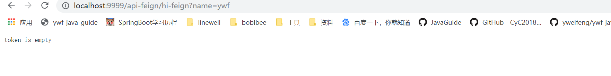

<!-- TOC -->

- [SpringCloud整合zuul(服务网关)](#springcloud整合zuul服务网关)
    - [Zuul简介](#zuul简介)
    - [zuul功能](#zuul功能)
    - [服务路由](#服务路由)
    - [服务过滤](#服务过滤)

<!-- /TOC -->
# SpringCloud整合zuul(服务网关)

## Zuul简介

Zuul的主要功能是路由转发和过滤器。路由功能是微服务的一部分，比如／api/user转发到到user服务，/api/shop转发到到shop服务。zuul默认和Ribbon结合实现了负载均衡的功能。

## zuul功能

- Authentication
- Insights
- Stress Testing
- Canary Testing
- Dynamic Routing
- Service Migration
- Load Shedding
- Security
- Static Response handling
- Active/Active traffic management


## 服务路由

**pom.xml**

```xml
<?xml version="1.0" encoding="UTF-8"?>
<project xmlns="http://maven.apache.org/POM/4.0.0"
         xmlns:xsi="http://www.w3.org/2001/XMLSchema-instance"
         xsi:schemaLocation="http://maven.apache.org/POM/4.0.0 http://maven.apache.org/xsd/maven-4.0.0.xsd">
    <parent>
        <artifactId>ywf-springcloud</artifactId>
        <groupId>com.ywf</groupId>
        <version>1.0-SNAPSHOT</version>
    </parent>
    <modelVersion>4.0.0</modelVersion>

    <artifactId>service-zuul</artifactId>

    <dependencies>
        <dependency>
            <groupId>org.springframework.boot</groupId>
            <artifactId>spring-boot-starter-web</artifactId>
        </dependency>
        <dependency>
            <groupId>org.springframework.cloud</groupId>
            <artifactId>spring-cloud-starter-netflix-zuul</artifactId>
        </dependency>
    </dependencies>
</project>
```

**bootstrap.yml**

```properties
spring:
  application:
    name: service-zuul
  cloud:
    nacos:
      discovery:
        server-addr: 127.0.0.1:8848
        # 命名空间
        namespace: c2efbc9a-03c3-46ab-9487-94b6e9e6fc53
  profiles:
    active: dev
server:
  port: 9999
zuul:
  routes:
    api-ribbon:
      path: /api-ribbon/**
      serviceId: service-ribbon
    api-feign:
      path: /api-feign/**
      serviceId: service-feign
```

**启动类**

```java
package com.ywf;

import org.springframework.boot.SpringApplication;
import org.springframework.boot.autoconfigure.SpringBootApplication;
import org.springframework.cloud.client.discovery.EnableDiscoveryClient;
import org.springframework.cloud.netflix.zuul.EnableZuulProxy;

/**
 * @Author:ywf
 */
@SpringBootApplication
@EnableDiscoveryClient
@EnableZuulProxy
public class ServiceZuulApp {
    public static void main(String[] args) {
        SpringApplication.run(ServiceZuulApp.class, args);
    }
}
```

- http://localhost:9999/api-ribbon/hi-ribbon?name=ywf
- http://localhost:9999/api-feign/hi-feign?name=ywf


## 服务过滤

zuul不仅只是**路由**，并且还能过滤，做一些安全验证。

新建**TokenFilter**

```java
package com.ywf.filter;

import com.netflix.zuul.ZuulFilter;
import com.netflix.zuul.context.RequestContext;
import com.netflix.zuul.exception.ZuulException;
import org.slf4j.Logger;
import org.slf4j.LoggerFactory;
import org.springframework.stereotype.Component;

import javax.servlet.http.HttpServletRequest;

/**
 * @Author:ywf
 */
@Component
public class TokenFilter extends ZuulFilter {
    private static Logger log = LoggerFactory.getLogger(TokenFilter.class);

    /**
     * filterType：返回一个字符串代表过滤器的类型，在zuul中定义了四种不同生命周期的过滤器类型，具体如下：
     * pre：路由之前
     * routing：路由之时
     * post： 路由之后
     * error：发送错误调用
     *
     * @return
     */
    @Override
    public String filterType() {
        return "pre";
    }

    /**
     * 过滤的顺序
     *
     * @return
     */
    @Override
    public int filterOrder() {
        return 0;
    }

    /**
     * 这里可以写逻辑判断，是否要过滤，本文true,永远过滤。
     *
     * @return
     */
    @Override
    public boolean shouldFilter() {
        return true;
    }

    /**
     * 过滤器的具体逻辑。可用很复杂，包括查sql，nosql去判断该请求到底有没有权限访问。
     *
     * @return
     * @throws ZuulException
     */
    @Override
    public Object run() throws ZuulException {
        // 获取请求 token
        RequestContext ctx = RequestContext.getCurrentContext();
        HttpServletRequest request = ctx.getRequest();
        log.info(String.format("%s >>> %s", request.getMethod(), request.getRequestURL().toString()));
        Object accessToken = request.getParameter("token");
        if (accessToken == null) {
            log.warn("token is empty");
            ctx.setSendZuulResponse(false);
            ctx.setResponseStatusCode(401);
            try {
                ctx.getResponse().getWriter().write("token is empty");
            } catch (Exception e) {
            }
            return null;
        } else {
            // TODO 校验token是否匹配
        }
        log.info("ok");
        return null;
    }
}
```

- 浏览器访问 http://localhost:9999/api-feign/hi-feign?name=ywf

