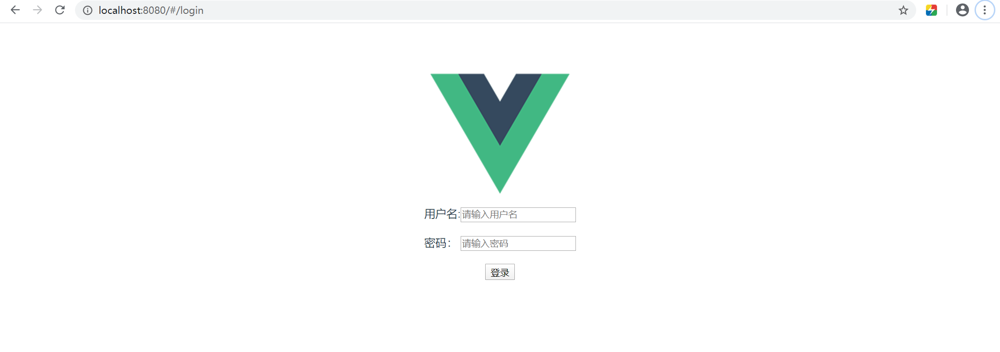
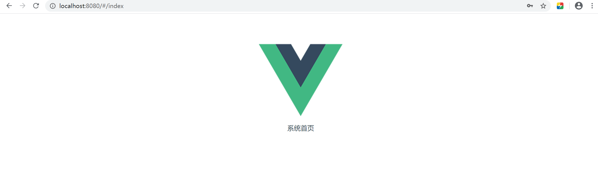
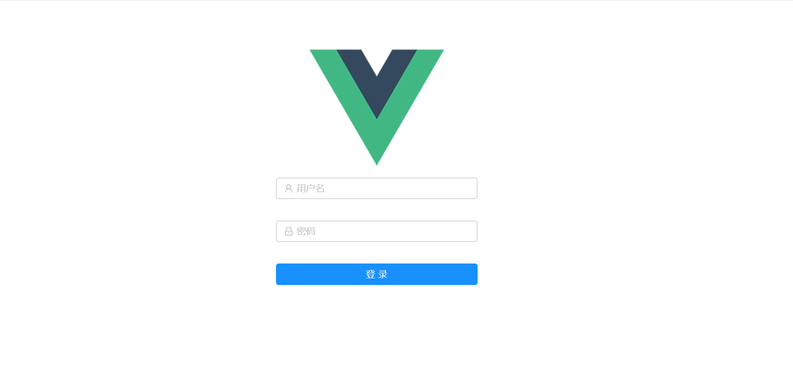
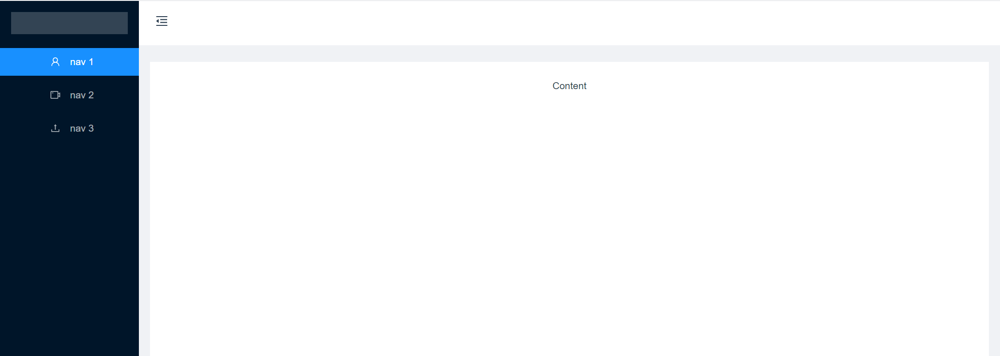

# vue项目实战

## 后端框架搭建

> 使用spring boot

**User.java**

```java
package com.ywf.myvueproject.entity;

public class User {
    private String username;
    private String password;

    public String getUsername() {
        return username;
    }

    public void setUsername(String username) {
        this.username = username;
    }

    public String getPassword() {
        return password;
    }

    public void setPassword(String password) {
        this.password = password;
    }
}
```

**BaseResponse.java**

```java
package com.ywf.myvueproject.util;

public class BaseResponse {
    private int code;
    private String msg;

    public int getCode() {
        return code;
    }

    public void setCode(int code) {
        this.code = code;
    }

    public String getMsg() {
        return msg;
    }

    public void setMsg(String msg) {
        this.msg = msg;
    }

    public BaseResponse(int code, String msg) {
        this.code = code;
        this.msg = msg;
    }
}
```

**LoginController.java**

```java
package com.ywf.myvueproject.controller;

import com.ywf.myvueproject.entity.User;
import com.ywf.myvueproject.util.BaseResponse;
import org.springframework.web.bind.annotation.CrossOrigin;
import org.springframework.web.bind.annotation.PostMapping;
import org.springframework.web.bind.annotation.RequestBody;
import org.springframework.web.bind.annotation.RestController;

@RestController
public class LoginController {

    @CrossOrigin
    @PostMapping("/login")
    public BaseResponse login(@RequestBody User user) {
        if ("admin".equals(user.getUsername()) && "123".equals(user.getPassword())) {
            return new BaseResponse(200, "验证成功");
        } else {
            return new BaseResponse(400, "验证失败");
        }
    }
}
```


## 前端框架搭建

- 搭建脚手架

  ```shell
  vue init webpack myProject
  ```

- 引入**axios**反向代理(src/main.js)

  ```js
  // The Vue build version to load with the `import` command
  // (runtime-only or standalone) has been set in webpack.base.conf with an alias.
  import Vue from 'vue'
  // 引入APP组件
  import App from './App'
  // 引入路由配置
  import router from './router'
  
  // 设置axios反向代理
  var axios = require('axios')
  axios.defaults.baseURL = 'http://localhost:8443/api'
  
  // 全局注册 后面直接使用this.$axios调用
  Vue.prototype.$axios = axios
  
  Vue.config.productionTip = false
  
  /* eslint-disable no-new */
  new Vue({
    el: '#app', // 最终效果：替换id为app的div
    router, // 使用路由
    components: { App }, // 使用APP组件
    template: '<App/>' // 告知页面APP组件使用该标签包裹
  })
  
  ```

- **安装 axios**

  ```shell
  npm install --save axios
  ```

- **配置跨域**(config/index.js)

  ```js
      proxyTable: {
        '/api': {
          // 配置跨域支持
          target: 'http://localhost:8443',
          changeOrigin: true,
          pathRewrite: {
            '^/api': ''
          }
        }
      }
  ```

- **创建Login.vue和Index.vue**

  - Login.vue 登录页面

  ```vue
  <template>
       <div>
        用户名:<input type="text" v-model="loginForm.username" placeholder="请输入用户名"/>
        <br><br>
        密码： <input type="password" v-model="loginForm.password" placeholder="请输入密码"/>
        <br><br>
        <button v-on:click="login">登录</button>
    </div>
  </template>
  <script>
  export default {
    name: 'Login',
    data () {
      return {
        loginForm: {
          username: '',
          password: ''
        }
      }
    },
    methods: {
      login () {
        this.$axios.post('/login', {
          username: this.loginForm.username,
          password: this.loginForm.password
        }).then(res => {
          if (res.data.code === 200) {
            this.$router.replace({path: '/index'})
          } else {
            alert(res.data.msg)
          }
        })
      }
    }
  }
  </script>
  <style scoped>
  
  </style>
  
  ```

  - Index.vue 首页

  ```vue
  <template>
      <div>
          系统首页
      </div>
  </template>
  <script>
  export default {
      name: 'Index',
      data () {
          return {
  
          }
      }
  }
  </script>
  <style scoped>
  
  </style>
  
  ```

- **配置路由**(route/index.js)

  ```js
  import Vue from 'vue'
  import Router from 'vue-router'
  import Login from '@/components/Login'
  import Index from '@/components/Index'
  
  Vue.use(Router)
  
  export default new Router({
    routes: [
      {
        path: '/',
        name: 'Login',
        component: Login
      },
      {
        path: '/login',
        name: 'Login',
        component: Login
      },
      {
        path: '/index',
        name: 'Index',
        component: Index
      }
    ]
  })
  
  ```


- 访问验证登录

  [http://localhost:8080/#/login](http://localhost:8080/#/login)

  

输入admin/123，页面成功跳转到首页




## 引入 ant-design-vue

- 安装ant 组件

  ```sh
  npm i --save ant-design-vue
  ```

- 安装form-create

  ```shell
  npm i --save form-create
  ```

- 项目引用ant (main.js)

  ```js
  // The Vue build version to load with the `import` command
  // (runtime-only or standalone) has been set in webpack.base.conf with an alias.
  import Vue from 'vue'
  // 引入APP组件
  import App from './App'
  // 引入路由配置
  import router from './router'
  // 引用antd组件
  import Antd from 'ant-design-vue'
  // 引入antd 样式
  import 'ant-design-vue/dist/antd.css'
  
  // 设置axios反向代理
  var axios = require('axios')
  axios.defaults.baseURL = 'http://localhost:8443/api'
  
  // 全局注册 后面直接使用this.$axios调用
  Vue.prototype.$axios = axios
  
  Vue.use(Antd)
  
  Vue.config.productionTip = false
  
  /* eslint-disable no-new */
  new Vue({
    el: '#app', // 最终效果：替换id为app的div
    router, // 使用路由
    components: { App }, // 使用APP组件
    template: '<App/>' // 告知页面APP组件使用该标签包裹
  })
  
  ```


- 改造login.vue

  ```vue
  <template>
  
    <a-form
        :form="form"
        class="login-form"
        @submit="login"
      >
      <a-form-item>
        <a-input
          v-decorator="[
            'username',
            { rules: [{ required: true, message: '请输入用户名!' }] },
          ]"
          placeholder="用户名"
        >
          <a-icon slot="prefix" type="user" style="color: rgba(0,0,0,.25)" />
        </a-input>
      </a-form-item>
      <a-form-item>
        <a-input
          v-decorator="[
            'password',
            { rules: [{ required: true, message: '请输入密码!' }] },
          ]"
          type="password"
          placeholder="密码"
        >
          <a-icon slot="prefix" type="lock" style="color: rgba(0,0,0,.25)" />
        </a-input>
      </a-form-item>
       <a-form-item>
        <a-button type="primary" html-type="submit" class="login-form-button">
          登录
        </a-button>
      </a-form-item>
    </a-form>
  
  </template>
  <script>
  export default {
    name: 'Login',
    beforeCreate () {
      this.form = this.$form.createForm(this, { name: 'login-form' })
    },
  
    methods: {
      login () {
        this.form.validateFields((err, values) => {
          if (!err) {
            this.$axios.post('/login', {
              username: values.username,
              password: values.password
            }).then(res => {
              if (res.data.code === 200) {
                this.$router.replace({path: '/index'})
              } else {
                alert(res.data.msg)
              }
            })
          }
        })
      }
    }
  }
  </script>
  <style scoped>
    .login-form {
      max-width: 300px;
      margin: 0 auto;
    }
    .login-form-button {
      width: 100%;
    }
  </style>
  
  ```

  

- 改造index.vue
  - 去掉App.vue logo.png
  - 使用ant 改造index.vue

  ```vue
  <template>
    <a-layout id="components-layout-demo-custom-trigger">
      <a-layout-sider :trigger="null" collapsible v-model="collapsed">
        <div class="logo" />
        <a-menu theme="dark" mode="inline" :defaultSelectedKeys="['1']">
          <a-menu-item key="1">
            <a-icon type="user" />
            <span>nav 1</span>
          </a-menu-item>
          <a-menu-item key="2">
            <a-icon type="video-camera" />
            <span>nav 2</span>
          </a-menu-item>
          <a-menu-item key="3">
            <a-icon type="upload" />
            <span>nav 3</span>
          </a-menu-item>
        </a-menu>
      </a-layout-sider>
      <a-layout>
        <a-layout-header style="background: #fff; padding: 0">
          <a-icon
            class="trigger"
            :type="collapsed ? 'menu-unfold' : 'menu-fold'"
            @click="() => (collapsed = !collapsed)"
          />
        </a-layout-header>
        <a-layout-content
          :style="{ margin: '24px 16px', padding: '24px', background: '#fff', minHeight: '280px' }"
        >
          Content
        </a-layout-content>
      </a-layout>
    </a-layout>
  </template>
  <script>
  export default {
    data () {
      return {
        collapsed: false
      }
    }
  }
  </script>
  <style>
  #components-layout-demo-custom-trigger {
    height:100%;
  }
  #components-layout-demo-custom-trigger .trigger {
    font-size: 18px;
    line-height: 64px;
    padding: 0 24px;
    cursor: pointer;
    transition: color 0.3s;
    float: left;
  }
  
  #components-layout-demo-custom-trigger .trigger:hover {
    color: #1890ff;
  }
  
  #components-layout-demo-custom-trigger .logo {
    height: 32px;
    background: rgba(255, 255, 255, 0.2);
    margin: 16px;
  }
  </style>
  
  ```

